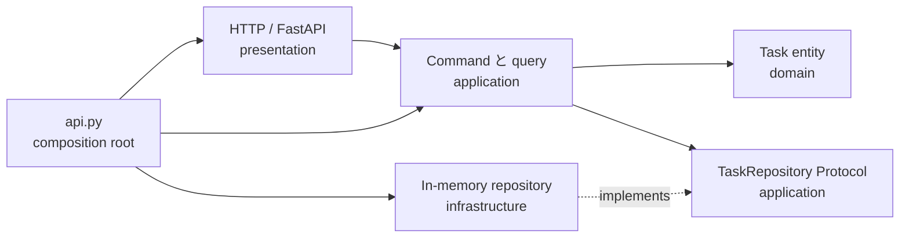
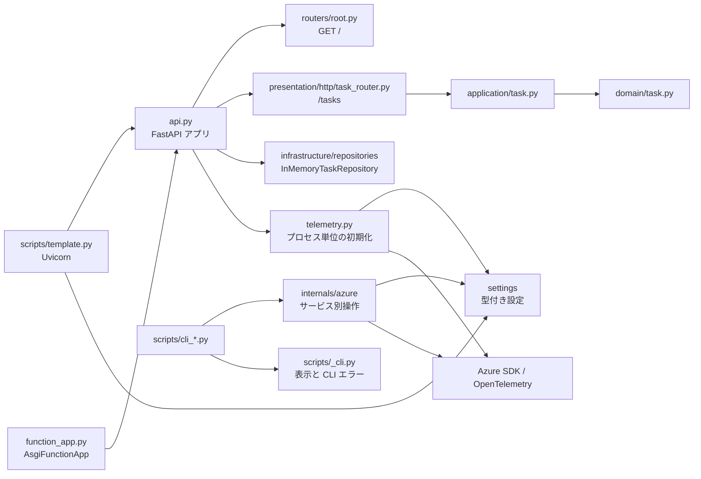
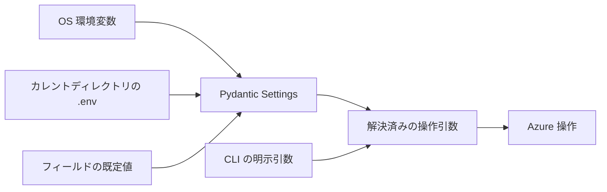

# アーキテクチャ

## 設計の考え方

このテンプレートは [FastAPI の複数ファイル構成](https://fastapi.tiangolo.com/tutorial/bigger-applications/)で
HTTP・設定・Azure 操作・CLI 表示を分離した構成に、型付き Task CRUD の縦スライスを追加しています。
既存の `GET /`、Azure Functions の起動経路、Azure/CLI 機能は維持しています。
Task は外部サービス不要の参照実装であり、完成した DDD システムではありません。

### Clean Architecture：技術と業務ルールを分離する

Clean Architecture は、業務ルールを HTTP・データベース・SDK などの技術詳細から独立させ、
**ソースコードの依存を内側へ向ける**設計です。内側に必要な I/O の契約（port）を定義し、
外側の adapter が実装します。実行時に use case が repository を呼んでも、
use case が具象 database adapter を import する必要はありません。
根拠は Robert C. Martin の原典
[The Clean Architecture](https://blog.cleancoder.com/uncle-bob/2012/08/13/the-clean-architecture.html)です。

### DDD：業務の言葉・ルール・境界をモデルにする

DDD（ドメイン駆動設計）は、業務に詳しい人と開発者が共通の言葉を使い、
業務の意味とルールをモデル・コードに反映する設計です。Clean Architecture が依存の配置を支える一方、
DDD は「何をモデル化するか」を扱います。**層を分けるだけで DDD が成立するわけではありません。**
用語の原典は Eric Evans の公式 [DDD Reference](https://www.domainlanguage.com/ddd/reference/)です。

| 用語 | 意味・判断の基準 |
| --- | --- |
| ユビキタス言語 | 業務関係者・会話・コードで共有する用語。「更新」より「着手」「完了」で意図を表す |
| Bounded Context | 同じ用語とモデルが同じ意味を持つ範囲。Azure サービス名や deployment 単位とは別 |
| Entity | 値が変わっても ID で同一性を追うもの。Task はその候補 |
| Value Object | ID ではなく値で区別する不変のもの。金額など、値に固有のルールを閉じ込める |
| Aggregate | 一度の更新で守る整合性の境界と、その入口となる root Entity。単一 Entity の場合もある |

Clean Architecture の Entity 層は業務ルールの分類であり、DDD の Entity という同一性の分類とは同義ではありません。
現行の `TaskId` は `NewType` による静的な型区別で、業務検証を備えた Value Object ではありません。
現行 Task はタイトル等を検証しますが、`update()` は任意の status を受け付け、状態遷移の業務ルールは未実装です。

単純な CRUD には現在の構成で十分です。業務が必要としたときに操作・Value Object・整合性境界を追加し、
Domain Event、Unit of Work、複数 Context、マイクロサービスを一律に導入しません。
業務分析からモデルへ進める補足は Microsoft の
[Domain analysis](https://learn.microsoft.com/en-us/azure/architecture/microservices/model/domain-analysis)と
[Tactical DDD](https://learn.microsoft.com/en-us/azure/architecture/microservices/model/tactical-domain-driven-design)を参照してください。
これらのマイクロサービス構成は、このテンプレートの必須条件ではありません。

## 現行の Clean Architecture

`/tasks` API は domain から HTTP までをつないだ縦スライスです。
以下の実線は依存方向、破線は port を実装する関係を表します。



| 層 | 責務 | 依存可能な対象 |
| --- | --- | --- |
| `domain` | Entity、値の型、不変条件 | Python 標準ライブラリ |
| `application` | Use case、command、query、Repository port | `domain` |
| `infrastructure` | Database・外部 service adapter | `application`、`domain` |
| `presentation` | HTTP DTO、routing、error/status mapping | `application`、`domain` |
| `api.py` | 具象 object の生成と接続 | すべての層 |

domain は Pydantic model ではなく frozen dataclass と enum を使います。
業務モデルを HTTP・JSON の検証・変換と外部ライブラリから独立させる、このテンプレートの設計判断です。
frozen は直接の属性変更を防ぎ、enum は状態の語彙を明示しますが、業務ルールは domain 側で検証します。
Clean Architecture や DDD が Pydantic を禁止したり、Entity の不変性を必須にしたりするわけではありません。
依存を受け入れるなら、domain に Pydantic model を使う設計も可能です。

application は
具象 repository ではなく構造的部分型の `TaskRepository` protocol に依存します
（[Python の Protocol 仕様](https://typing.python.org/en/latest/spec/protocol.html)）。
FastAPI と Pydantic は HTTP adapter 内に限定します。`create_app()` が composition root であり、
app ごとに独立した repository を生成するため、test の状態分離と adapter の明示的な差し替えが可能です。
インメモリの状態は再起動で失われ、複数 worker・process 間では共有されません。

## 開発手順：業務から実装・検証まで

Task の class を無関係な業務へ流用せず、縦スライスの構成をテンプレートにします。
層・adapter のパスは `template_azure_python/` 配下、test・プロジェクト設定・command はリポジトリルート基準です。

| 手順 | 決めること・実装する場所 |
| --- | --- |
| 1. 業務を整理 | 共通用語、利用者の操作、成功例・禁止例を短く記録する |
| 2. 境界を決定 | Context、Entity/Value Object、不変条件、同時に整合させる Aggregate を決める。小規模なら単一 Context から始める |
| 3. domain を実装 | `domain/<feature>.py` に業務操作と不変条件を置き、先に domain test で検証する |
| 4. use case を実装 | `application/<feature>.py` に command と取得・業務操作・保存の調整を置き、必要な I/O を `application/ports` の Protocol で定義する |
| 5. 外側を接続 | `infrastructure` に I/O と SDK 変換、`presentation/http` に DTO・routing・HTTP error mapping を置く。`api.py` と公開 export を更新して配線する |
| 6. 検証 | domain の禁止操作、use case、repository contract、API 応答・OpenAPI をテストし、型・依存ガードを実行する |

HTTP DTO は形式や必須項目を検証し、domain は HTTP を経由しない呼び出しでも業務の不変条件を守ります。
ユースケースは処理を調整し、業務判断を router や SDK adapter へ移しません。
新しい HTTP 業務機能はこの手順で追加し、単なる router 追加だけで済ませないでください。
具体的な変更箇所は[既存サービスへの追加例](#extending-existing-services)に示します。

### 自動ガードレール

`make lint` は Ruff、Clean Architecture package に対する mypy strict、ty、Pyrefly、
import-linter を実行します。現行の契約は内向きの層順序、presentation と infrastructure の相互非依存、
domain/application から FastAPI・Pydantic・Azure を import しないことを検証します
（[import-linter の層契約](https://github.com/seddonym/import-linter/blob/main/docs/contract_types/layers.md)）。
標準ライブラリだけで domain を書く方針ですが、契約がすべての外部 library を禁止するわけではありません。
型検査も実行時の業務ルールや未設定の Context 間境界を保証しないため、シナリオ test が必要です。
新しい Context や外部依存を導入するときは `pyproject.toml` の検査対象・契約も確認してください。

```bash
uv sync --locked --group dev
uv run --locked mypy
uv run --locked lint-imports
uv run --locked pytest tests/test_task_domain.py tests/test_task_application.py tests/test_api.py
```

上記は現在の Task の検証例です。新機能ではその test も追加します。
全体検証は `make ci-test`、ドキュメント変更は `make ci-test-docs` を使い、同じ command を CI でも実行します。

## 構成と起動経路



- Uvicorn の起動パスは `template_azure_python.api:app` のままです。
  `api.py` の小さな application factory が任意のテレメトリを初期化してからアプリを生成し、
  `include_router` でルーターを明示的に登録します。
  公式ガイドの `main.py` と同じ責務を担うため、別の起動ファイルは不要です。
- `function_app.py` は同じアプリを Azure Functions でラップします。
  既存の匿名 HTTP トリガーと、`/api` プレフィックスを付けない設定は維持しています。
- `routers/root.py` が既存の `GET /` を担当し、`{"Hello":"World"}` を返します。
  Task router は `/tasks` の CRUD を担当し、`/docs` と OpenAPI も利用できます。
  Azure を利用する HTTP エンドポイントはまだありません。
- Azure CLI は `internals/azure` のサービス別操作へ委譲します。
  scripts は引数・表示・削除確認・終了コードを担当し、SDK のクライアントやモデルを扱いません。

テレメトリが無効（既定）の場合、API 起動時に Azure クライアントを作らず、
Azure 設定も必須にしません。有効にした場合は有効な Application Insights 接続文字列が必要で、
初期化に失敗すると起動を止めます。
実行手順は[ローカル開発](../scripts.md)と[デプロイ](../deployment.md)を参照してください。

## パッケージの責務

```text
template_azure_python/
  api.py                       # composition root・テレメトリ初期化・ルーター登録
  domain/
    task.py                    # Task・TaskId・TaskStatus・不変条件
  application/
    task.py                    # command・CRUD use case・application error
    ports/task_repository.py   # 非同期 Repository Protocol
  infrastructure/
    repositories/in_memory_task.py # インメモリ adapter
  presentation/
    http/task_schemas.py       # HTTP DTO と domain からの変換
    http/task_router.py        # router factory と error mapping
  telemetry.py                 # プロセス単位の Azure Monitor 初期化
  routers/
    root.py                    # 既存の GET /
  settings/
    _base.py                   # dotenv 読み込みの共通設定
    project.py                 # ProjectSettings とキャッシュ付き取得関数
    azure/
      settings.py              # 階層化した AzureSettings とキャッシュ付き取得関数
      <domain>.py              # サービス別 Pydantic Settings モデル
    _telemetry.py              # SDK 用環境変数の一時設定・復元
    __init__.py                # 設定への公開アクセス経路
  internals/
    azure/
      _common.py               # 検証・例外・クライアント寿命・Logs 結果変換
      <service>.py             # SDK 操作と結果変換
scripts/
  _cli.py                      # CLI エラー・JSON 出力・対話確認
  template.py                  # ローカル起動と基本コマンド
  cli_<service>.py              # Azure CLI のエントリーポイント
```

Azure 操作は `cosmosdb`、`foundry`、`event_grid`、`event_hubs`、`service_bus`、
`queue_storage`、`azure_monitor`、`log_analytics`、`application_insights`、
`network_watcher`、`activity_log` の各モジュールに分かれています。
操作の戻り値は通常の辞書・リスト・文字列・件数です。
SDK のクライアントと結果モデルは内部実装に閉じ込めます。

汎用サービス基底クラス、ルーター自動探索、独自 DI コンテナーはありません。
Repository protocol は永続化が必要な application 境界だけに導入し、その他の抽象化は
実際の責務が生まれたときだけ追加します。

API テレメトリも同じ方針です。未使用の exporter registry や自作 provider stack は追加せず、
小さな module 境界の内側で Azure Monitor を設定します。カスタム span や metric が必要な
場合は HTTP adapter など外側の層で OpenTelemetry を使い、domain に技術詳細を持ち込みません。

## 設定の集約

アプリケーションの設定には `template_azure_python.settings` 経由でアクセスします。

- `get_project_settings()` はプロジェクト名とログレベルを取得します。
- `get_azure_settings()` は `.env.template` に記載されたアプリ用 Azure 設定を取得します。
- `ProjectSettings` は Pydantic Settings モデルです。`AzureSettings` はサービス別の
  Pydantic Settings モデルを集約し、`settings.cosmos_db.endpoint` や
  `settings.resource.subscription_id` のような階層化したパスで値を公開します。
  `.env.template` のフラットな環境変数名を維持しつつ、UTF-8 の dotenv 読み込み、
  大文字・小文字を区別しない変数名、無関係なキーの無視を共有します。



優先順位は **CLI の明示引数 > OS 環境変数 > `.env` > フィールドの既定値**です。
内部操作は省略されたオプションだけを settings から解決します。
明示引数によって OS 環境変数やキャッシュ中のモデルを書き換えることはありません。

相対パスの `.env` はカレントディレクトリから読み、親ディレクトリを自動探索しません。
掲載コマンドはリポジトリルートで実行してください。
ファイルがなくても OS の値と既定値を使用できますが、
必要な endpoint や ID がない操作は認証前に必須オプションのエラーになります。
Azure 設定では空の環境変数値を無視し、任意の resource group フィルターや
database・container・consumer group の既定値を維持します。

取得関数は初回利用時に設定をロードし、そのスナップショットをキャッシュします。
実行中に設定ファイルを変更した場合はプロセスを再起動してください。
テストではキャッシュを明示的にクリアします。
サービス固有の検証はその操作の実行時に行い、無関係な設定不足で
API 起動・他サービスの CLI・`--help` を失敗させません。

scripts は `load_dotenv` を呼ばず、Typer の `envvar` も使用しません。
Pydantic は dotenv 内の値を読みますが、ファイル全体を `os.environ` へ注入しません。
SDK の認証は引き続き `DefaultAzureCredential` の標準動作に従い、
`az login` やマネージド ID を利用します。
SDK 自体の認証用変数は OS またはホスティング環境へ設定してください。
dotenv の任意の追加キーを SDK 用の環境変数として export することはありません。

`APPLICATIONINSIGHTS_CONNECTION_STRING` は `SecretStr` とし、設定の dump からも除外しています。
CLI 引数として受け付けず、基本コマンドが表示するプロジェクト設定にも含めません。
自前コードで環境変数を変更するのは `telemetry_environment()` だけです。
1 回の送信に必要な SDK 制御値を一時設定し、失敗時も元の値・未設定状態を復元します。

読み込み元と優先順位の詳細は
[Pydantic Settings](https://pydantic.dev/docs/validation/latest/concepts/pydantic_settings/)を参照してください。

## エラー・逐次出力・クライアントの寿命

Task API は domain の `InvalidTaskError` を 422、application の `TaskNotFoundError` を 404、
`TaskAlreadyExistsError` を 409 に変換します。HTTP の変換処理は `presentation/http` に置きます。

既存 Azure 操作の入力検証は `InputError`、必須設定不足はそのサブクラスの `MissingSetting` を使い、
SDK 操作の失敗は `OperationError` に変換します。
CLI は入力エラーを終了コード 2、操作失敗を終了コード 1 とし、
既存のサービスごとの JSON または標準エラー診断に変換します。
Azure Logs の部分結果はテーブルと秘匿したエラーを残して終了コード 1 とし、
成功に見えるフォールバックにはしません。

同期・非同期の資格情報とクライアントはコンテキストマネージャーで CLI 操作の期間だけ保持し、
成功・失敗・キャンセル時に解放します。
Cosmos DB はパラメーター化された partition-scoped query を維持し、
throughput 省略時には container 作成に値を渡しません。

Event Hubs と Service Bus は通常のレコードをコールバックで CLI に渡します。
内部実装を Typer に依存させず、逐次出力を維持するためです。
Service Bus は表示に成功してからメッセージを complete し、表示失敗時には acknowledge しません。
Event Hubs はグローバル idle timeout・件数上限・partition task のキャンセルを維持します。
Foundry の 2 ターンの出力順序も変えません。

Application Insights の送信は、プロセス全体の OpenTelemetry provider を設定し、
ログ処理を一時的に隔離します。**単一プロセスの CLI 操作**であり、
API のリクエストごとに呼び出すヘルパーではありません。
provider の flush 完了は Azure の取り込みを保証しません。
運用上の詳細は[監視とログ](../monitoring.md)を参照してください。

<a id="extending-existing-services"></a>

## 既存サービスへの追加例

以下はいずれも**今後実装する場合の手順**です。完了操作や Cosmos Task Repository はまだ提供していません。

### 例1：Task に業務上の「完了」を追加する

1. 先に業務ルールを合意します。例えば「着手済みの Task だけ完了できる」を採用するなら、
   `in_progress → done` は成功し、`todo` や `done` からの完了はエラーとするシナリオを決めます。
   これは説明用のルールであり、現行 API の仕様ではありません。
2. `domain/task.py` に `complete()` と必要な domain error を追加し、
   `tests/test_task_domain.py` で成功・禁止遷移を検証します。
3. `application/task.py` に `CompleteTask` を追加します。
   repository から取得して domain 操作を呼び、保存する流れと not-found を application test で検証します。
4. `presentation/http/task_router.py` に、例えば `POST /tasks/{task_id}/complete` と error mapping を追加します。
   必要なら `task_schemas.py` を更新し、`api.py` と各 `__init__.py` の公開 export を変更して配線します。
5. `tests/test_api.py` に応答・禁止操作・OpenAPI test を追加します。
   既存 PUT や `Task.update()` がルールを迂回しないよう両方を確認し、
   API 契約を意図的に変更する場合は互換性への影響を記録します。

### 例2：Azure/Cosmos DB を利用する adapter を追加する

1. 業務用 port を確認します。Task の永続化なら `application/ports/task_repository.py` の
   `add/get/list/update/delete` と重複・未検出時の意味を保つ adapter を
   `infrastructure/repositories` に追加します。
2. 既存 `internals/azure/cosmosdb.py` は**CLI 用の同期処理・商品データ・`/category` partition の例**です。
   非同期 Task Repository とそのまま互換ではありません。既存 CLI を維持し、
   新 adapter で document/domain 変換、partition key、非同期 I/O、SDK error の変換を実装します。
3. 再利用する client と credential は HTTP アプリの
   [FastAPI lifespan](https://fastapi.tiangolo.com/advanced/events/)で生成・解放し、
   `api.py` で adapter と use case を接続します。設定は既存 settings に集約し、内側から SDK や環境変数を参照しません。
4. 同時更新を保護する場合は、読み取り時の version と条件付き保存を設計します。
   現行 port は version を渡さないため、adapter の差し替えだけで競合制御が完成するとは限りません。
   必要に応じて port/use case の契約も拡張し、競合を明示的な application error にします。
   Cosmos DB の [ETag とトランザクション境界](https://learn.microsoft.com/en-us/azure/cosmos-db/database-transactions-optimistic-concurrency)に従い、
   Aggregate の整合性要件と logical partition の範囲を照合してください。
5. repository contract test で重複・not-found・更新・削除、追加した競合制御を検証し、
   SDK 境界の失敗・キャンセル時の解放と、配線後の API の回帰をテストします。

### 既存 Azure CLI の技術操作を追加する

業務モデルではなく SDK 操作の追加であれば、既存の薄い CLI と adapter の構成を維持します。

1. `settings/azure` 以下のサービス別モデルを追加または拡張し、
   秘密情報を含まない設定例を `.env.template` に記載します。
   新しいサービスモデルが必要な場合は `AzureSettings` に組み込みます。
2. `internals/azure` にサービス操作を追加します。
   省略設定は公開 settings パッケージから解決し、認証前の検証・リソース管理・通常の値への変換を行います。
3. `cli_errors` と既存の表示ヘルパーを使う薄い `scripts/cli_<service>.py` を追加します。
   明示引数・設定へのフォールバック・失敗・出力形状・解放をテストします。

構造テストで、scripts に SDK import がなく、環境変数アクセスが settings に限定され、
Azure 内部実装が CLI 表示に依存しないことを確認します。
回帰テストは SDK 境界をモックし、OpenTelemetry の構築テストは
一度だけ設定できる provider を隔離するため、別プロセスでオフライン実行します。

## 出典・参考資料

原則は著者の一次情報を参照し、実装上の判断は公式資料で補足しています。
上記の Task/Cosmos 手順は、このリポジトリへの適用例であり、出典のコードや図の転載ではありません。

- Robert C. Martin, [The Clean Architecture](https://blog.cleancoder.com/uncle-bob/2012/08/13/the-clean-architecture.html)：依存ルールと責務の分離。
- Eric Evans / Domain Language, [DDD Reference](https://www.domainlanguage.com/ddd/reference/)：DDD の用語・パターンの著者公式リファレンス。
- Microsoft Azure Architecture Center, [Domain analysis](https://learn.microsoft.com/en-us/azure/architecture/microservices/model/domain-analysis) / [Tactical DDD](https://learn.microsoft.com/en-us/azure/architecture/microservices/model/tactical-domain-driven-design)：業務分析・Context・Entity・Value Object・Aggregate の補足。
- Python typing specification, [Protocols](https://typing.python.org/en/latest/spec/protocol.html)：Repository port の構造的部分型。
- FastAPI, [Bigger Applications](https://fastapi.tiangolo.com/tutorial/bigger-applications/) / [Lifespan Events](https://fastapi.tiangolo.com/advanced/events/)：router 構成と共有 resource の寿命。
- Microsoft, [Cosmos DB transactions and optimistic concurrency](https://learn.microsoft.com/en-us/azure/cosmos-db/database-transactions-optimistic-concurrency)：partition 内の transaction と ETag による条件付き更新。
- Import-linter, [Layers contract](https://github.com/seddonym/import-linter/blob/main/docs/contract_types/layers.md)：内向き依存と sibling layer の相互非依存。
