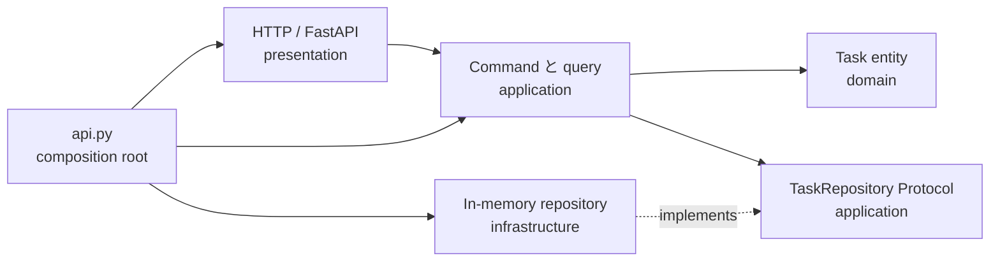
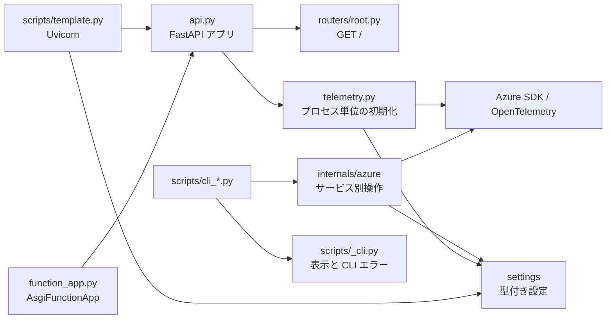
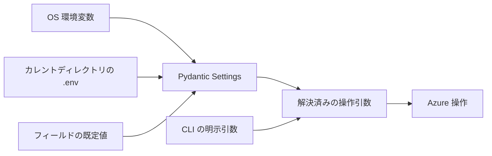

# アーキテクチャ

[FastAPI の複数ファイル構成ガイド](https://fastapi.tiangolo.com/tutorial/bigger-applications/)と
Clean Architecture の境界を組み合わせ、HTTP ルーティング、ユースケース、ドメインルール、
永続化、設定、Azure 操作、CLI 表示の責務を分離しています。

## Clean Architecture テンプレート

`/tasks` API は代表的な縦スライスです。依存は内側へ向かい、内側の層は Web framework、
database、cloud SDK の選択を知りません。



| 層 | 責務 | 依存可能な対象 |
| --- | --- | --- |
| `domain` | Entity、値の型、不変条件 | Python 標準ライブラリ |
| `application` | Use case、command、query、Repository port | `domain` |
| `infrastructure` | Database・外部 service adapter | `application`、`domain` |
| `presentation` | HTTP DTO、routing、error/status mapping | `application`、`domain` |
| `api.py` | 具象 object の生成と接続 | すべての層 |

domain は Pydantic model ではなく frozen dataclass と enum を使います。application は
具象 repository ではなく構造的部分型の `TaskRepository` protocol に依存します。
FastAPI と Pydantic は HTTP adapter 内に限定します。`create_app()` が composition root であり、
app ごとに独立した repository を生成するため、test の状態分離と adapter の明示的な差し替えが可能です。

### 機能追加の手順

Task の class を無関係な domain から再利用するのではなく、縦スライスの構成をテンプレートにします。

1. `domain/<feature>.py` に業務状態と不変条件を定義する。
2. 必要な I/O を application の `Protocol` port として定義し、
   `application/<feature>.py` に use case を実装する。
3. port に対する infrastructure adapter を実装する。SDK や database の model を port から公開しない。
4. `presentation/http` に transport DTO と変換を定義し、application error を HTTP response へ変換する。
5. 具象実装の配線は `api.py` だけで行う。
6. domain/use case の unit test、adapter contract test、API integration test を追加する。

in-memory adapter を Cosmos DB へ差し替える場合は、同じ `TaskRepository` protocol を実装し、
Cosmos document と `Task` の変換および楽観的 concurrency を adapter 内へ閉じ込め、
`api.py` の生成処理だけを変更します。domain/application から Azure package や settings を
import してはいけません。

### 自動ガードレール

`make lint` は Ruff、Clean Architecture package に対する mypy strict、ty、Pyrefly、
import-linter を実行します。import-linter は内向きの層順序、presentation と infrastructure の
相互非依存、domain/application から framework・SDK を import しないことを強制します。
`make test` は各層と配線済み API を検証し、同じ command を CI でも実行します。

## 構成と起動経路



- Uvicorn の起動パスは `template_azure_python.api:app` のままです。
  `api.py` の小さな application factory が任意のテレメトリを初期化してからアプリを生成し、
  `include_router` でルーターを明示的に登録します。
  公式ガイドの `main.py` と同じ責務を担うため、別の起動ファイルは不要です。
- `function_app.py` は同じアプリを Azure Functions でラップします。
  既存の匿名 HTTP トリガーと、`/api` プレフィックスを付けない設定は維持しています。
- `routers/root.py` が既存の `GET /` を担当し、`{"Hello":"World"}` を返します。
  `/docs` と OpenAPI も利用できます。Azure 用 HTTP エンドポイントは新設していません。
- Azure CLI は `internals/azure` のサービス別操作へ委譲します。
  scripts は引数・表示・削除確認・終了コードを担当し、SDK のクライアントやモデルを扱いません。

テレメトリが無効（既定）の場合、API 起動時に Azure クライアントを作らず、
Azure 設定も必須にしません。有効にした場合は有効な Application Insights 接続文字列が必要で、
初期化に失敗すると起動を止めます。
実行手順は[ローカル開発](../scripts.md)と[デプロイ](../deployment.md)を参照してください。

## パッケージの責務

```text
template_azure_python/
  api.py                       # テレメトリ呼び出し・アプリ生成・ルーター登録
  telemetry.py                 # プロセス単位の Azure Monitor 初期化
  routers/
    root.py                    # 現在の HTTP ドメイン
  settings/
    _base.py                   # dotenv 読み込みの共通設定
    project.py                 # ProjectSettings とキャッシュ付き取得関数
    azure/
      settings.py              # 階層化した AzureSettings とキャッシュ付き取得関数
      <domain>.py              # サービス別 Pydantic Settings モデル
    _telemetry.py              # SDK 用環境変数の一時設定・復元
    __init__.py                # 設定への公開アクセス経路
  internals/
    azure/
      _common.py               # 検証・例外・クライアント寿命・Logs 結果変換
      <service>.py             # SDK 操作と結果変換
scripts/
  _cli.py                      # CLI エラー・JSON 出力・対話確認
  template.py                  # ローカル起動と基本コマンド
  cli_<service>.py              # Azure CLI のエントリーポイント
```

Azure 操作は `cosmosdb`、`foundry`、`event_grid`、`event_hubs`、`service_bus`、
`queue_storage`、`azure_monitor`、`log_analytics`、`application_insights`、
`network_watcher`、`activity_log` の各モジュールに分かれています。
操作の戻り値は通常の辞書・リスト・文字列・件数です。
SDK のクライアントと結果モデルは内部実装に閉じ込めます。

汎用サービス基底クラス、ルーター自動探索、独自 DI コンテナーはありません。
Repository protocol は永続化が必要な application 境界だけに導入し、その他の抽象化は
実際の責務が生まれたときだけ追加します。

API テレメトリも同じ方針です。未使用の exporter registry や自作 provider stack は追加せず、
小さな module 境界の内側で Azure Monitor を設定します。カスタム span や metric が必要な
router・ドメインコードは OpenTelemetry API を使います。

## 設定の集約

アプリケーションの設定には `template_azure_python.settings` 経由でアクセスします。

- `get_project_settings()` はプロジェクト名とログレベルを取得します。
- `get_azure_settings()` は `.env.template` に記載されたアプリ用 Azure 設定を取得します。
- `ProjectSettings` は Pydantic Settings モデルです。`AzureSettings` はサービス別の
  Pydantic Settings モデルを集約し、`settings.cosmos_db.endpoint` や
  `settings.resource.subscription_id` のような階層化したパスで値を公開します。
  `.env.template` のフラットな環境変数名を維持しつつ、UTF-8 の dotenv 読み込み、
  大文字・小文字を区別しない変数名、無関係なキーの無視を共有します。



優先順位は **CLI の明示引数 > OS 環境変数 > `.env` > フィールドの既定値**です。
内部操作は省略されたオプションだけを settings から解決します。
明示引数によって OS 環境変数やキャッシュ中のモデルを書き換えることはありません。

相対パスの `.env` はカレントディレクトリから読み、親ディレクトリを自動探索しません。
掲載コマンドはリポジトリルートで実行してください。
ファイルがなくても OS の値と既定値を使用できますが、
必要な endpoint や ID がない操作は認証前に必須オプションのエラーになります。
Azure 設定では空の環境変数値を無視し、任意の resource group フィルターや
database・container・consumer group の既定値を維持します。

取得関数は初回利用時に設定をロードし、そのスナップショットをキャッシュします。
実行中に設定ファイルを変更した場合はプロセスを再起動してください。
テストではキャッシュを明示的にクリアします。
サービス固有の検証はその操作の実行時に行い、無関係な設定不足で
API 起動・他サービスの CLI・`--help` を失敗させません。

scripts は `load_dotenv` を呼ばず、Typer の `envvar` も使用しません。
Pydantic は dotenv 内の値を読みますが、ファイル全体を `os.environ` へ注入しません。
SDK の認証は引き続き `DefaultAzureCredential` の標準動作に従い、
`az login` やマネージド ID を利用します。
SDK 自体の認証用変数は OS またはホスティング環境へ設定してください。
dotenv の任意の追加キーを SDK 用の環境変数として export することはありません。

`APPLICATIONINSIGHTS_CONNECTION_STRING` は `SecretStr` とし、設定の dump からも除外しています。
CLI 引数として受け付けず、基本コマンドが表示するプロジェクト設定にも含めません。
自前コードで環境変数を変更するのは `telemetry_environment()` だけです。
1 回の送信に必要な SDK 制御値を一時設定し、失敗時も元の値・未設定状態を復元します。

読み込み元と優先順位の詳細は
[Pydantic Settings](https://pydantic.dev/docs/validation/latest/concepts/pydantic_settings/)を参照してください。

## エラー・逐次出力・クライアントの寿命

内部の入力検証は `InputError`、必須設定不足はそのサブクラスの `MissingSetting` を使い、
SDK 操作の失敗は `OperationError` に変換します。
CLI は入力エラーを終了コード 2、操作失敗を終了コード 1 とし、
既存のサービスごとの JSON または標準エラー診断に変換します。
Azure Logs の部分結果はテーブルと秘匿したエラーを残して終了コード 1 とし、
成功に見えるフォールバックにはしません。

同期・非同期の資格情報とクライアントはコンテキストマネージャーで CLI 操作の期間だけ保持し、
成功・失敗・キャンセル時に解放します。
Cosmos DB はパラメーター化された partition-scoped query を維持し、
throughput 省略時には container 作成に値を渡しません。

Event Hubs と Service Bus は通常のレコードをコールバックで CLI に渡します。
内部実装を Typer に依存させず、逐次出力を維持するためです。
Service Bus は表示に成功してからメッセージを complete し、表示失敗時には acknowledge しません。
Event Hubs はグローバル idle timeout・件数上限・partition task のキャンセルを維持します。
Foundry の 2 ターンの出力順序も変えません。

Application Insights の送信は、プロセス全体の OpenTelemetry provider を設定し、
ログ処理を一時的に隔離します。**単一プロセスの CLI 操作**であり、
API のリクエストごとに呼び出すヘルパーではありません。
provider の flush 完了は Azure の取り込みを保証しません。
運用上の詳細は[監視とログ](../monitoring.md)を参照してください。

## ドメイン・サービスの追加手順

### HTTP ドメイン

1. `routers/<domain>.py` に `APIRouter` とそのドメインの操作を追加します。
   必要な共通 prefix・tags・responses・dependencies はルーターに指定します。
2. `api.py` からルーターモジュールを import し、`app.include_router` で登録します。
   モジュール単位の明示的な import で、同名の `router` 変数の衝突を避けます。
3. 応答・検証・OpenAPI のテストを追加します。
   実際に共有する依存は `Depends` を利用し、責務が生まれた場合だけ `dependencies.py` を追加します。

Azure を利用する HTTP ドメインを追加する場合、Cosmos クライアントをリクエストごとに生成せず、
アプリの lifespan で再利用可能なクライアントを管理して注入します。
必要に応じて非同期操作も選択してください。
これは将来の拡張時の設計であり、現在の root endpoint に不要な初期化を追加するものではありません。

### Azure CLI

1. `settings/azure` 以下のサービス別モデルを追加または拡張し、
   秘密情報を含まない設定例を `.env.template` に記載します。
   新しいサービスモデルが必要な場合は `AzureSettings` に組み込みます。
2. `internals/azure` にサービス操作を追加します。
   省略設定は公開 settings パッケージから解決し、認証前の検証・リソース管理・通常の値への変換を行います。
3. `cli_errors` と既存の表示ヘルパーを使う薄い `scripts/cli_<service>.py` を追加します。
   明示引数・設定へのフォールバック・失敗・出力形状・解放をテストします。

構造テストで、scripts に SDK import がなく、環境変数アクセスが settings に限定され、
Azure 内部実装が CLI 表示に依存しないことを確認します。
回帰テストは SDK 境界をモックし、OpenTelemetry の構築テストは
一度だけ設定できる provider を隔離するため、別プロセスでオフライン実行します。
