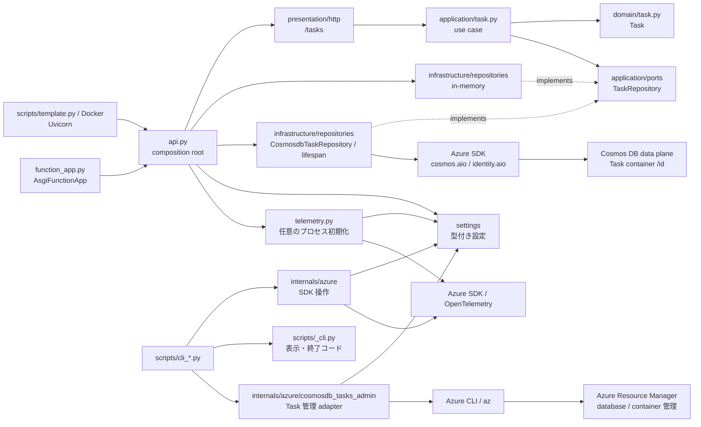

# アーキテクチャ

## プロジェクト概要

Python 3.10+ / FastAPI / Typer と Azure SDK を使う開発テンプレートです。
**HTTP の Task CRUD 参照実装**と、**Azure サービスを操作する独立した CLI サンプル**を提供します。
同じ FastAPI アプリを Uvicorn・Azure Functions・Azure Container Apps で動かします。
完成した業務システムや本番向けの永続化・認証基盤ではありません。

| 最初に知りたいこと | 読む場所 |
| --- | --- |
| 起動と開発環境 | [ローカル開発](../scripts.md)。InMemory・テレメトリ無効なら Azure リソース・サインインは不要 |
| HTTP の全体像 | `api.py` → `presentation/http` → `application/task.py` → `domain/task.py` |
| Azure 操作の全体像 | `scripts/cli_<service>.py` → `internals/azure/<service>.py` → `settings` |
| 公開と運用 | [デプロイ](../deployment.md)、[監視とログ](../monitoring.md) |

以下のソースパスとコマンドはリポジトリルート基準です。
パッケージ内のパスは `template_azure_python/` 配下を指します。

```shell
make install-deps-dev
uv run --locked python -m scripts.template serve-container-apps
```

`http://127.0.0.1:8000/tasks` が初期状態で `[]` を返し、`/docs` から API を操作できます。
旧モックの `GET /` は削除され、404 を返します。
`install-deps-dev` は既存の pre-commit hook を置き換えます。詳細は開発ガイドを参照してください。

## 構成と起動経路



実線は呼び出し・依存、破線は port の実装を示します。
`create_app()` は use case と具象 repository を明示的に接続します。
InMemory はアプリごとに独立し、Cosmos は設定したコンテナーを共有します。
use case の provider は composition root に置き、HTTP router は FastAPI の DI で受け取ります。
起動 CLI は選択値を factory に渡し、直接 Uvicorn を使う入口は `template_azure_python.api:app` です。
Functions は同じ app をラップします。
Functions の HTTP トリガーは匿名で、`host.json` により `/api` プレフィックスを付けません。
`TASK_REPOSITORY=cosmosdb` の場合、tasks API が非同期 Azure SDK を利用します。
SDK と資格情報は lifespan 内で一度だけ初期化し、正常終了・失敗・キャンセル時に解放します。
API は database / container を作成せず、起動時に存在と `/id` partition を検証します。

| 場所 | 責務 |
| --- | --- |
| `api.py` | アプリ生成、use case / adapter の組み立て、router 登録、任意のテレメトリ初期化 |
| `domain/` | Task、ID・status の型、値の正規化と不変条件 |
| `application/`、`application/ports/` | command、CRUD use case、repository の非同期 Protocol、application error |
| `infrastructure/repositories/` | InMemory / Cosmos の port 実装、document 変換、SDK error 変換、非同期 resource factory |
| `presentation/http/` | HTTP DTO、routing、応答・エラー変換 |
| `scripts/` | 起動コマンド、CLI 引数、表示、削除確認、終了コード |
| `internals/azure/` | サービス別 SDK 操作と Task 管理用 az adapter、結果変換、入力検証、リソース寿命 |
| `settings/`、`telemetry.py` | 設定の公開窓口とキャッシュ、プロセス単位の Azure Monitor 初期化 |
| `tests/`、`pyproject.toml`、`Makefile` | 回帰・構造テスト、依存と型の検査設定、開発・CI コマンド |
| `docs/`、`mkdocs.yml` | 日英の利用・設計ガイドとサイト構成 |

## 設計原則

「採用する規則」「採用理由」「実装・確認箇所」をセットで扱います。
層の名前を揃えるだけで設計が成立したとは判断しません。

| 規則 | 理由 | 実装・確認箇所 |
| --- | --- | --- |
| Task の依存は内側へ向ける | HTTP・保存技術を変えても業務側を変更しない | `domain` ← `application` ← `presentation` / `infrastructure`。import-linter |
| 内側に I/O の port を置く | use case が具象 SDK・repository を import しない | `TaskRepository` Protocol と repository contract test |
| 組み立ては明示する | 依存とアプリごとの状態分離を追える | `create_app()`。router 自動探索・独自 DI コンテナーは導入しない |
| Task の domain は標準ライブラリで書く | 業務モデルを HTTP/JSON・外部ライブラリから独立させる | frozen dataclass、enum、domain test。Pydantic は HTTP DTO と設定層で使う |
| HTTP の検証と業務の不変条件を分ける | HTTP 以外から呼んでも業務側の条件を守る | HTTP DTO は形式・必須項目、domain は正規化・値の条件、use case は処理の調整 |
| SDK と CLI 表示を分ける | SDK 操作を Typer や表示処理から独立させる | `internals/azure` は通常の値を返すか callback に渡す。SDK import は scripts に置かない |
| 設定を一か所で解決する | 優先順位と必須設定の判断を統一する | 公開 `settings` パッケージ。環境変数・dotenv への直接アクセスを分散させない |
| 資格情報と client の寿命を所有する | 成功・初期化失敗・キャンセル時のリークを避ける | API lifespan、非同期 resource factory、生成直後の解放登録、解放テスト |
| API の SDK 接点は infrastructure に置く | 保存技術を HTTP・業務側に漏らさない | Cosmos adapter。API / presentation の直接 Azure import を禁止 |
| 保存先の選択は composition root と settings で解決する | 既定の Azure 非依存と起動形態間の一貫性を保つ | `create_app()`、`--repository`、`TASK_REPOSITORY`。router 内で具象保存先を選択しない |
| SDK 例外を application の失敗契約に変換する | 未検出・重複と基盤障害を区別し、SDK 情報を露出しない | `TaskRepositoryError`、HTTP 503、安全な種別・status のログ |
| リソース管理を API のデータ操作から分離する | Entra ID の database / container 管理は管理プレーンが必要 | Task 管理 CLI → az → ARM。API に管理権限を付けない |
| 失敗を成功に見せない | 利用者と自動処理が失敗・部分結果を区別できる | HTTP error model、`InputError` / `OperationError`、CLI 終了コード |
| テレメトリは明示的な opt-in | ローカルの Azure 非依存を保ち、初期化失敗を隠さない | API は既定無効、有効時は fail-fast。provider はプロセスごとに一度だけ初期化 |
| 必要になるまで抽象化しない | テンプレートに未使用の仕組みを増やさない | 単純な CRUD と薄い CLI を維持。汎用 service 基底クラス・exporter registry は追加しない |

### Clean Architecture と DDD の位置付け

Clean Architecture は**技術と業務ルールの分離・ソース依存の向き**を扱います。
DDD は**業務の共通言語・モデル・整合性境界**を扱い、層分けとは別の判断です。
Task は縦スライスの参照例であり、業務分析済みの Bounded Context や完成した DDD モデルではありません。

`TaskId` の `NewType` は静的な型区別で、実行時の業務検証を備えた Value Object ではありません。
frozen dataclass は直接の属性変更を防ぎますが、業務操作のルールを自動生成しません。
Pydantic を内側で使わないことと Entity の不変性はこのテンプレートの判断であり、
Clean Architecture / DDD 一般の必須条件ではありません。
Aggregate、Domain Event、Unit of Work、複数 Context は業務上の必要性が生じたときに検討します。

## 維持する契約

### HTTP と repository

| 操作 | 契約 |
| --- | --- |
| `POST /tasks` | 201。UUID を生成し、status は `todo` |
| `GET /tasks`、`GET /tasks/{task_id}` | 200。Task の配列、または 1 件 |
| `PUT /tasks/{task_id}` | 200。title と status は必須。description 省略時は空文字に置換する。部分更新ではない |
| `DELETE /tasks/{task_id}` | 204、応答 body なし |
| エラー | 入力・domain 検証は 422、未検出は 404、重複は 409、保存先障害は 503。body は `{"detail": "メッセージ"}`。OpenAPI と一致させる |

HTTP DTO は未知の入力フィールドを拒否します。
title は空白だけを禁止し最大 200 文字、description は最大 2,000 文字です。
HTTP は元の入力長を検証し、domain は前後の空白を除去してから値を検証します。
status は `todo` / `in_progress` / `done`。現行 PUT はこれらの間の任意の変更を許可します。
HTTP 検証の例外ハンドラーはアプリ全体に登録されるため、今後の router も応答形式を合わせてください。

`TaskRepository` は `add/get/list/update/delete` の非同期契約です。
`get` の未検出は `None`、`update/delete` の未検出は `False`、
`add` の重複は `TaskAlreadyExistsError`。use case が未検出を application error に変換します。
インメモリ adapter の lock は操作単位であり、将来の adapter のトランザクション・競合制御を保証しません。
Cosmos adapter は UUID 文字列を `id` と partition key にし、status は文字列で保存します。
未検出はコンテナーの存在も確認し、消失した保存先を Task の 404 に見せません。
一覧は cross-partition query の全ページを読み切り、途中の失敗や不正 document は 503 とします。
全件取得の RU・メモリーコストと、更新が後勝ちである制限があります。

### 設定と認証

- 優先順位は **明示 CLI 引数 → OS 環境変数 → カレントディレクトリの `.env` → 既定値**。
  Azure 設定では空の OS 値を無視するため、`.env` に値があれば引き続き利用します。
- `get_project_settings()` は名前・ログレベル・API テレメトリ設定、
  `get_azure_settings()` はサービス別の階層化した設定を返します。
  環境変数名は `.env.template` のフラットな名前を維持し、大文字・小文字を区別しません。
  alias を持つフィールドに無関係な `NAME` や `RESOURCE_ID` を流用しません。
- getter は初回の値をキャッシュします。変更後は再起動し、テストではキャッシュをクリアします。
  `.env` の親ディレクトリ探索や OS 環境への一括注入は行いません。
- 保存先は `--repository` → `TASK_REPOSITORY` → `in-memory` で選択します。
  Cosmos は `AZURE_COSMOS_DB_ENDPOINT` / `DATABASE` / `TASK_CONTAINER` を使い、
  商品 CLI の `AZURE_COSMOS_DB_CONTAINER` とは分離します。
  Functions CLI は選択を子プロセス環境に渡し、親環境は変更しません。
- 必須 endpoint / ID とサービス固有の入力は操作時に検証します。
  無関係な Azure 設定の不足で、API 起動や他サービスの `--help` を失敗させません。
- Azure 操作の認証は `DefaultAzureCredential`。`az login`、マネージド ID 等を使います。
  SDK 自体の認証用変数は OS / ホスティング環境に設定し、dotenv の追加キーで代用しません。
- Task 管理 CLI だけは Azure CLI のサインインを使い、明示 subscription と管理プレーン RBAC を要求します。
  account / resource group は既存リソースを指定し、API のデータプレーン RBAC とは別です。
- Application Insights の送信だけは接続文字列を SDK に渡します。クエリの認証とは別です。
  接続文字列は `SecretStr` として dump から除外し、CLI 引数・ログ・ソースに出しません。

### CLI・リソース寿命・テレメトリ

- 入力エラーは終了コード 2、操作失敗は 1。診断は既存のサービス別 JSON / stderr 形式を維持します。
  Logs の部分結果はテーブルと error を残し、終了コード 1 で完全成功と区別します。
- Event Hubs は全 partition 共通の idle timeout・件数上限・task のキャンセルを維持し、checkpoint は保存しません。
  Service Bus は表示成功後に complete し、表示失敗時は acknowledge しません。
  Queue Storage の受信は削除せず、キュー削除は確認または明示的な `--yes` が必要です。
- Cosmos CLI は商品データと `/category` partition の例です。クエリはパラメーター化し、
  throughput 省略時は container 作成に値を渡しません。Task の永続化ではありません。
- `cli_cosmosdb tasks create-container/show-container/delete-container` は Task 専用の管理操作です。
  az の実行は `internals/azure` の薄い運用 adapter、確認と表示は scripts に置きます。
  shell を使わず引数配列で実行し、非ゼロ終了・timeout・不正 JSON・部分完了を通知します。
  コンテナー削除は確認または `--yes` が必須で、database は削除しません。移行は提供しません。
- Foundry は project URL を使い、2 ターンの表示順序を維持します。
- API の計装と CLI の `emit-telemetry` は別経路です。
  CLI は `TELEMETRY_ENABLED=false` でも明示送信し、プロセス全体の provider・ログを扱うため API 内から呼びません。
  SDK 制御用の環境変更は `telemetry_environment()` 内に限定し、失敗時も復元します。
  provider の flush 完了は Azure の取り込みや Live Metrics の表示を保証しません。

サービス別の手順・副作用は [Foundry](../foundry.md)、[Cosmos DB](../cosmosdb.md)、
[メッセージング](../messaging.md)、[監視とログ](../monitoring.md)を参照してください。

<a id="extending-existing-services"></a>

## 変更時の規則

### HTTP の業務機能を追加する

1. 共通用語、利用者の操作、成功・禁止シナリオ、必要な整合性境界を決める。
   無関係な業務へ Task の class を流用せず、縦スライスの構成を参考にする。
2. `domain/<feature>.py` に業務操作と不変条件、`application/<feature>.py` に command と処理の調整を置く。
   必要な I/O だけを `application/ports` の Protocol にする。
3. `infrastructure` に adapter、`presentation/http` に DTO・router・error mapping を置く。
   `api.py` と関連する `__init__.py` の公開 export を更新して接続する。
4. domain、use case、repository contract、API と OpenAPI をテストする。
   新しい業務ルールを既存 PUT 等で迂回できないか確認し、契約変更は明示する。

例えば「着手後だけ完了できる」は**将来の業務ルール例**で、現行仕様ではありません。
Cosmos Task Repository は同期の商品 CLI とは独立し、
非同期 I/O、document/domain 変換、partition、client の lifespan、SDK error の変換を扱います。
同時更新の保護には version / ETag と条件付き保存が必要で、port / use case の契約拡張も検討します。

### Azure CLI の技術操作を追加する

1. `settings/azure` のモデルと、秘密値を含まない `.env.template` を更新する。
   新しいモデルは `AzureSettings` と公開 export に組み込む。
2. `internals/azure` に操作を実装し、共通 helper を再利用する。
   endpoint のサービス固有要件は残し、認証前の検証・結果変換・解放を確認する。
3. 薄い `scripts/cli_<service>.py` を追加し、`cli_errors` と既存の表示 helper を利用する。
   引数優先順位・必須設定・失敗・終了コード・出力形状・キャンセルをテストする。
4. 直接関連する日英文書を同時に更新し、既存 CLI の有効な入力と出力契約を維持する。

## 検証と自動ガード

| 確認 | コマンド・対象 |
| --- | --- |
| Task の変更 | `uv run --locked pytest tests/test_task_domain.py tests/test_task_application.py tests/test_task_repositories.py tests/test_api.py` |
| Task コンテナー管理 | `tests/test_cli_cosmosdb_tasks.py`、商品 CLI / Queue の回帰。az subprocess をモック |
| 設定・Azure 操作の変更 | `tests/test_settings.py` と該当する `test_cli_<service>.py`、共通処理テスト |
| 書式・型・依存・workflow | `make format-check lint` |
| 全回帰 | `make test`。カバレッジはパッケージ・scripts・Functions の実行コードを対象にする |
| CI と同じ依存準備からの確認 | `make ci-test` |
| 日英ドキュメント | `make ci-test-docs` |

mypy strict の対象は `api.py` と Task の縦スライスです。ty / Pyrefly は設定されたプロジェクト範囲を検査します。
import-linter は内向きの層順序、presentation / infrastructure の相互非依存、
domain / application から FastAPI・Pydantic・Azure 等への禁止依存を検査します。
構造テストは scripts の SDK import、settings 外の環境アクセス、Azure 操作の CLI 依存を検査します。

**方針と自動保証は同一ではありません。** domain の標準ライブラリ限定方針について、
全外部ライブラリや未指定の内部パッケージへの import が自動禁止されるわけではありません。
新しい依存・Context を導入したら `pyproject.toml` の検査対象と契約も見直します。
型検査は実行時の業務ルール・トランザクション・Azure での動作を保証しません。
SDK 境界はモックし、write-once の OpenTelemetry provider の構築テストは別プロセスでオフライン実行します。

## 意図的な制限と非目標

- 既定の InMemory は再起動で消え、worker / process / replica 間で共有されません。
  Cosmos は永続化と共有が可能ですが、ページング、楽観的競合制御、業務上の状態遷移は未実装です。
- HTTP は認証なしの参照実装です。機密データを扱う本番環境にはアクセス制御と保存設計が必要です。
- Azure CLI は SDK の技術サンプルであり、Task API の業務 use case ではありません。
  メッセージ削除やデータ上書き等の副作用があります。検証用リソースを使ってください。
- account 構築・汎用インフラ管理はこのリポジトリに含みません。
  Task 用 database / container の準備は管理 CLI で行えます。外部 Terraform はサービス別ガイドを参照してください。
- HTTP 200、空の検索結果、ローカル flush の成功だけで Azure の取り込み・監視・本番適合性を保証しません。

## 出典・参考資料

原則と、このテンプレートへの適用判断を区別して参照してください。

- Robert C. Martin, [The Clean Architecture](https://blog.cleancoder.com/uncle-bob/2012/08/13/the-clean-architecture.html)：依存ルールと責務。
- Eric Evans / Domain Language, [DDD Reference](https://www.domainlanguage.com/ddd/reference/)：共通言語・モデル・境界。
- Microsoft, [Domain analysis](https://learn.microsoft.com/en-us/azure/architecture/microservices/model/domain-analysis) / [Tactical DDD](https://learn.microsoft.com/en-us/azure/architecture/microservices/model/tactical-domain-driven-design)：業務からモデルへの補足。マイクロサービス化は本テンプレートの必須条件ではありません。
- FastAPI, [Bigger Applications](https://fastapi.tiangolo.com/tutorial/bigger-applications/) / [Lifespan Events](https://fastapi.tiangolo.com/advanced/events/)：router の分離と共有リソースの寿命。
- Python, [Protocols](https://typing.python.org/en/latest/spec/protocol.html)、Pydantic, [Settings](https://docs.pydantic.dev/latest/concepts/pydantic_settings/)：型と設定の仕組み。
- Microsoft, [Cosmos DB transactions and optimistic concurrency](https://learn.microsoft.com/en-us/azure/cosmos-db/database-transactions-optimistic-concurrency)：partition 内の transaction と ETag。
- Import-linter, [Layers contract](https://github.com/seddonym/import-linter/blob/main/docs/contract_types/layers.md)：依存ガードの保証範囲。
