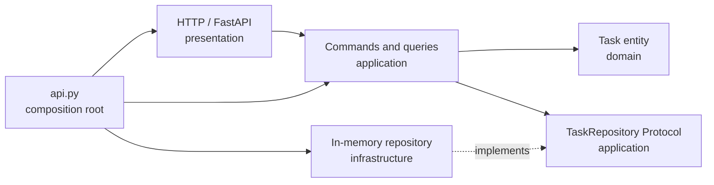
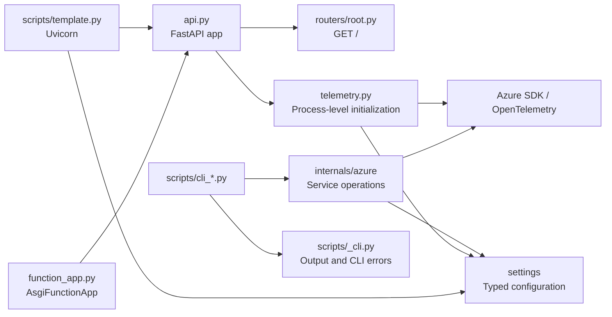
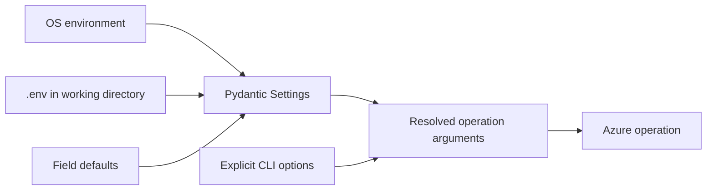

# Architecture

This project combines [FastAPI's multiple-files guide](https://fastapi.tiangolo.com/tutorial/bigger-applications/)
with Clean Architecture boundaries. HTTP routing, use cases, domain rules, persistence,
configuration, Azure operations, and command-line presentation have separate responsibilities.

## Clean Architecture template

The `/tasks` API is a reference vertical slice. Dependencies point inward; inner layers
do not know which web framework, database, or cloud SDK the application uses.



| Layer | Responsibility | May depend on |
| --- | --- | --- |
| `domain` | Entities, value types, invariants | Python standard library |
| `application` | Use cases, commands, queries, repository ports | `domain` |
| `infrastructure` | Database and external-service adapters | `application`, `domain` |
| `presentation` | HTTP DTOs, routing, error/status mapping | `application`, `domain` |
| `api.py` | Construct and connect concrete objects | All layers |

The domain uses frozen dataclasses and enums rather than Pydantic models. The application
depends on the structural `TaskRepository` protocol rather than a concrete repository.
FastAPI and Pydantic remain in the HTTP adapter. `create_app()` is the composition root;
each app receives a separate repository, which keeps tests isolated and makes adapter
replacement explicit.

### Adding a feature

Use the Task slice as a template rather than importing its classes into an unrelated domain:

1. Model business state and invariants in `domain/<feature>.py`.
2. Define required I/O as application `Protocol` ports and implement use cases in
   `application/<feature>.py`.
3. Implement infrastructure adapters against those ports. Do not expose SDK or database
   models through the port.
4. Define transport DTOs and mapping in `presentation/http`; translate application errors
   into HTTP responses there.
5. Wire concrete implementations only in `api.py`.
6. Add domain and use-case unit tests, an adapter contract test, and API integration tests.

To replace the in-memory adapter with Cosmos DB, implement the same `TaskRepository`
protocol, map Cosmos documents to and from `Task` inside that adapter, handle optimistic
concurrency there, and change only the construction in `api.py`. Domain and application
modules must not import Azure packages or settings.

### Automated guardrails

Run `make lint` to execute Ruff, strict mypy checks for the Clean Architecture packages,
ty, Pyrefly, and import-linter. Import-linter enforces the inward layer order, prevents
presentation and infrastructure from depending on each other, and prevents framework or
SDK imports in domain/application code. `make test` exercises each layer and the composed API.
The same commands run in CI.

## Components and entrypoints



- `template_azure_python.api:app` remains the Uvicorn entrypoint.
  `api.py` uses a small application factory that initializes optional telemetry,
  creates the app, and explicitly registers routers with `include_router`.
  It serves the same role as `main.py` in the FastAPI guide; a second entrypoint is unnecessary.
- `function_app.py` passes that same app to Azure Functions. The existing anonymous
  trigger and absence of an `/api` prefix are unchanged.
- `routers/root.py` owns the existing `GET /`, returning `{"Hello":"World"}`.
  `/docs` and OpenAPI remain available. There are no new Azure HTTP endpoints.
- Azure commands delegate to service operations in `internals/azure`.
  Scripts handle options, presentation, deletion confirmation, and exit codes,
  not SDK clients or SDK models.

With telemetry disabled (the default), the API does not create Azure clients at
startup or require Azure configuration. Enabling telemetry requires a valid
Application Insights connection string and fails startup if initialization fails.
See [local development](../scripts.md) and [deployment](../deployment.md) for execution.

## Package boundaries

```text
template_azure_python/
  api.py                       # telemetry call, app creation, router registration
  telemetry.py                 # process-level Azure Monitor initialization
  routers/
    root.py                    # current HTTP domain
  settings/
    _base.py                   # shared dotenv configuration
    project.py                 # ProjectSettings and cached getter
    azure/
      settings.py              # nested AzureSettings aggregate and cached getter
      <domain>.py              # service-specific Pydantic Settings models
    _telemetry.py              # scoped SDK environment controls
    __init__.py                # public configuration access
  internals/
    azure/
      _common.py               # validation, errors, client lifetime, Logs results
      <service>.py             # SDK operations and result conversion
scripts/
  _cli.py                      # CLI errors, JSON output, confirmation
  template.py                  # local launchers and basic commands
  cli_<service>.py              # Azure command entrypoints
```

Each Azure service has its own module: `cosmosdb`, `foundry`, `event_grid`,
`event_hubs`, `service_bus`, `queue_storage`, `azure_monitor`, `log_analytics`,
`application_insights`, `network_watcher`, and `activity_log`.
Internal operations return ordinary dictionaries, lists, strings, or counts.
SDK clients and result models stay inside the adapters.

There is no generic service base class, router auto-discovery, or dependency-injection
container. Repository protocols are introduced only at application boundaries that need
persistence; add other abstractions only when an actual responsibility requires them.

API telemetry follows the same rule. Azure Monitor is configured behind one small
module boundary, without an unused exporter registry or hand-built provider stack.
Routers and domain code use OpenTelemetry APIs if they need custom spans or metrics.

## Configuration

Application code accesses configuration through `template_azure_python.settings`:

- `get_project_settings()` supplies project name and logging level.
- `get_azure_settings()` supplies the application Azure settings listed in `.env.template`.
- `ProjectSettings` is a Pydantic Settings model. `AzureSettings` composes
  service-specific Pydantic Settings models and exposes values through nested
  paths such as `settings.cosmos_db.endpoint` and `settings.resource.subscription_id`.
  The models share UTF-8 dotenv loading, case-insensitive field names, and ignored
  unrelated keys while retaining the flat environment variable names in `.env.template`.



The priority is **explicit CLI options > OS environment > `.env` > field defaults**.
Operation adapters resolve omitted options from settings; an explicit option does not
modify the environment or the cached model.

The relative `.env` path is resolved from the current working directory, not by
searching parent directories. Run documented commands from the repository root.
A missing file is allowed: OS values and defaults still apply. An operation that
requires a missing endpoint or ID reports a missing option before authentication.
Azure settings ignore empty environment values, preserving optional resource-group
filters and the existing database, container, and consumer-group defaults.

Getters load settings on first use and cache the snapshot. Changing a configuration
file while a process is running requires a restart; tests clear caches explicitly.
Service-specific validation runs when that service is used, so unrelated missing
settings do not prevent API startup, another CLI, or `--help`.

Scripts do not call `load_dotenv`, and Typer options do not use `envvar`.
Pydantic reads dotenv values without injecting the entire file into `os.environ`.
Azure SDK authentication still uses `DefaultAzureCredential`, including `az login`
and managed identity. Configure SDK-owned authentication variables in the OS or
hosting environment; arbitrary extra dotenv keys are not exported to the SDK.

`APPLICATIONINSIGHTS_CONNECTION_STRING` is a `SecretStr` excluded from settings dumps.
It is never a CLI argument or part of the basic command's project-settings output.
The only application-owned environment mutation is `telemetry_environment()`:
it temporarily applies SDK controls for one emission and restores original values,
including unset variables, even on failure.

See [Pydantic Settings](https://pydantic.dev/docs/validation/latest/concepts/pydantic_settings/)
for the underlying sources and precedence.

## Errors, streaming, and client lifetime

Internal validation raises `InputError`; missing configuration raises its
`MissingSetting` subtype. SDK failures become `OperationError`. The CLI maps these
to input errors (exit 2) or operation failures (exit 1), keeping the existing
service-specific JSON or stderr diagnostics. Azure Logs partial results retain
their tables and a sanitized error, with exit 1 rather than a success-shaped fallback.

Context managers scope credentials and synchronous/asynchronous clients to each
CLI operation and close them on success, failure, and cancellation. Cosmos queries
remain parameterized and partition-scoped; omitting throughput does not set it
when creating a container.

Event Hubs and Service Bus use callbacks to hand ordinary records to the CLI.
This preserves streaming output without importing Typer in the adapters.
Service Bus displays a message before completing it; a failed display does not
acknowledge that message. Event Hubs retains its global idle timeout, event limit,
and cancellation of partition tasks. Foundry preserves two-turn output order.

Application Insights emission changes process-wide OpenTelemetry providers and
temporarily isolates logging. It is a **single-process CLI operation**, not a
per-request API helper. Provider flushing does not guarantee ingestion.
See [monitoring](../monitoring.md) for operational details.

## Adding a domain or service

### HTTP domain

1. Add `routers/<domain>.py` with an `APIRouter` and its path operations.
   Put a shared prefix, tags, responses, or dependencies on the router when needed.
2. Import the router module in `api.py` and register its `router` with `app.include_router`.
   Explicit module imports avoid collisions between variables named `router`.
3. Add response, validation, and OpenAPI tests. Use `Depends` for real shared
   dependencies; introduce `dependencies.py` only when it has a responsibility.

An Azure-backed HTTP domain should manage reusable clients through application
lifespan and inject them, rather than opening a Cosmos client for every request.
Choose asynchronous operations where appropriate. This is a future extension,
not initialization that the current root endpoint needs.

### Azure CLI

1. Add or extend the service-specific model under `settings/azure` and add
   nonsecret examples to `.env.template`. Compose a new service model in
   `AzureSettings` when needed.
2. Add a service operation under `internals/azure`. Resolve omitted configuration
   through the public settings package, validate before authentication, manage
   resources, and convert SDK results into ordinary values.
3. Add a thin `scripts/cli_<service>.py` using `cli_errors` and existing output helpers.
   Test explicit options, settings fallback, failures, output shape, and resource cleanup.

Tests enforce that SDK imports stay out of scripts, environment access stays in
settings, and Azure adapters do not depend on CLI presentation. Regression tests
mock SDK boundaries; the OpenTelemetry construction test runs offline in a separate
process to isolate write-once providers.
