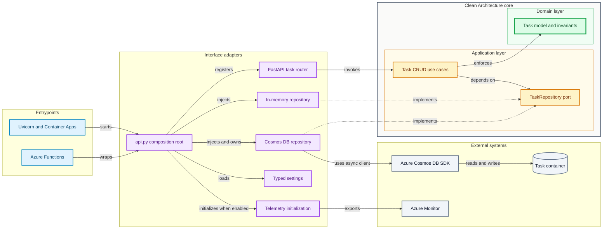
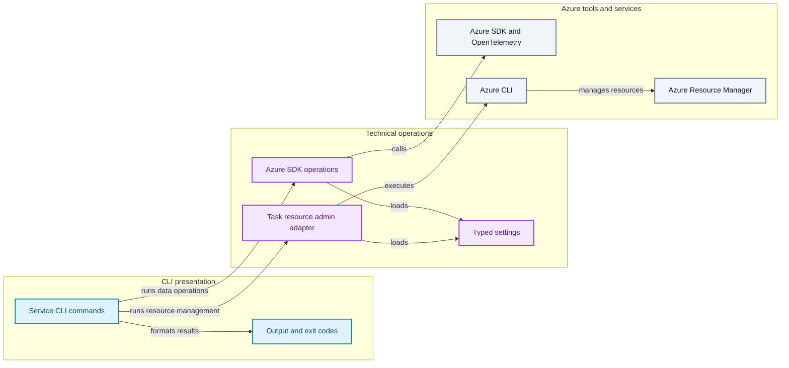

# Architecture

## Project overview

A development template using Python 3.10+, FastAPI, Typer, and Azure SDKs.
It provides an **HTTP Task CRUD reference implementation** and **independent Azure service CLI samples**.
The same FastAPI app runs through Uvicorn, Azure Functions, and Azure Container Apps.
It is not a complete business system or a production persistence/authentication platform.

| Start here to understand... | Read |
| --- | --- |
| Local setup and startup | [Local development](../scripts.md). No Azure resources or sign-in are needed with InMemory and telemetry disabled |
| The HTTP path | `api.py` → `presentation/http` → `application/task.py` → `domain/task.py` |
| The Azure path | `scripts/cli_<service>.py` → `internals/azure/<service>.py` → `settings` |
| Deployment and operations | [Deployment](../deployment.md), [monitoring and logs](../monitoring.md) |

Source paths and commands below are relative to the repository root.
Package-internal paths refer to locations under `template_azure_python/`.

```shell
make install-deps-dev
uv run --locked python -m scripts.template serve-container-apps
```

`http://127.0.0.1:8000/tasks` initially returns `[]`; `/docs` provides an interactive API.
The old mock `GET /` has been removed and returns 404.
`install-deps-dev` replaces an existing pre-commit hook. See the development guide for details.

## Components and entrypoints

### Task API - Clean Architecture



Blue is an entrypoint, purple is an interface adapter, amber is the application layer,
green is the domain, and gray is an external system. Dependencies cross the core boundary
inward; dotted arrows show implementations of the application-owned port.

### Azure operations CLI - independent technical path



This path is deliberately outside the Task API core: it demonstrates technical Azure operations
without making the domain or use cases depend on SDKs, Typer, or control-plane tools.
`create_app()` explicitly connects use cases to a concrete repository.
InMemory storage is isolated per app; Cosmos apps share the configured container.
Use-case providers live in the composition root and HTTP routes receive them through FastAPI DI.
The launcher injects the selected backend; direct Uvicorn uses `template_azure_python.api:app`.
Functions wraps that same app.
The Functions HTTP trigger is anonymous; `host.json` removes the `/api` prefix.
With `TASK_REPOSITORY=cosmosdb`, tasks API uses the asynchronous Azure SDK.
Lifespan initializes one client/credential per app and closes them on shutdown, failure, or cancellation.
The API does not create databases/containers: startup verifies their existence and the `/id` partition.

| Location | Responsibility |
| --- | --- |
| `api.py` | App creation, use-case/adapter composition, router registration, optional telemetry initialization |
| `domain/` | Task, ID/status types, normalization, and value invariants |
| `application/`, `application/ports/` | Commands, CRUD use cases, asynchronous repository Protocol, application errors |
| `infrastructure/repositories/` | InMemory/Cosmos port implementations, document mapping, SDK errors, asynchronous resource factory |
| `presentation/http/` | HTTP DTOs, routing, response/error mapping |
| `scripts/` | Launch commands, CLI arguments, presentation, deletion confirmation, exit codes |
| `internals/azure/` | Service SDK operations and Task management az adapter, mapping, validation, resource lifetime |
| `settings/`, `telemetry.py` | Public configuration access and caching, process-level Azure Monitor initialization |
| `tests/`, `pyproject.toml`, `Makefile` | Regression/structural tests, dependency/type rules, development/CI commands |
| `docs/`, `mkdocs.yml` | English/Japanese usage and design guides, site configuration |

## Design principles

Treat a rule, its rationale, and its implementation/check together.
Matching layer names alone does not establish the design.

| Rule | Rationale | Implementation/check |
| --- | --- | --- |
| Task dependencies point inward | Changing HTTP or storage technology should not change business code | `domain` ← `application` ← `presentation` / `infrastructure`; import-linter |
| Define I/O ports in inner layers | Use cases do not import concrete SDKs or repositories | `TaskRepository` Protocol and repository contract tests |
| Compose explicitly | Make dependencies and app-level state isolation traceable | `create_app()`; no router auto-discovery or custom DI container |
| Use the standard library in the Task domain | Keep business models independent of HTTP/JSON and external libraries | Frozen dataclasses, enums, domain tests; use Pydantic in HTTP DTOs and settings |
| Separate HTTP validation from business invariants | Business constraints also hold for non-HTTP callers | DTOs validate format/required fields; domain normalizes/validates values; use cases orchestrate |
| Separate SDK operations from CLI presentation | Keep operations independent of Typer and output code | `internals/azure` returns ordinary values or invokes callbacks; no SDK imports in scripts |
| Resolve settings centrally | Keep precedence and required-setting decisions consistent | Public `settings` package; do not scatter environment/dotenv access |
| Own credential/client lifetime | Avoid leaks on success, initialization failure, and cancellation | API lifespan, asynchronous resource factory, immediate cleanup registration, cleanup tests |
| Keep API SDK boundaries in infrastructure | Do not leak storage technology into HTTP/business code | Cosmos adapter; forbid direct Azure imports in API/presentation |
| Select storage in the composition root and settings | Keep the Azure-independent default and consistent entrypoints | `create_app()`, `--repository`, `TASK_REPOSITORY`; no concrete selection in routes |
| Translate SDK errors into application failures | Distinguish absence/conflicts from outages without exposing SDK details | `TaskRepositoryError`, HTTP 503, safe type/status logging |
| Separate resource management from API data operations | Entra database/container management requires the control plane | Task management CLI → az → ARM; no management privileges on the API identity |
| Do not make failures look successful | Users and automation must distinguish failure/partial results | HTTP error models, `InputError` / `OperationError`, CLI exit codes |
| Make telemetry an explicit opt-in | Preserve Azure-independent local use without hiding initialization failure | Disabled by default for the API; fail-fast when enabled; initialize once per process |
| Abstract only when needed | Avoid unused mechanisms in a template | Retain simple CRUD/thin CLIs; no generic service base class or exporter registry |

### Shared repository interface and separate implementations

**Share the storage-operation contract, not the implementation of each storage technology.**
The `TaskRepository` Protocol in `application/ports/task_repository.py` defines the asynchronous
`add/get/list/update/delete` interface shared by InMemory and Cosmos.
Use cases depend on this port; `api.py` selects and injects the concrete repository.

Python Protocols use **structural typing**: an implementation with the required methods and compatible
signatures satisfies the port without explicitly inheriting from it.
Both `InMemoryTaskRepository` and `CosmosdbTaskRepository` currently use this approach.
Explicitly inheriting from the existing Protocol is also an option when the implementation relationship
should be visible in class declarations; it does not require a separate ABC or generic repository base class.

Check conformance at two different levels:

- **Type checking**: injection as `TaskRepository` checks compatibility of methods, arguments, and return types.
- **Shared contract tests**: `test_repository_contract` in `tests/test_task_repositories.py` runs against both
  implementations, checking CRUD, absence, duplicates, and updates not creating missing Tasks.
  Matching method names alone does not guarantee these semantics.

Align absence, duplicates, and storage failures with the "Contracts to preserve" section below.
Keep dict/lock storage and Cosmos document mapping, partitioning, and SDK error translation in their adapters.
Forcing storage logic into a common base class would introduce backend-specific branches and mix responsibilities.
SDK call verification and connection-cleanup tests are distinct from the shared CRUD contract.

The Cosmos resource factory and API lifespan own client/credential initialization and cleanup.
Do not make those operations mandatory CRUD port methods: InMemory and use cases should not be required
to manage Cosmos-specific resource lifetimes.

### Clean Architecture and DDD

Clean Architecture concerns **technology/business separation and source dependency direction**.
DDD concerns **shared business language, models, and consistency boundaries**, a separate decision from layering.
Task demonstrates a vertical slice, not a business-analyzed Bounded Context or a complete DDD model.

`TaskId` uses `NewType` for static type distinction, not a Value Object with runtime business validation.
Frozen dataclasses prevent direct attribute changes but do not generate business-operation rules.
Avoiding Pydantic in inner layers and choosing immutable Entities are template-specific decisions,
not universal Clean Architecture/DDD requirements.
Consider Aggregates, Domain Events, Unit of Work, and multiple Contexts when the business requires them.

## Contracts to preserve

### HTTP and repository

| Operation | Contract |
| --- | --- |
| `POST /tasks` | 201; generates a UUID with initial status `todo` |
| `GET /tasks`, `GET /tasks/{task_id}` | 200; an array of Tasks or one Task |
| `PUT /tasks/{task_id}` | 200; title/status required; omitted description replaces it with an empty string; not a partial update |
| `DELETE /tasks/{task_id}` | 204, no response body |
| Errors | Input/domain validation: 422; not-found: 404; duplicate: 409; storage failure: 503. Body: `{"detail": "message"}`; keep OpenAPI aligned |

HTTP DTOs reject unknown input fields.
Titles cannot be whitespace-only and allow at most 200 characters; descriptions allow at most 2,000.
HTTP validates the original input length; the domain trims surrounding whitespace before validating values.
Statuses are `todo`, `in_progress`, and `done`; current PUT allows any change between these states.
The HTTP validation exception handler is registered app-wide: future routers must match its response format.

`TaskRepository` defines asynchronous `add/get/list/update/delete` operations.
Missing `get` returns `None`; missing `update/delete` returns `False`;
duplicate `add` raises `TaskAlreadyExistsError`. Use cases translate absence into an application error.
The in-memory adapter's lock is per operation, not a transaction/concurrency guarantee for future adapters.
Cosmos uses the UUID string as both `id` and partition key, and stores status as a string.
Not-found checks also verify container existence, so lost storage does not masquerade as a missing Task.
Lists consume all cross-partition pages; partial failures and invalid documents produce 503.
Full scans consume RUs/memory and updates remain last-writer-wins.

### Settings and authentication

- Precedence: **explicit CLI arguments → OS environment → `.env` in the working directory → defaults**.
  Azure settings ignore empty OS values, so an existing dotenv value still applies.
- `get_project_settings()` supplies project name, logging level, and API telemetry configuration;
  `get_azure_settings()` supplies nested service settings.
  Retain the flat, case-insensitive environment names in `.env.template`.
  Do not use unrelated `NAME` or `RESOURCE_ID` variables for aliased fields.
- Getters cache their first snapshot. Restart after changes; clear caches in tests.
  Do not search parent directories for `.env` or inject its contents into the OS environment.
- Select storage using `--repository` → `TASK_REPOSITORY` → `in-memory`.
  Cosmos uses `AZURE_COSMOS_DB_ENDPOINT` / `DATABASE` / `TASK_CONTAINER`,
  separate from the product CLI's `AZURE_COSMOS_DB_CONTAINER`.
  Functions CLI passes selection to the child environment without changing the parent.
- Validate required endpoints/IDs and service-specific input at operation time.
  Unrelated missing Azure settings must not prevent API startup or another service's `--help`.
- Azure operations use `DefaultAzureCredential`, including Azure CLI login and managed identity.
  SDK-owned authentication variables belong in the OS/hosting environment, not arbitrary extra dotenv keys.
- Only Task management uses Azure CLI authentication, explicit subscription, and control-plane RBAC.
  Select an existing account/resource group; API data-plane RBAC is separate.
- Only Application Insights emission passes a connection string to the SDK; query authentication is separate.
  Keep it as a `SecretStr` excluded from dumps, never in CLI arguments, logs, or source.

### CLI, resource lifetime, and telemetry

- Input errors exit 2; operation failures exit 1. Preserve service-specific JSON/stderr diagnostics.
  Logs partial results retain tables and an error with exit 1, not complete success.
- Event Hubs preserves a global partition-wide idle timeout, event limit, and task cancellation; no checkpoints.
  Service Bus completes messages after successful display and does not acknowledge failed display.
  Queue Storage receive does not delete; queue deletion requires confirmation or explicit `--yes`.
- Cosmos CLI demonstrates products with a `/category` partition. Queries stay parameterized;
  omitted throughput is not passed to container creation. This is not Task persistence.
- `cli_cosmosdb tasks create-container/show-container/delete-container` manages Task resources separately.
  A thin operation adapter in `internals/azure` executes az; scripts own confirmation/output.
  Argument arrays avoid a shell; nonzero exits, timeouts, invalid JSON, and partial completion are explicit failures.
  Deletion requires confirmation or `--yes`, never deletes the database, and does not provide migrations.
- Foundry uses a project URL and preserves two-turn output order.
- API instrumentation and CLI `emit-telemetry` are separate paths.
  The CLI explicitly emits even when `TELEMETRY_ENABLED=false`; it owns process-wide providers/logging,
  so do not call it inside the API.
  SDK environment mutations stay within `telemetry_environment()` and are restored even on failure.
  Successful provider flushing does not guarantee Azure ingestion or Live Metrics display.

See [Foundry](../foundry.md), [Cosmos DB](../cosmosdb.md), [messaging](../messaging.md),
and [monitoring](../monitoring.md) for service procedures and side effects.

<a id="extending-existing-services"></a>

## Changing the code

### Add HTTP business functionality

1. Define shared terms, user actions, successful/prohibited scenarios, and required consistency boundaries.
   Reuse the vertical-slice structure, not Task classes in unrelated business domains.
2. Put business operations/invariants in `domain/<feature>.py`, commands/orchestration in `application/<feature>.py`.
   Introduce Protocols in `application/ports` only for needed I/O.
3. Add adapters in `infrastructure` and DTOs/routers/error mapping in `presentation/http`.
   Wire them through `api.py` and the relevant `__init__.py` public exports.
4. Test domain rules, use cases, repository contracts, API responses, and OpenAPI.
   Check whether existing PUT or other paths bypass a new rule; explicitly record contract changes.

"Only started Tasks can be completed" is a **possible future business rule**, not current behavior.
The Cosmos Task Repository is independent of the synchronous product CLI and handles
asynchronous I/O, document/domain mapping, partitioning, client lifespan, and SDK error translation.
Protecting concurrent updates requires versions/ETags and conditional saves; consider port/use-case contract changes too.

### Add Azure CLI technical operations

1. Update models under `settings/azure` and nonsecret examples in `.env.template`.
   Compose new models into `AzureSettings` and public exports.
2. Implement operations in `internals/azure`, reusing shared helpers.
   Preserve service-specific endpoint requirements; check pre-auth validation, mapping, and cleanup.
3. Add a thin `scripts/cli_<service>.py` with `cli_errors` and existing output helpers.
   Test argument precedence, required settings, failures, exit codes, output shape, and cancellation.
4. Update directly related guides in both languages, preserving valid inputs and existing CLI output contracts.

## Validation and automated guards

| Check | Command/scope |
| --- | --- |
| Task changes | `uv run --locked pytest tests/test_task_domain.py tests/test_task_application.py tests/test_task_repositories.py tests/test_api.py` |
| Task container management | `tests/test_cli_cosmosdb_tasks.py`, product/Queue regressions; mock az subprocess |
| Settings/Azure operations | `tests/test_settings.py`, relevant `test_cli_<service>.py`, shared-operation tests |
| Format/types/dependencies/workflows | `make format-check lint` |
| Full regression | `make test`; coverage targets package, scripts, and Functions runtime code |
| CI checks including dependency setup | `make ci-test` |
| English/Japanese documentation | `make ci-test-docs` |

Strict mypy covers `api.py` and the Task vertical slice; ty/Pyrefly check their configured project scopes.
Import-linter enforces inward layer order, presentation/infrastructure independence,
and forbidden dependencies such as FastAPI, Pydantic, and Azure from domain/application.
Structural tests check SDK imports in scripts, environment access outside settings, and CLI dependencies in Azure operations.

**Policy and automated guarantees differ.** The standard-library-only domain policy does not
automatically forbid every external library or unlisted internal package.
Review scopes/contracts in `pyproject.toml` when introducing dependencies or Contexts.
Type checks do not guarantee runtime business rules, transactions, or operation in Azure.
Mock SDK boundaries; construct write-once OpenTelemetry providers in separate offline test processes.

## Intentional limits and non-goals

- Default InMemory Tasks disappear on restart and are not shared across workers/processes/replicas.
  Cosmos persists/shared storage; pagination, optimistic concurrency, and business state transitions remain unimplemented.
- HTTP is an anonymous reference implementation. Production sensitive-data handling needs access controls and storage design.
- Azure CLIs are technical SDK samples, not Task API business use cases.
  They can delete messages or overwrite data; use test resources.
- Account provisioning/general infrastructure management is outside this repository.
  The management CLI prepares Task databases/containers; service guides cover external Terraform scenarios.
- HTTP 200, empty query results, and successful local flushing alone do not establish Azure ingestion,
  monitoring coverage, or production readiness.

## Sources and further reading

Distinguish general principles from this template's application decisions.

- Robert C. Martin, [The Clean Architecture](https://blog.cleancoder.com/uncle-bob/2012/08/13/the-clean-architecture.html): dependency rules and responsibilities.
- Eric Evans / Domain Language, [DDD Reference](https://www.domainlanguage.com/ddd/reference/): language, models, and boundaries.
- Microsoft, [Domain analysis](https://learn.microsoft.com/en-us/azure/architecture/microservices/model/domain-analysis) / [Tactical DDD](https://learn.microsoft.com/en-us/azure/architecture/microservices/model/tactical-domain-driven-design): guidance from business to models; microservices are not mandatory for this template.
- FastAPI, [Bigger Applications](https://fastapi.tiangolo.com/tutorial/bigger-applications/) / [Lifespan Events](https://fastapi.tiangolo.com/advanced/events/): router separation and shared-resource lifetime.
- Python, [Protocols](https://typing.python.org/en/latest/spec/protocol.html); Pydantic, [Settings](https://docs.pydantic.dev/latest/concepts/pydantic_settings/): typing and configuration mechanisms.
- Microsoft, [Cosmos DB transactions and optimistic concurrency](https://learn.microsoft.com/en-us/azure/cosmos-db/database-transactions-optimistic-concurrency): partition-scoped transactions and ETags.
- Import-linter, [Layers contract](https://github.com/seddonym/import-linter/blob/main/docs/contract_types/layers.md): dependency guard scope.
