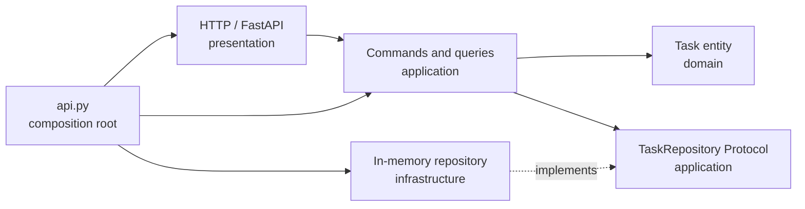
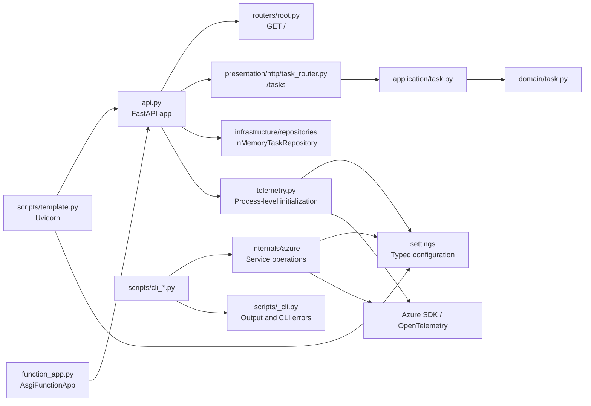
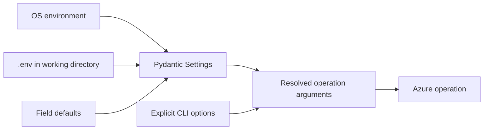

# Architecture

## Design approach

This template adds a typed Task CRUD vertical slice to
[FastAPI's multiple-files structure](https://fastapi.tiangolo.com/tutorial/bigger-applications/),
which separates HTTP, configuration, Azure operations, and CLI presentation.
The existing `GET /`, Azure Functions entrypoint, and Azure/CLI features remain unchanged.
Task is a reference implementation that needs no external service, not a complete DDD system.

### Clean Architecture: separate business rules from technology

Clean Architecture isolates business rules from HTTP, databases, and SDKs, with
**source-code dependencies pointing inward**. Inner layers define the I/O contracts
(ports) that outer adapters implement. A use case can call a repository at runtime
without importing a concrete database adapter.
The primary source is Robert C. Martin's
[The Clean Architecture](https://blog.cleancoder.com/uncle-bob/2012/08/13/the-clean-architecture.html).

### DDD: model business language, rules, and boundaries

Domain-driven design (DDD) uses language shared by domain experts and developers to
reflect business meaning and rules in models and code. Clean Architecture supports
dependency placement, while DDD addresses what to model.
**Separating layers alone does not establish DDD.**
Eric Evans' official [DDD Reference](https://www.domainlanguage.com/ddd/reference/)
is the primary source for the terminology.

| Term | Meaning and modeling decision |
| --- | --- |
| Ubiquitous Language | Terms shared by business stakeholders, conversations, and code. Prefer intent such as "start" or "complete" over "update" |
| Bounded Context | A scope within which terms and models have consistent meanings, not an Azure service name or deployment unit |
| Entity | Something whose identity persists as its values change. Task is a candidate |
| Value Object | An immutable object distinguished by its values rather than an ID, encapsulating rules for values such as money |
| Aggregate | A consistency boundary maintained in one update, accessed through a root Entity. It may contain only one Entity |

Clean Architecture's Entity layer classifies business rules; a DDD Entity classifies
identity. These are not equivalent definitions. The current `TaskId` uses `NewType`
for static type distinction, not a Value Object with business validation.
Task currently validates its title and other values, but `update()` accepts any status;
business rules for state transitions are not implemented.

The current structure is sufficient for simple CRUD. Add business operations,
Value Objects, and consistency boundaries when the domain requires them, rather than
mandating Domain Events, Unit of Work, multiple Contexts, or microservices.
Microsoft's
[Domain analysis](https://learn.microsoft.com/en-us/azure/architecture/microservices/model/domain-analysis)
and [Tactical DDD](https://learn.microsoft.com/en-us/azure/architecture/microservices/model/tactical-domain-driven-design)
provide practical guidance from business analysis to modeling.
Their microservice architecture is not a requirement for this template.

## Current Clean Architecture

The `/tasks` API is a vertical slice from domain to HTTP.
Solid arrows below show dependencies; the dotted arrow shows a port implementation.



| Layer | Responsibility | May depend on |
| --- | --- | --- |
| `domain` | Entities, value types, invariants | Python standard library |
| `application` | Use cases, commands, queries, repository ports | `domain` |
| `infrastructure` | Database and external-service adapters | `application`, `domain` |
| `presentation` | HTTP DTOs, routing, error/status mapping | `application`, `domain` |
| `api.py` | Construct and connect concrete objects | All layers |

The domain uses frozen dataclasses and enums rather than Pydantic models.
This template chooses to keep business models independent of HTTP/JSON validation,
conversion, and external libraries. Frozen dataclasses prevent direct attribute changes;
enums define the vocabulary of states, while the domain validates business rules.
Clean Architecture and DDD neither prohibit Pydantic nor require immutable Entities.
Using Pydantic models in the domain is also valid if that dependency is accepted.

The application
depends on the structural `TaskRepository` protocol rather than a concrete repository
(see the [Python Protocol specification](https://typing.python.org/en/latest/spec/protocol.html)).
FastAPI and Pydantic remain in the HTTP adapter. `create_app()` is the composition root;
each app receives a separate repository, which keeps tests isolated and makes adapter
replacement explicit.
In-memory state is lost on restart and is not shared across workers or processes.

## Development workflow: from business rules to implementation

Use the Task slice's structure as a template, not its classes in unrelated business domains.
Layer and adapter paths are relative to `template_azure_python/`;
test paths, project configuration, and commands are relative to the repository root.

| Step | Decisions and implementation location |
| --- | --- |
| 1. Understand the business | Briefly record shared terms, user actions, successful scenarios, and prohibited scenarios |
| 2. Choose boundaries | Define Contexts, Entities/Value Objects, invariants, and Aggregates that require consistent updates. Start with one Context for a small system |
| 3. Implement the domain | Put business operations and invariants in `domain/<feature>.py`; verify them with domain tests first |
| 4. Implement use cases | Put commands and orchestration of retrieval, business operations, and persistence in `application/<feature>.py`; define required I/O with Protocols in `application/ports` |
| 5. Connect outer layers | Put I/O and SDK mapping in `infrastructure`, DTOs/routing/HTTP error mapping in `presentation/http`; update `api.py` and public exports to wire them |
| 6. Validate | Test prohibited domain operations, use cases, repository contracts, API responses, and OpenAPI; run type and dependency guards |

HTTP DTOs validate format and required fields; the domain maintains business invariants
even when called without HTTP. Use cases orchestrate the workflow; do not move business
decisions into routers or SDK adapters.
Use this workflow for new HTTP business features rather than adding a router alone.
[Extension examples](#extending-existing-services) identify concrete files to change.

### Automated guardrails

Run `make lint` to execute Ruff, strict mypy checks for the Clean Architecture packages,
ty, Pyrefly, and import-linter. Current contracts enforce inward layer order, independence
between presentation and infrastructure, and no FastAPI, Pydantic, or Azure imports in
domain/application code
(see [import-linter's layer contract](https://github.com/seddonym/import-linter/blob/main/docs/contract_types/layers.md)).
The domain policy is standard-library-only, but contracts do not forbid every external
library. Type checking does not guarantee runtime business rules or enforce Context
boundaries that have not been configured; scenario tests are still necessary.
When introducing Contexts or external dependencies, also check the scopes and contracts
in `pyproject.toml`.

```bash
uv sync --locked --group dev
uv run --locked mypy
uv run --locked lint-imports
uv run --locked pytest tests/test_task_domain.py tests/test_task_application.py tests/test_api.py
```

These commands cover the current Task example; add the new feature's tests as well.
Use `make ci-test` for full validation and `make ci-test-docs` for documentation changes.
The same commands run in CI.

## Components and entrypoints



- `template_azure_python.api:app` remains the Uvicorn entrypoint.
  `api.py` uses a small application factory that initializes optional telemetry,
  creates the app, and explicitly registers routers with `include_router`.
  It serves the same role as `main.py` in the FastAPI guide; a second entrypoint is unnecessary.
- `function_app.py` passes that same app to Azure Functions. The existing anonymous
  trigger and absence of an `/api` prefix are unchanged.
- `routers/root.py` owns the existing `GET /`, returning `{"Hello":"World"}`.
  The Task router handles `/tasks` CRUD; `/docs` and OpenAPI remain available.
  There are no Azure-backed HTTP endpoints yet.
- Azure commands delegate to service operations in `internals/azure`.
  Scripts handle options, presentation, deletion confirmation, and exit codes,
  not SDK clients or SDK models.

With telemetry disabled (the default), the API does not create Azure clients at
startup or require Azure configuration. Enabling telemetry requires a valid
Application Insights connection string and fails startup if initialization fails.
See [local development](../scripts.md) and [deployment](../deployment.md) for execution.

## Package boundaries

```text
template_azure_python/
  api.py                       # composition root, telemetry, router registration
  domain/
    task.py                    # Task, TaskId, TaskStatus, invariants
  application/
    task.py                    # commands, CRUD use cases, application errors
    ports/task_repository.py   # asynchronous Repository Protocol
  infrastructure/
    repositories/in_memory_task.py # in-memory adapter
  presentation/
    http/task_schemas.py       # HTTP DTOs and mapping from the domain
    http/task_router.py        # router factory and error mapping
  telemetry.py                 # process-level Azure Monitor initialization
  routers/
    root.py                    # existing GET /
  settings/
    _base.py                   # shared dotenv configuration
    project.py                 # ProjectSettings and cached getter
    azure/
      settings.py              # nested AzureSettings aggregate and cached getter
      <domain>.py              # service-specific Pydantic Settings models
    _telemetry.py              # scoped SDK environment controls
    __init__.py                # public configuration access
  internals/
    azure/
      _common.py               # validation, errors, client lifetime, Logs results
      <service>.py             # SDK operations and result conversion
scripts/
  _cli.py                      # CLI errors, JSON output, confirmation
  template.py                  # local launchers and basic commands
  cli_<service>.py              # Azure command entrypoints
```

Each Azure service has its own module: `cosmosdb`, `foundry`, `event_grid`,
`event_hubs`, `service_bus`, `queue_storage`, `azure_monitor`, `log_analytics`,
`application_insights`, `network_watcher`, and `activity_log`.
Internal operations return ordinary dictionaries, lists, strings, or counts.
SDK clients and result models stay inside the adapters.

There is no generic service base class, router auto-discovery, or dependency-injection
container. Repository protocols are introduced only at application boundaries that need
persistence; add other abstractions only when an actual responsibility requires them.

API telemetry follows the same rule. Azure Monitor is configured behind one small
module boundary, without an unused exporter registry or hand-built provider stack.
Use OpenTelemetry in outer layers such as HTTP adapters for custom spans or metrics,
without bringing technology details into the domain.

## Configuration

Application code accesses configuration through `template_azure_python.settings`:

- `get_project_settings()` supplies project name and logging level.
- `get_azure_settings()` supplies the application Azure settings listed in `.env.template`.
- `ProjectSettings` is a Pydantic Settings model. `AzureSettings` composes
  service-specific Pydantic Settings models and exposes values through nested
  paths such as `settings.cosmos_db.endpoint` and `settings.resource.subscription_id`.
  The models share UTF-8 dotenv loading, case-insensitive field names, and ignored
  unrelated keys while retaining the flat environment variable names in `.env.template`.



The priority is **explicit CLI options > OS environment > `.env` > field defaults**.
Operation adapters resolve omitted options from settings; an explicit option does not
modify the environment or the cached model.

The relative `.env` path is resolved from the current working directory, not by
searching parent directories. Run documented commands from the repository root.
A missing file is allowed: OS values and defaults still apply. An operation that
requires a missing endpoint or ID reports a missing option before authentication.
Azure settings ignore empty environment values, preserving optional resource-group
filters and the existing database, container, and consumer-group defaults.

Getters load settings on first use and cache the snapshot. Changing a configuration
file while a process is running requires a restart; tests clear caches explicitly.
Service-specific validation runs when that service is used, so unrelated missing
settings do not prevent API startup, another CLI, or `--help`.

Scripts do not call `load_dotenv`, and Typer options do not use `envvar`.
Pydantic reads dotenv values without injecting the entire file into `os.environ`.
Azure SDK authentication still uses `DefaultAzureCredential`, including `az login`
and managed identity. Configure SDK-owned authentication variables in the OS or
hosting environment; arbitrary extra dotenv keys are not exported to the SDK.

`APPLICATIONINSIGHTS_CONNECTION_STRING` is a `SecretStr` excluded from settings dumps.
It is never a CLI argument or part of the basic command's project-settings output.
The only application-owned environment mutation is `telemetry_environment()`:
it temporarily applies SDK controls for one emission and restores original values,
including unset variables, even on failure.

See [Pydantic Settings](https://pydantic.dev/docs/validation/latest/concepts/pydantic_settings/)
for the underlying sources and precedence.

## Errors, streaming, and client lifetime

The Task API maps the domain's `InvalidTaskError` to 422 and the application's
`TaskNotFoundError` and `TaskAlreadyExistsError` to 404 and 409 respectively.
HTTP mapping stays in `presentation/http`.

Existing Azure operation validation raises `InputError`; missing configuration raises its
`MissingSetting` subtype. SDK failures become `OperationError`. The CLI maps these
to input errors (exit 2) or operation failures (exit 1), keeping the existing
service-specific JSON or stderr diagnostics. Azure Logs partial results retain
their tables and a sanitized error, with exit 1 rather than a success-shaped fallback.

Context managers scope credentials and synchronous/asynchronous clients to each
CLI operation and close them on success, failure, and cancellation. Cosmos queries
remain parameterized and partition-scoped; omitting throughput does not set it
when creating a container.

Event Hubs and Service Bus use callbacks to hand ordinary records to the CLI.
This preserves streaming output without importing Typer in the adapters.
Service Bus displays a message before completing it; a failed display does not
acknowledge that message. Event Hubs retains its global idle timeout, event limit,
and cancellation of partition tasks. Foundry preserves two-turn output order.

Application Insights emission changes process-wide OpenTelemetry providers and
temporarily isolates logging. It is a **single-process CLI operation**, not a
per-request API helper. Provider flushing does not guarantee ingestion.
See [monitoring](../monitoring.md) for operational details.

## Extending existing services

Both examples below describe **future implementation steps**.
Neither the completion operation nor a Cosmos Task Repository is provided yet.

### Example 1: add a business completion operation to Task

1. Agree on the business rule first. For example, if only a started Task can be completed,
   define `in_progress -> done` as success and completion from `todo` or `done` as errors.
   This is an illustrative rule, not the current API contract.
2. Add `complete()` and the required domain error in `domain/task.py`;
   test successful and prohibited transitions in `tests/test_task_domain.py`.
3. Add `CompleteTask` in `application/task.py`.
   Retrieve from the repository, invoke the domain operation, and save;
   test this flow and not-found behavior in application tests.
4. Add, for example, `POST /tasks/{task_id}/complete` and error mapping in
   `presentation/http/task_router.py`. Update `task_schemas.py` if needed,
   and wire the use case through `api.py` and public exports in the relevant `__init__.py` files.
5. Add response, prohibited-operation, and OpenAPI tests to `tests/test_api.py`.
   Check both the existing PUT endpoint and `Task.update()` for ways to bypass the rule;
   record compatibility implications when deliberately changing the API contract.

### Example 2: add an Azure/Cosmos DB adapter

1. Check the business port. For Task persistence, add an adapter in
   `infrastructure/repositories` that preserves `add/get/list/update/delete`
   and duplicate/not-found semantics from `application/ports/task_repository.py`.
2. Existing `internals/azure/cosmosdb.py` is a **synchronous CLI example for products
   with a `/category` partition key**, not a drop-in asynchronous Task Repository.
   Preserve the existing CLI and implement document/domain mapping, a partition key,
   asynchronous I/O, and SDK error translation in the new adapter.
3. Create and release reusable clients and credentials using
   [FastAPI lifespan](https://fastapi.tiangolo.com/advanced/events/), and connect
   the adapter and use cases in `api.py`. Keep configuration in existing settings;
   inner layers must not access SDKs or environment variables.
4. To protect concurrent updates, design for a version captured on read and a conditional save.
   The current port does not carry a version, so replacing the adapter alone may not suffice.
   Extend port/use-case contracts as needed and report conflicts as explicit application errors.
   Follow Cosmos DB's
   [ETag and transaction boundaries](https://learn.microsoft.com/en-us/azure/cosmos-db/database-transactions-optimistic-concurrency)
   and align Aggregate consistency requirements with logical partition scope.
5. Test duplicates, not-found, updates, deletes, and any added concurrency control
   through repository contracts. Test cleanup on SDK failure and cancellation,
   plus API regressions after wiring.

### Add technical operations to the existing Azure CLI

For SDK operations rather than business models, retain the existing thin CLI and adapter structure.

1. Add or extend the service-specific model under `settings/azure` and add
   nonsecret examples to `.env.template`. Compose a new service model in
   `AzureSettings` when needed.
2. Add a service operation under `internals/azure`. Resolve omitted configuration
   through the public settings package, validate before authentication, manage
   resources, and convert SDK results into ordinary values.
3. Add a thin `scripts/cli_<service>.py` using `cli_errors` and existing output helpers.
   Test explicit options, settings fallback, failures, output shape, and resource cleanup.

Tests enforce that SDK imports stay out of scripts, environment access stays in
settings, and Azure adapters do not depend on CLI presentation. Regression tests
mock SDK boundaries; the OpenTelemetry construction test runs offline in a separate
process to isolate write-once providers.

## Sources and further reading

Principles reference their authors' primary sources; official documentation supplements
implementation decisions. The Task/Cosmos procedures above apply those principles to
this repository, rather than reproducing source code or diagrams from these references.

- Robert C. Martin, [The Clean Architecture](https://blog.cleancoder.com/uncle-bob/2012/08/13/the-clean-architecture.html): dependency rules and separation of responsibilities.
- Eric Evans / Domain Language, [DDD Reference](https://www.domainlanguage.com/ddd/reference/): the author's official reference for DDD terms and patterns.
- Microsoft Azure Architecture Center, [Domain analysis](https://learn.microsoft.com/en-us/azure/architecture/microservices/model/domain-analysis) / [Tactical DDD](https://learn.microsoft.com/en-us/azure/architecture/microservices/model/tactical-domain-driven-design): business analysis, Contexts, Entities, Value Objects, and Aggregates.
- Python typing specification, [Protocols](https://typing.python.org/en/latest/spec/protocol.html): structural subtyping for repository ports.
- FastAPI, [Bigger Applications](https://fastapi.tiangolo.com/tutorial/bigger-applications/) / [Lifespan Events](https://fastapi.tiangolo.com/advanced/events/): router structure and shared resource lifetime.
- Microsoft, [Cosmos DB transactions and optimistic concurrency](https://learn.microsoft.com/en-us/azure/cosmos-db/database-transactions-optimistic-concurrency): transactions within partitions and conditional updates using ETags.
- Import-linter, [Layers contract](https://github.com/seddonym/import-linter/blob/main/docs/contract_types/layers.md): inward dependencies and independence of sibling layers.
