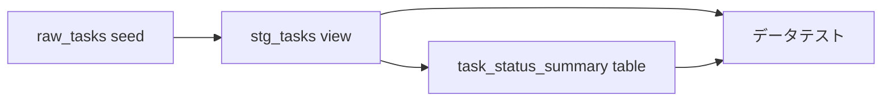

# dbt によるデータ変換

このリポジトリには、自己完結型の小さな [dbt](https://docs.getdbt.com/) プロジェクトが含まれます。
DuckDB を使用するため、データベースサービス、クラウドアカウント、認証情報なしで、ローカルと
GitHub Actions において同じパイプラインを実行できます。

## ユースケース

Task CRUD 機能のサンプルレコードを、状態別の集計へ変換します。



このプロジェクトでは、dbt の基本的なワークフローを確認できます。

- `raw_tasks` は `dbt seed` によって決定的な CSV データを読み込みます。
- `stg_tasks` は `ref()` で依存関係を宣言し、型と文字列を正規化します。
- `task_status_summary` は staging モデルを使い、状態ごとの Task 件数を集計します。
- generic data test は一意性、必須値、許可された状態値を検証します。
- singular SQL test は集計件数と staging の全件数が一致することを検証します。

## ローカル実行

環境を事前に準備する場合は、分離された dbt dependency group だけをインストールします。

```bash
make install-deps-dbt
```

依存グラフ全体をビルドし、すべてのデータテストを実行します。

```bash
make dbt-build
```

一部のグラフだけを開発するときは、標準の dbt 選択引数を `DBT_ARGS` で渡します。

```bash
make dbt-build DBT_ARGS="--select stg_tasks+"
```

dbt の生成ファイルとローカル DuckDB データベースを削除します。

```bash
make dbt-clean
```

生成されたデータベース、ログ、コンパイル済み SQL、インストール済み dbt package は Git の
追跡対象外です。

## プロジェクト構成

```text
dbt/
├── dbt_project.yml
├── profiles.yml
├── seeds/
│   └── raw_tasks.csv
├── models/
│   ├── staging/
│   │   ├── _staging.yml
│   │   └── stg_tasks.sql
│   └── marts/
│       ├── _marts.yml
│       └── task_status_summary.sql
└── tests/
    └── assert_task_status_summary_matches_staging.sql
```

`dbt build` は `ref()` の依存関係に従ってリソースを実行します。データテストが失敗すると
終了コードが非ゼロになるため、GitHub Actions の独立した `dbt` ジョブは、同じ
`make dbt-build` コマンドを使って不正な変更をブロックします。

## サービスのデータを追加する

サービスがデータを生成するようになったら、既存のレイヤーに従って追加します。

1. 決定的なサンプルとして小さな seed を追加するか、adapter を設定して本番の relation を
   dbt source として宣言します。
2. 安定した名前と型を公開する staging モデルを追加します。下流 SQL に relation 名を直接
   書かず、seed または source を参照します。
3. 識別子、必須フィールド、許可値、リレーションを検証する generic test を staging モデルの
   YAML に定義します。
4. `ref()` を使い、staging モデルから mart を構築します。
5. generic test で表現できない業務ルールは singular SQL test として追加します。
6. `make dbt-build` を実行します。dbt プロジェクトに追加したリソースは、既存の CI ジョブへ
   自動的に含まれます。

adapter の依存関係は `pyproject.toml` の `dbt` group に追加し、`uv.lock` を更新してください。
dbt をアプリケーションの本番依存関係には追加しません。
