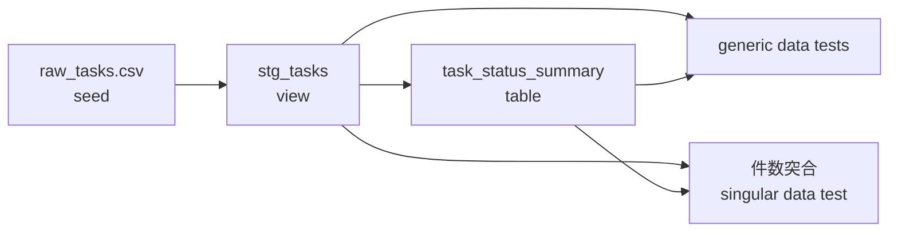

# dbt によるデータ変換

このページは、dbt を初めて使う人が次の二つを行えることを目的としています。

1. このリポジトリに用意された検証環境を動かす
2. 同じ検証環境を空の状態から作り直す

この環境は [dbt Core](https://docs.getdbt.com/docs/core) と
[DuckDB](https://duckdb.org/docs/stable/) を使います。外部データベース、クラウドアカウント、
認証情報は不要です。ローカルと GitHub Actions は、どちらも `make dbt-build` を実行します。

## 最初に知っておく用語

すべてを理解してから始める必要はありません。まずは次の対応だけ押さえてください。

| 用語 | この環境での役割 |
| --- | --- |
| dbt project | SQL、設定、テストをまとめた `dbt/` ディレクトリ |
| adapter | dbt とデータベースを接続する部品。この環境では `dbt-duckdb` |
| profile | 接続先の設定。この環境ではローカル DuckDB ファイル |
| seed | dbt がテーブルとして読み込む小さな CSV |
| model | `select` 文で記述するデータ変換。実行すると view または table になる |
| `ref()` | seed や model を名前で参照し、実行順序を dbt に伝える関数 |
| data test | SQL の結果が0行なら成功するデータ検証 |
| lineage | seed と model がどの順番で依存しているかを表す関係 |

より詳しくは dbt 公式の
[About dbt projects](https://docs.getdbt.com/docs/build/projects) と
[About `ref` function](https://docs.getdbt.com/reference/dbt-jinja-functions/ref) を参照してください。

## まず既存環境を動かす

### 前提

- Git でこのリポジトリを取得済みであること
- [uv](https://docs.astral.sh/uv/getting-started/installation/) がインストール済みであること
- `make` を実行できること

以降のコマンドは、`pyproject.toml` と `Makefile` があるリポジトリルートで実行します。

### 1. dbt の依存関係をインストールする

```bash
make install-deps-dbt
```

内部では次のコマンドを実行しています。

```bash
uv sync --locked --only-group dbt
```

`--locked` は `uv.lock` を変更せず、記録済みのバージョンを使うための指定です。
`--only-group dbt` により、アプリケーション本体の依存関係と dbt の依存関係を分離します。
dependency group の仕組みは uv 公式の
[Development dependencies](https://docs.astral.sh/uv/concepts/projects/dependencies/#development-dependencies)
を参照してください。

### 2. 接続設定を確認する

```bash
uv run --locked --only-group dbt dbt debug \
  --project-dir dbt \
  --profiles-dir dbt
```

最後に `All checks passed!` と表示されれば、dbt project と DuckDB の設定を読み込めています。
`dbt debug` の詳細は
[dbt debug command](https://docs.getdbt.com/reference/commands/debug) を参照してください。

### 3. データの読み込み、変換、テストをまとめて実行する

```bash
make dbt-build
```

内部では次のコマンドを実行しています。

```bash
uv run --locked --only-group dbt dbt build \
  --project-dir dbt \
  --profiles-dir dbt
```

`dbt build` は依存関係の順に seed、model、test を実行します。この環境では次の順番です。



正常終了すると、末尾におおむね次のような結果が表示されます。

```text
Completed successfully
Done. PASS=13 WARN=0 ERROR=0 SKIP=0 ... TOTAL=13
```

この13件は、seed 1件、model 2件、data test 10件です。`ERROR=0` であることを確認してください。
`dbt build` の動作は
[About dbt build command](https://docs.getdbt.com/reference/commands/build) を参照してください。

### 4. 一部だけ実行する

`stg_tasks` と、それに依存する下流の model/test だけを実行する例です。

```bash
make dbt-build DBT_ARGS="--select stg_tasks+"
```

末尾の `+` は選択した model の下流も含める指定です。選択構文は
[Graph operators](https://docs.getdbt.com/reference/node-selection/graph-operators) を参照してください。

### 5. 生成物を削除する

```bash
make dbt-clean
```

`dbt/target/` に生成された DuckDB データベース、コンパイル済み SQL、manifest などが削除されます。
これらは再生成できるため Git にはコミットしません。

## 何が検証されるか

入力は `dbt/seeds/raw_tasks.csv` にある6件の Task です。`status` にはアプリケーションと同じ
`todo`、`in_progress`、`done` を使います。

`stg_tasks` では、ID を UUID に変換し、文字列の前後の空白や status の大文字小文字を正規化します。
YAML で次を検証します。

- `task_id` が欠損していない
- `task_id` が重複していない
- `title` が欠損していない
- `status` が欠損していない
- `status` が `todo`、`in_progress`、`done` のいずれかである

`task_status_summary` は status ごとの Task 件数を集計します。さらに、集計後の合計件数が
`stg_tasks` の全件数と一致することを SQL test で確認します。

generic data test と singular data test の違いは dbt 公式の
[Data tests](https://docs.getdbt.com/docs/build/data-tests) を参照してください。

## 同じ環境をゼロから構築する

ここからは、現在のファイルが存在しないと仮定して、同じ環境を再現する手順です。
コマンドはリポジトリルートで実行してください。

### Step 1. dbt の依存関係を追加する

`pyproject.toml` の `[dependency-groups]` に、アプリケーションとは独立した `dbt` group を
追加します。

```toml
[dependency-groups]
dbt = [
    "dbt-duckdb>=1.10,<2",
]
```

lockfile を更新します。

```bash
uv lock
```

`dbt-duckdb` は dbt Core と DuckDB adapter を提供します。adapter の設定項目は
[DuckDB setup](https://docs.getdbt.com/docs/local/connect-data-platform/duckdb-setup) と
[duckdb/dbt-duckdb](https://github.com/duckdb/dbt-duckdb) を参照してください。

### Step 2. ディレクトリを作成する

```bash
mkdir -p \
  dbt/seeds \
  dbt/models/staging \
  dbt/models/marts \
  dbt/tests
```

完成時の構成は次のとおりです。

```text
dbt/
├── dbt_project.yml
├── profiles.yml
├── seeds/
│   └── raw_tasks.csv
├── models/
│   ├── staging/
│   │   ├── _staging.yml
│   │   └── stg_tasks.sql
│   └── marts/
│       ├── _marts.yml
│       └── task_status_summary.sql
└── tests/
    └── assert_task_status_summary_matches_staging.sql
```

### Step 3. dbt project を設定する

`dbt/dbt_project.yml` を作成します。

```yaml
name: task_analytics
version: "1.0.0"
config-version: 2

profile: task_analytics

model-paths: ["models"]
seed-paths: ["seeds"]
test-paths: ["tests"]
macro-paths: ["macros"]

clean-targets:
  - target
  - dbt_packages

models:
  task_analytics:
    staging:
      +materialized: view
    marts:
      +materialized: table

seeds:
  task_analytics:
    raw_tasks:
      +column_types:
        id: varchar
        title: varchar
        description: varchar
        status: varchar
```

重要な点は次のとおりです。

- `profile` は次に作成する `profiles.yml` の名前と一致させます。
- staging model は軽量な `view` として作ります。
- 集計結果の mart は `table` として作ります。
- CSV の ID が自動で数値などに推論されないよう、seed の列型を明示します。

設定項目の一覧は
[`dbt_project.yml` reference](https://docs.getdbt.com/reference/dbt_project.yml) を参照してください。

### Step 4. DuckDB への接続を設定する

`dbt/profiles.yml` を作成します。

```yaml
task_analytics:
  target: dev
  outputs:
    dev:
      type: duckdb
      path: dbt/target/task_analytics.duckdb
      threads: 1
```

この設定では `dbt/target/task_analytics.duckdb` がローカルに作られます。外部サーバーへの
接続情報やパスワードはありません。profile の役割は
[Connection profiles](https://docs.getdbt.com/docs/core/connect-data-platform/profiles.yml)
を参照してください。

ここで一度、設定を確認できます。

```bash
uv run --locked --only-group dbt dbt debug \
  --project-dir dbt \
  --profiles-dir dbt
```

### Step 5. 入力となる seed を作成する

`dbt/seeds/raw_tasks.csv` を作成します。

```csv
id,title,description,status
00000000-0000-0000-0000-000000000001,Define API contract,Document the first service endpoint,done
00000000-0000-0000-0000-000000000002,Implement task repository,Add the persistence adapter,in_progress
00000000-0000-0000-0000-000000000003,Add integration tests,Cover the repository boundary,in_progress
00000000-0000-0000-0000-000000000004,Review telemetry fields,Confirm the required dimensions,todo
00000000-0000-0000-0000-000000000005,Prepare release notes,Summarize user-visible changes,todo
00000000-0000-0000-0000-000000000006,Plan next service,Reuse the validated template,todo
```

seed は、バージョン管理できる小さな参照データや検証用データに適しています。機密情報や
大規模な本番データは seed に含めません。詳細は
[Add seeds to your DAG](https://docs.getdbt.com/docs/build/seeds) を参照してください。

### Step 6. staging model を作成する

`dbt/models/staging/stg_tasks.sql` を作成します。

```sql
select
    cast(id as uuid) as task_id,
    trim(title) as title,
    trim(description) as description,
    lower(trim(status)) as status
from {{ ref("raw_tasks") }}
```

`ref("raw_tasks")` はテーブル名の単純な置換ではありません。dbt に
「`stg_tasks` は `raw_tasks` の後に実行する」という依存関係も伝えます。

続いて `dbt/models/staging/_staging.yml` を作成します。

```yaml
version: 2

models:
  - name: stg_tasks
    description: Task records normalized for downstream analytics models.
    columns:
      - name: task_id
        description: Stable task identifier.
        data_tests:
          - unique
          - not_null
      - name: title
        description: Human-readable task title.
        data_tests:
          - not_null
      - name: status
        description: Current task lifecycle status.
        data_tests:
          - not_null
          - accepted_values:
              arguments:
                values:
                  - todo
                  - in_progress
                  - done
```

### Step 7. mart model を作成する

`dbt/models/marts/task_status_summary.sql` を作成します。

```sql
select
    status,
    count(*) as task_count
from {{ ref("stg_tasks") }}
group by status
```

`dbt/models/marts/_marts.yml` を作成します。

```yaml
version: 2

models:
  - name: task_status_summary
    description: Number of tasks in each lifecycle status.
    columns:
      - name: status
        description: Task lifecycle status.
        data_tests:
          - unique
          - not_null
          - accepted_values:
              arguments:
                values:
                  - todo
                  - in_progress
                  - done
      - name: task_count
        description: Number of tasks with this status.
        data_tests:
          - not_null
```

### Step 8. 業務ルールの SQL test を作成する

`dbt/tests/assert_task_status_summary_matches_staging.sql` を作成します。

```sql
with staging_total as (
    select count(*) as task_count
    from {{ ref("stg_tasks") }}
),

summary_total as (
    select coalesce(sum(task_count), 0) as task_count
    from {{ ref("task_status_summary") }}
)

select
    staging_total.task_count as staging_task_count,
    summary_total.task_count as summary_task_count
from staging_total
cross join summary_total
where staging_total.task_count != summary_total.task_count
```

dbt の data test は「失敗している行を返す SQL」です。この SQL は件数が一致すると0行を返して
成功し、一致しない場合だけ1行を返して失敗します。

### Step 9. ローカルと CI で共通のコマンドを作る

`Makefile` に次を追加します。レシピ行の先頭は空白ではなくタブです。

```makefile
.PHONY: install-deps-dbt
install-deps-dbt: ## install dependencies for dbt
	uv sync --locked --only-group dbt

DBT_ARGS ?=

.PHONY: dbt-build
dbt-build: ## build and test dbt models
	uv run --locked --only-group dbt dbt build --project-dir dbt --profiles-dir dbt $(DBT_ARGS)

.PHONY: dbt-clean
dbt-clean: ## remove dbt generated files
	uv run --locked --only-group dbt dbt clean --project-dir dbt --profiles-dir dbt
```

直接 `dbt build` を書く代わりに Make target をCIからも呼ぶことで、ローカルとCIの手順が
ずれることを防ぎます。

### Step 10. 生成物を Git の対象外にする

`.gitignore` に次を追加します。

```gitignore
# dbt
dbt/target/
dbt/logs/
dbt/dbt_packages/
dbt/.user.yml
*.duckdb
*.duckdb.wal
```

### Step 11. ローカルで完成を確認する

```bash
make install-deps-dbt
make dbt-build
```

`PASS=13`、`ERROR=0` なら、このページと同じ環境を再現できています。テストが本当に変更を
検出することも試せます。

1. `dbt/seeds/raw_tasks.csv` の status を1件だけ `invalid` に変更する
2. `make dbt-build` が `accepted_values` test で失敗することを確認する
3. status を元に戻す
4. `make dbt-build` が成功することを確認する

### Step 12. GitHub Actions に追加する

`.github/workflows/test.yaml` の `jobs:` 配下に、既存のアプリケーションテストとは独立した
ジョブを追加します。

```yaml
dbt:
  runs-on: ubuntu-latest
  timeout-minutes: 5
  steps:
    - uses: actions/checkout@3d3c42e5aac5ba805825da76410c181273ba90b1
      with:
        persist-credentials: false
    - name: Set up uv with caching enabled
      uses: astral-sh/setup-uv@c18668ad3cf93ea998bef934396af7bb5c839dc7
      with:
        enable-cache: true
        version: "0.12.19"
        python-version: "3.13"
    - name: Set up Python 3.13
      uses: actions/setup-python@5fda3b95a4ea91299a34e894583c3862153e4b97
      with:
        python-version: "3.13"
    - name: Build and test dbt models
      run: make dbt-build
```

action の参照を commit SHA で固定することで、意図しない action の変更を避けています。
新しい model や test を `dbt/` 配下に追加すると、次回から同じ `make dbt-build` の対象になります。

## 新しいサービスのデータを追加する

最初は既存の Task と同じパターンをコピーすると理解しやすくなります。

1. 小さな検証データを `dbt/seeds/` に追加する
2. `dbt/models/staging/` に型と名前を整える model を追加する
3. staging の YAML に `not_null`、`unique`、`accepted_values` などを追加する
4. `dbt/models/marts/` に利用目的に合わせた model を追加する
5. generic test で表現できない業務ルールを `dbt/tests/` に追加する
6. `make dbt-build` を実行する

実サービスへ接続するときは、seed を増やし続けるのではなく
[Sources](https://docs.getdbt.com/docs/build/sources) を定義し、対象データベース用 adapter と
認証情報の管理方法を別途設計してください。認証情報は Git にコミットしません。

## よくある問題

### `uv: command not found`

[uv installation](https://docs.astral.sh/uv/getting-started/installation/) に従って uv を
インストールし、ターミナルを開き直します。

### `Could not find profile named 'task_analytics'`

次の二つが一致しているか確認します。

- `dbt/dbt_project.yml` の `profile: task_analytics`
- `dbt/profiles.yml` の最上位キー `task_analytics:`

また、コマンドに `--profiles-dir dbt` が含まれていることを確認します。

### model が見つからない、または実行されない

- SQL ファイルが `dbt/models/` 配下にあるか
- `dbt_project.yml` の `model-paths` が `["models"]` か
- `ref()` の名前がファイル名から `.sql` を除いた名前と一致するか

を確認します。

### YAML の読み込みに失敗する

YAML はインデントで構造を表します。タブを使わず、既存ファイルと同じ空白数にそろえてください。
次のコマンドでも設定を確認できます。

```bash
uv run --locked --only-group dbt dbt parse \
  --project-dir dbt \
  --profiles-dir dbt
```

### DuckDB ファイルを削除できない

DuckDB ファイルを開いている別の dbt、Python、エディタ拡張機能を終了してから
`make dbt-clean` を再実行してください。

## 一次情報

- [dbt Developer Hub](https://docs.getdbt.com/)
- [dbt Core documentation](https://docs.getdbt.com/docs/core)
- [DuckDB setup for dbt](https://docs.getdbt.com/docs/local/connect-data-platform/duckdb-setup)
- [dbt-duckdb source repository](https://github.com/duckdb/dbt-duckdb)
- [dbt command reference](https://docs.getdbt.com/reference/dbt-commands)
- [DuckDB documentation](https://duckdb.org/docs/stable/)
- [uv project dependencies](https://docs.astral.sh/uv/concepts/projects/dependencies/)
