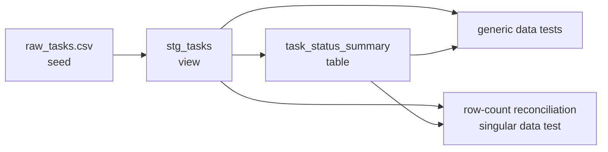

# Data transformation with dbt

This page is designed to help someone new to dbt do two things:

1. Run the validation environment provided by this repository
2. Recreate the same validation environment from an empty starting point

This environment uses [dbt Core](https://docs.getdbt.com/docs/core) and
[DuckDB](https://duckdb.org/docs/stable/). It does not require an external database,
cloud account, or credentials. Both local development and GitHub Actions run
`make dbt-build`.

## Terms to know before you start

You do not need to understand everything before starting. Begin with these basic
relationships:

| Term | Role in this environment |
| --- | --- |
| dbt project | The `dbt/` directory containing SQL, configuration, and tests |
| adapter | The component connecting dbt to a database; this environment uses `dbt-duckdb` |
| profile | Connection configuration; this environment points to a local DuckDB file |
| seed | A small CSV file that dbt loads as a table |
| model | A data transformation written as a `select` statement and built as a view or table |
| `ref()` | A function that references a seed or model by name and tells dbt the execution order |
| data test | A data validation that succeeds when its SQL query returns zero rows |
| lineage | The dependency relationship that describes the order between seeds and models |

For more detail, see the official dbt documentation for
[About dbt projects](https://docs.getdbt.com/docs/build/projects) and
[About `ref` function](https://docs.getdbt.com/reference/dbt-jinja-functions/ref).

## Run the existing environment first

### Prerequisites

- You have cloned this repository with Git
- [uv](https://docs.astral.sh/uv/getting-started/installation/) is installed
- You can run `make`

Run all commands below from the repository root containing `pyproject.toml` and
`Makefile`.

### 1. Install the dbt dependencies

```bash
make install-deps-dbt
```

This target runs the following command:

```bash
uv sync --locked --only-group dbt
```

`--locked` uses the versions recorded in `uv.lock` without changing the lockfile.
`--only-group dbt` keeps the dbt dependencies separate from the application
dependencies. For details about dependency groups, see uv's official
[Development dependencies](https://docs.astral.sh/uv/concepts/projects/dependencies/#development-dependencies)
documentation.

### 2. Check the connection configuration

```bash
uv run --locked --only-group dbt dbt debug \
  --project-dir dbt \
  --profiles-dir dbt
```

If the command ends with `All checks passed!`, dbt successfully loaded the project
and DuckDB configuration. For details, see the
[dbt debug command](https://docs.getdbt.com/reference/commands/debug).

### 3. Load the data, transform it, and run the tests

```bash
make dbt-build
```

This target runs the following command:

```bash
uv run --locked --only-group dbt dbt build \
  --project-dir dbt \
  --profiles-dir dbt
```

`dbt build` runs seeds, models, and tests in dependency order. This environment
uses the following order:



A successful run ends with output similar to:

```text
Completed successfully
Done. PASS=13 WARN=0 ERROR=0 SKIP=0 ... TOTAL=13
```

These 13 resources consist of one seed, two models, and ten data tests. Confirm that
the output contains `ERROR=0`. For more information, see
[About dbt build command](https://docs.getdbt.com/reference/commands/build).

### 4. Run only part of the project

The following example runs `stg_tasks` and its downstream models and tests:

```bash
make dbt-build DBT_ARGS="--select stg_tasks+"
```

The trailing `+` includes downstream resources of the selected model. See
[Graph operators](https://docs.getdbt.com/reference/node-selection/graph-operators)
for selection syntax.

### 5. Remove generated files

```bash
make dbt-clean
```

This removes the DuckDB database, compiled SQL, manifest, and other files generated
under `dbt/target/`. These files can be regenerated and are not committed to Git.

## What is validated

The input consists of six Task records in `dbt/seeds/raw_tasks.csv`. The `status`
column uses the same `todo`, `in_progress`, and `done` values as the application.

`stg_tasks` converts IDs to UUIDs, trims surrounding whitespace, and normalizes the
letter case of status values. Its YAML validates that:

- `task_id` is not missing
- `task_id` is not duplicated
- `title` is not missing
- `status` is not missing
- `status` is one of `todo`, `in_progress`, or `done`

`task_status_summary` counts Tasks by status. A SQL test also verifies that the
total count after aggregation matches the total number of rows in `stg_tasks`.

For the difference between generic and singular data tests, see dbt's official
[Data tests](https://docs.getdbt.com/docs/build/data-tests) documentation.

## Build the same environment from scratch

This section assumes the current files do not exist and recreates the same
environment. Run every command from the repository root.

### Step 1. Add the dbt dependencies

Add a `dbt` group under `[dependency-groups]` in `pyproject.toml`, separate from
the application dependencies:

```toml
[dependency-groups]
dbt = [
    "dbt-duckdb>=1.10,<2",
]
```

Update the lockfile:

```bash
uv lock
```

`dbt-duckdb` provides dbt Core and the DuckDB adapter. For adapter configuration,
see [DuckDB setup](https://docs.getdbt.com/docs/local/connect-data-platform/duckdb-setup)
and [duckdb/dbt-duckdb](https://github.com/duckdb/dbt-duckdb).

### Step 2. Create the directories

```bash
mkdir -p \
  dbt/seeds \
  dbt/models/staging \
  dbt/models/marts \
  dbt/tests
```

The completed layout is:

```text
dbt/
├── dbt_project.yml
├── profiles.yml
├── seeds/
│   └── raw_tasks.csv
├── models/
│   ├── staging/
│   │   ├── _staging.yml
│   │   └── stg_tasks.sql
│   └── marts/
│       ├── _marts.yml
│       └── task_status_summary.sql
└── tests/
    └── assert_task_status_summary_matches_staging.sql
```

### Step 3. Configure the dbt project

Create `dbt/dbt_project.yml`:

```yaml
name: task_analytics
version: "1.0.0"
config-version: 2

profile: task_analytics

model-paths: ["models"]
seed-paths: ["seeds"]
test-paths: ["tests"]
macro-paths: ["macros"]

clean-targets:
  - target
  - dbt_packages

models:
  task_analytics:
    staging:
      +materialized: view
    marts:
      +materialized: table

seeds:
  task_analytics:
    raw_tasks:
      +column_types:
        id: varchar
        title: varchar
        description: varchar
        status: varchar
```

The important points are:

- `profile` must match the name in the `profiles.yml` created next.
- Staging models are created as lightweight views.
- The aggregated mart is created as a table.
- Seed column types are explicit so the CSV ID is not inferred as a number or
  another unwanted type.

For all available settings, see the
[`dbt_project.yml` reference](https://docs.getdbt.com/reference/dbt_project.yml).

### Step 4. Configure the DuckDB connection

Create `dbt/profiles.yml`:

```yaml
task_analytics:
  target: dev
  outputs:
    dev:
      type: duckdb
      path: dbt/target/task_analytics.duckdb
      threads: 1
```

This configuration creates `dbt/target/task_analytics.duckdb` locally. It does
not contain an external server connection or password. See
[Connection profiles](https://docs.getdbt.com/docs/core/connect-data-platform/profiles.yml)
for the purpose of a profile.

You can now check the configuration:

```bash
uv run --locked --only-group dbt dbt debug \
  --project-dir dbt \
  --profiles-dir dbt
```

### Step 5. Create the input seed

Create `dbt/seeds/raw_tasks.csv`:

```csv
id,title,description,status
00000000-0000-0000-0000-000000000001,Define API contract,Document the first service endpoint,done
00000000-0000-0000-0000-000000000002,Implement task repository,Add the persistence adapter,in_progress
00000000-0000-0000-0000-000000000003,Add integration tests,Cover the repository boundary,in_progress
00000000-0000-0000-0000-000000000004,Review telemetry fields,Confirm the required dimensions,todo
00000000-0000-0000-0000-000000000005,Prepare release notes,Summarize user-visible changes,todo
00000000-0000-0000-0000-000000000006,Plan next service,Reuse the validated template,todo
```

Seeds are suitable for small, version-controlled reference or validation data.
Do not include sensitive information or large production datasets in seeds. See
[Add seeds to your DAG](https://docs.getdbt.com/docs/build/seeds) for details.

### Step 6. Create the staging model

Create `dbt/models/staging/stg_tasks.sql`:

```sql
select
    cast(id as uuid) as task_id,
    trim(title) as title,
    trim(description) as description,
    lower(trim(status)) as status
from {{ ref("raw_tasks") }}
```

`ref("raw_tasks")` is more than simple table-name substitution. It also tells dbt
that `stg_tasks` must run after `raw_tasks`.

Next, create `dbt/models/staging/_staging.yml`:

```yaml
version: 2

models:
  - name: stg_tasks
    description: Task records normalized for downstream analytics models.
    columns:
      - name: task_id
        description: Stable task identifier.
        data_tests:
          - unique
          - not_null
      - name: title
        description: Human-readable task title.
        data_tests:
          - not_null
      - name: status
        description: Current task lifecycle status.
        data_tests:
          - not_null
          - accepted_values:
              arguments:
                values:
                  - todo
                  - in_progress
                  - done
```

### Step 7. Create the mart model

Create `dbt/models/marts/task_status_summary.sql`:

```sql
select
    status,
    count(*) as task_count
from {{ ref("stg_tasks") }}
group by status
```

Create `dbt/models/marts/_marts.yml`:

```yaml
version: 2

models:
  - name: task_status_summary
    description: Number of tasks in each lifecycle status.
    columns:
      - name: status
        description: Task lifecycle status.
        data_tests:
          - unique
          - not_null
          - accepted_values:
              arguments:
                values:
                  - todo
                  - in_progress
                  - done
      - name: task_count
        description: Number of tasks with this status.
        data_tests:
          - not_null
```

### Step 8. Create a SQL test for the business rule

Create `dbt/tests/assert_task_status_summary_matches_staging.sql`:

```sql
with staging_total as (
    select count(*) as task_count
    from {{ ref("stg_tasks") }}
),

summary_total as (
    select coalesce(sum(task_count), 0) as task_count
    from {{ ref("task_status_summary") }}
)

select
    staging_total.task_count as staging_task_count,
    summary_total.task_count as summary_task_count
from staging_total
cross join summary_total
where staging_total.task_count != summary_total.task_count
```

A dbt data test is SQL that returns failing rows. This query succeeds by returning
zero rows when the counts match. It returns one row and fails only when they do
not match.

### Step 9. Create shared local and CI commands

Add the following to `Makefile`. Recipe lines must begin with a tab, not spaces.

```makefile
.PHONY: install-deps-dbt
install-deps-dbt: ## install dependencies for dbt
	uv sync --locked --only-group dbt

DBT_ARGS ?=

.PHONY: dbt-build
dbt-build: ## build and test dbt models
	uv run --locked --only-group dbt dbt build --project-dir dbt --profiles-dir dbt $(DBT_ARGS)

.PHONY: dbt-clean
dbt-clean: ## remove dbt generated files
	uv run --locked --only-group dbt dbt clean --project-dir dbt --profiles-dir dbt
```

Calling the same Make target from CI instead of writing a separate `dbt build`
command prevents the local and CI procedures from drifting apart.

### Step 10. Ignore generated files in Git

Add the following to `.gitignore`:

```gitignore
# dbt
dbt/target/
dbt/logs/
dbt/dbt_packages/
dbt/.user.yml
*.duckdb
*.duckdb.wal
```

### Step 11. Verify the completed environment locally

```bash
make install-deps-dbt
make dbt-build
```

If the result contains `PASS=13` and `ERROR=0`, you have recreated the environment
described on this page. You can also verify that the tests detect a change:

1. Change one status in `dbt/seeds/raw_tasks.csv` to `invalid`.
2. Confirm that `make dbt-build` fails the `accepted_values` test.
3. Restore the original status.
4. Confirm that `make dbt-build` succeeds.

### Step 12. Add the GitHub Actions job

Add a job under `jobs:` in `.github/workflows/test.yaml`, separate from the
application test job:

```yaml
dbt:
  runs-on: ubuntu-latest
  timeout-minutes: 5
  steps:
    - uses: actions/checkout@3d3c42e5aac5ba805825da76410c181273ba90b1
      with:
        persist-credentials: false
    - name: Set up uv with caching enabled
      uses: astral-sh/setup-uv@c18668ad3cf93ea998bef934396af7bb5c839dc7
      with:
        enable-cache: true
        version: "0.12.19"
        python-version: "3.13"
    - name: Set up Python 3.13
      uses: actions/setup-python@5fda3b95a4ea91299a34e894583c3862153e4b97
      with:
        python-version: "3.13"
    - name: Build and test dbt models
      run: make dbt-build
```

Pinning action references to commit SHAs avoids unintended action changes. New
models and tests added under `dbt/` are included in the next run of the same
`make dbt-build` command.

## Add data for a new service

The easiest way to start is to copy the pattern used by the existing Task data:

1. Add a small validation dataset under `dbt/seeds/`.
2. Add a model under `dbt/models/staging/` that normalizes names and types.
3. Add tests such as `not_null`, `unique`, and `accepted_values` to the staging YAML.
4. Add a model under `dbt/models/marts/` for its intended use.
5. Add business rules that generic tests cannot express under `dbt/tests/`.
6. Run `make dbt-build`.

When connecting to a real service, do not continue adding production data as
seeds. Instead, define [Sources](https://docs.getdbt.com/docs/build/sources), then
separately design the adapter and credential management for the target database.
Never commit credentials to Git.

## Troubleshooting

### `uv: command not found`

Install uv by following
[uv installation](https://docs.astral.sh/uv/getting-started/installation/), then
open a new terminal.

### `Could not find profile named 'task_analytics'`

Confirm that these two values match:

- `profile: task_analytics` in `dbt/dbt_project.yml`
- The top-level `task_analytics:` key in `dbt/profiles.yml`

Also confirm that the command includes `--profiles-dir dbt`.

### A model cannot be found or does not run

Check that:

- The SQL file is under `dbt/models/`.
- `model-paths` in `dbt_project.yml` is `["models"]`.
- The name passed to `ref()` matches the filename without `.sql`.

### YAML cannot be parsed

YAML uses indentation to represent structure. Do not use tabs; match the number
of spaces used by the existing files. You can also check the configuration with:

```bash
uv run --locked --only-group dbt dbt parse \
  --project-dir dbt \
  --profiles-dir dbt
```

### The DuckDB file cannot be removed

Close any other dbt process, Python process, or editor extension that has the
DuckDB file open, then run `make dbt-clean` again.

## Primary sources

- [dbt Developer Hub](https://docs.getdbt.com/)
- [dbt Core documentation](https://docs.getdbt.com/docs/core)
- [DuckDB setup for dbt](https://docs.getdbt.com/docs/local/connect-data-platform/duckdb-setup)
- [dbt-duckdb source repository](https://github.com/duckdb/dbt-duckdb)
- [dbt command reference](https://docs.getdbt.com/reference/dbt-commands)
- [DuckDB documentation](https://duckdb.org/docs/stable/)
- [uv project dependencies](https://docs.astral.sh/uv/concepts/projects/dependencies/)
