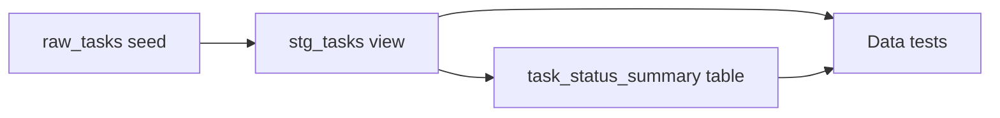

# Data transformation with dbt

This repository includes a small, self-contained [dbt](https://docs.getdbt.com/) project.
It uses DuckDB, so the same pipeline runs locally and in GitHub Actions without a database
service, cloud account, or credentials.

## Use case

The project turns sample records from the Task CRUD feature into a status summary:



This demonstrates the core dbt workflow:

- `raw_tasks` loads deterministic CSV data with `dbt seed`.
- `stg_tasks` uses `ref()` to declare a dependency and normalizes types and text.
- `task_status_summary` uses the staging model to count tasks by status.
- Generic data tests validate uniqueness, required values, and accepted statuses.
- A singular SQL test verifies that the summary total matches the staging total.

## Run locally

Install only the isolated dbt dependency group when you want to prepare the environment:

```bash
make install-deps-dbt
```

Build the complete dependency graph and run all data tests:

```bash
make dbt-build
```

Pass standard dbt selection arguments through `DBT_ARGS` when developing one part of the
graph:

```bash
make dbt-build DBT_ARGS="--select stg_tasks+"
```

Remove dbt-generated files and the local DuckDB database with:

```bash
make dbt-clean
```

The generated database, logs, compiled SQL, and installed dbt packages are ignored by Git.

## Project layout

```text
dbt/
├── dbt_project.yml
├── profiles.yml
├── seeds/
│   └── raw_tasks.csv
├── models/
│   ├── staging/
│   │   ├── _staging.yml
│   │   └── stg_tasks.sql
│   └── marts/
│       ├── _marts.yml
│       └── task_status_summary.sql
└── tests/
    └── assert_task_status_summary_matches_staging.sql
```

`dbt build` orders these resources from their `ref()` dependencies. A failed data test
returns a nonzero exit code, so the dedicated `dbt` job in GitHub Actions blocks invalid
changes using the same `make dbt-build` command.

## Add data for a service

Follow the existing layers when a service starts producing data:

1. Add a small seed for a deterministic example, or configure an adapter and declare the
   production relation as a dbt source.
2. Add a staging model that exposes stable names and types. Reference the seed or source
   rather than embedding relation names in downstream SQL.
3. Define generic tests beside the staging model for identifiers, required fields, allowed
   values, and relationships.
4. Build marts from staging models with `ref()`.
5. Add a singular SQL test for business rules that generic tests cannot express.
6. Run `make dbt-build`. New resources in the dbt project are automatically included in
   the existing CI job.

Keep adapter dependencies in the `dbt` group in `pyproject.toml` and update `uv.lock`.
Do not add dbt to the application's production dependency list.
