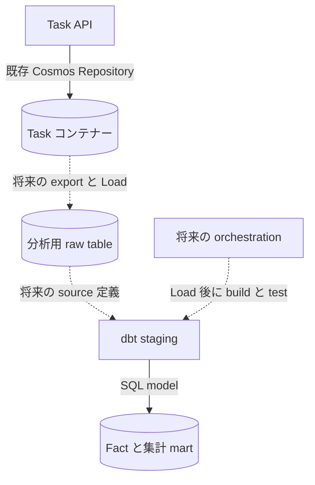

# Task の保存先と分析基盤を拡張する

実際に動かす手順は [ハンズオン](tutorial.md)を参照してください。
このページは DuckDB 追加を小さく保つ理由と、業務の保存先・分析基盤を拡張する際の変更点を説明します。
後半の Cosmos 取り込み例は**将来設計の参考例**であり、実装済みコマンドではありません。

## 目的から読む

| やりたいこと | 状態 | 読む場所 |
| --- | --- | --- |
| DuckDB の Task を API で操作する | 実行可能 | [API 連携演習](tutorial.md#api-persistence-exercise) |
| Repository の実装・追加方法を理解する | 現在の実装の解説 | [DuckDB 実装](#duckdb-implementation) |
| API の保存先を Cosmos に替える | 準備後に実行可能 | [Cosmos への切替](#cosmos-storage) |
| Cosmos の Task を分析へ取り込む | 将来設計・未実装 | [Cosmos の分析](#cosmos-analytics) |
| dbt の実行先を他の基盤に替える | 将来設計・互換性確認が必要 | [分析基盤の変更](#analytics-target) |

## 独立した3つの拡張ポイント

| 境界 | 現在の実装 | 拡張する方法 |
| --- | --- | --- |
| API の CRUD 保存先 | TaskRepositoryBackend: in-memory（既定）/ cosmosdb / duckdb | 既存 TaskRepository Protocol を実装し、設定と lifespan に接続 |
| 分析への入力 | 固定の学習用 CSV を dbt seed で Load | 別の export / Load job を実装し、投入済み表を dbt source として宣言 |
| dbt の SQL 実行先 | 教材の profiles.yml: type: duckdb、ローカルファイル | 対応 adapter を確認し、profile target と SQL / model の互換性を検証 |

TASK_REPOSITORY を変えても dbt profile は変わらず、Task のコピー・移行も行いません。
逆に dbt target を変更しても API の保存先は変わりません。
dbt は対応先で SQL を実行します。sources の metadata は抽出用 connector ではありません。

<a id="duckdb-implementation"></a>

## DuckDB 実装を読み解く

[アーキテクチャ](../architecture/index.md)と、次の実装を順に読んでください。

| 読む順序 | 責務 |
| --- | --- |
| [TaskRepository](https://github.com/ks6088ts-labs/template-azure-python/blob/main/template_azure_python/application/ports/task_repository.py) | 非同期 add / get / list / update / delete の契約 |
| [Task と TaskStatus](https://github.com/ks6088ts-labs/template-azure-python/blob/main/template_azure_python/domain/task.py) | UUID の型、status、文字列の正規化と不変条件 |
| [Task use cases](https://github.com/ks6088ts-labs/template-azure-python/blob/main/template_azure_python/application/task.py) | port を利用する CRUD と application error。保存先を追加しても変更しない |
| [DuckDB adapter](https://github.com/ks6088ts-labs/template-azure-python/blob/main/template_azure_python/infrastructure/repositories/duckdb_task.py) | SQL、行の変換、排他、エラー、接続 factory |
| [Project settings](https://github.com/ks6088ts-labs/template-azure-python/blob/main/template_azure_python/settings/project.py) | backend enum と任意のファイルパス |
| [Composition root](https://github.com/ks6088ts-labs/template-azure-python/blob/main/template_azure_python/api.py) | adapter の選択・注入と lifespan |
| [共通契約テスト](https://github.com/ks6088ts-labs/template-azure-python/blob/main/tests/test_task_repositories.py)と [DuckDB テスト](https://github.com/ks6088ts-labs/template-azure-python/blob/main/tests/test_duckdb_task_repository.py) | 共通動作と永続性・不正データ・障害・キャンセル |

### 保存形式の変換は adapter の責務

| Domain / HTTP の項目 | dbt の列 | 変換 |
| --- | --- | --- |
| id | task_id VARCHAR | UUID を文字列化し、dbt model のハイフン付き UUID を解析。英字の大小で同一性を変えない |
| title | task_title VARCHAR | Task を生成して既存の文字列規則を適用 |
| description | task_description VARCHAR | 空文字は有効。保存済み NULL は勝手に補正しない |
| status | status VARCHAR | 未検証の文字列ではなく TaskStatus に変換 |
| Domain には追加しない | is_completed BOOLEAN | done のときだけ true。読み取り時に不正・不整合を拒否 |

SQL の対象は **main.fct_tasks のみ**です。値は SQL 文字列へ埋め込まず bind parameter で渡します。
get の未検出は None、update / delete は False、重複 add は既存の TaskAlreadyExistsError です。
DuckDB 障害・不正行は操作名と例外種別をログに記録し、TaskRepositoryError へ変換します。
既存 HTTP handler が 503 に変換し、テーブル消失を Task の未検出に見せません。
内部 SQL や保存データを応答へ露出しません。

dbt の unique test は物理的な PK 制約ではありません。起動時に重複・NULL ID を拒否します。
UUID の英字の大小だけが異なる重複も拒否し、検索でも同じ UUID の同一性を維持します。
add の存在確認と挿入を lock 内で行います。これは単一アプリの接続の保護であり、
任意の外部 writer・独立した複数アプリの競合制御ではありません。
同じファイルに書き込む Repository は、同一プロセス内も含め1インスタンスに限定してください。

### 非同期 port と同期 driver

DuckDB の Python driver は同期処理です。_run_sync が処理全体を worker thread に退避し、
lock が同じ接続の execute と fetch をまとめて排他します。
asyncio task のキャンセルではスレッドを停止できないため、実行中 worker の完了まで所有権を維持します。
すでに実行中の更新は、呼び出し元がキャンセルされても完了する場合があります。

open_duckdb_task_repository は既存パスを検証して接続・テーブル検証を行い、
adapter を提供し、正常・失敗・キャンセル時に接続を閉じます。
create_app は startup 時に AsyncExitStack で factory に入ります。
アプリ生成・OpenAPI 参照だけではファイルを開きません。
Protocol に close を追加せず、use case も DuckDB に依存しません。
既存インスタンスを `create_app(repository=...)` に注入する場合は、factory で選択する経路とは異なり、
呼び出し側が接続を解放します。`repository_backend` との同時指定はできません。

生成・注入の図は [アーキテクチャのコンポーネント接続](../architecture/index.md#repository-wiring)に集約しています。
このページでは保存形式・SQL・エラーなどの adapter 固有の判断を扱います。

### 起動時の検証と行の検証を分ける

| タイミング | 検証するもの | 失敗時 |
| --- | --- | --- |
| CLI / factory の開始 | DUCKDB_PATH の必須性と既存ファイル | 明示的な設定エラー |
| DB 接続後の startup | main.fct_tasks の実テーブル・列型、NULL / 重複 ID | 起動を拒否し、接続を解放 |
| get / list の行変換 | UUID・status・文字列・is_completed の整合性 | 保存先障害として HTTP 503 |

起動成功だけで全行の品質を保証するわけではありません。品質の入口は dbt test、
API の読み取り境界は行変換による検証です。

### 変更するもの・維持するもの

| 変更するもの | 維持するもの |
| --- | --- |
| 具象 adapter、driver 依存、backend enum、path 設定 | Domain と use case のインタフェース |
| 明示的な lifespan 分岐、CLI のパス検証 | HTTP path・4項目 schema・404 / 409 / 422 / 503 契約 |
| adapter 固有のテストと資料 | 同じ共通 CRUD 契約、in-memory の既定値、Cosmos のリソース寿命 |

## コアを再設計せず Repository を追加する

1. Protocol とエラー契約を読み、戻り値と「update は upsert ではない」動作を維持する。
2. 保存先固有の変換・検証・パラメーター化と、未検出・重複・障害の変換を実装する。
3. リソースを所有する driver には初期化・解放用 factory を用意する。
4. 型付き settings と enum 値を追加し、その backend を選択した場合だけ検証する。
5. router ではなく composition root と既存共通の起動経路で接続する。
6. 共通契約テストを適用し、永続性・障害・競合・解放の固有テストを追加する。
7. 設定手順・図・制限を更新し、既存の型検査と import 境界検査を実行する。

保存先追加だけを理由に ORM・汎用 repository 基底クラス・factory registry・Domain 項目を増やしません。
Protocol は構造的型付けであり、互換性のあるメソッドがあれば適合します。

<a id="cosmos-storage"></a>

## 既存 API の保存先を Cosmos DB に切り替える

これは実装済みです。[Task 専用コンテナーの準備](../cosmosdb.md)に従い、
商品サンプルの `/category` ではなく **`/id`** を使います。
endpoint・database・task container を設定し、API の DefaultAzureCredential の identity に
必要な native data-plane 権限を付与します。準備 CLI の管理権限は API へ混在させません。

```shell
uv run --locked python -m scripts.template serve-container-apps --repository cosmosdb
```

テストデータで POST → GET → 再起動 → GET を確認します。
Cosmos では DUCKDB_PATH は不要です。DuckDB の Task は元のファイルに残り、自動移行はしません。
切り替わるのは業務 CRUD の保存先だけであり、dbt project・入力ではありません。

<a id="cosmos-analytics"></a>

## 将来: Cosmos の Task を dbt で分析する

**今回は未実装です。** 業務の保存先と再構築可能な分析 mart を分離します。
dbt 管理 fact の直接 CRUD はローカル演習には便利ですが、再構築で更新が消え、
集計も古いままになります。本番の同期設計としては扱いません。

<!-- mermaid-checked: quoted labels, unique ids, closed subgraphs -->


この図はデータの流れです。破線の export・source 定義・orchestration は今回未実装です。
source 定義は投入済み表を参照する metadata で、取り込み処理を代行しません。

### 最初は全件 snapshot から

検証済みの id / title / description / status だけを export します。
型注釈を信頼するのではなく、UUID の解析・TaskStatus・Task の文字列検証を再利用します。
取得中に Task が変化する場合、ページ付きクエリが単一時点の一貫した snapshot になるとは限りません。
観測区間を定義してください。

全件を取得・検証してから公開し、重複・不正値を拒否します。途中ページを完全 snapshot に見せず、
成功した世代だけを置き換えます。全件置換は削除を反映できますが、単純 append はできません。
定期実行前に retry・世代 ID・freshness・失敗通知を設計します。
観測 metadata は、業務上必要でなければ Domain ではなく取り込み層に置きます。

学習・小規模データなら、検証済み CSV を作業用 seed に置き換えて再構築できます。
本番の外部 Load table は [dbt Sources](https://docs.getdbt.com/docs/build/sources) で宣言します。
次は**外部 loader が main.cosmos_tasks_raw を作成した後**の将来 YAML と staging の参考例です。
これ自体は Cosmos からの Load を行いません。

```yaml
version: 2
sources:
  - name: operational
    schema: main
    tables:
      - name: cosmos_tasks_raw
        columns:
          - name: id
            data_tests: [not_null, unique]
```

```sql
select
    cast(id as varchar) as task_id,
    trim(title) as task_title,
    trim(coalesce(description, '')) as task_description,
    status
from {{ source('operational', 'cosmos_tasks_raw') }}
```

既存の domain / status test を維持し、source の品質検査と description / lineage を追加します。
別の作業 project で staging の ref('raw_tasks') を置き換えてください。
同じ表を seed と外部 source の両方へ登録したり、失敗する test を黙って無効化したりしません。

### 必要になってから incremental / change feed

| 判断 | 必要な設計 |
| --- | --- |
| 新規・更新レコード | 安定した key、冪等 upsert、checkpoint 所有、retry / replay |
| 削除レコード | 全件照合、または対応する削除捕捉の仕組み |
| 障害・古い結果 | 部分 Load の扱い、原子的な公開境界、freshness と通知 |
| 運用 | 最小権限、schema 進化、RU / memory コスト、保持と schedule |

[Cosmos latest-version change feed](https://learn.microsoft.com/azure/cosmos-db/change-feed-modes)
は**削除を捕捉せず**、中間更新も取りこぼす場合があります。
有効化するだけで完全な履歴・削除同期ができるとは説明しません。
all-versions-and-deletes mode は continuous backup が必要で、保持期間内の変更だけを参照できます。
採用前に現在の account・SDK・service の対応状況を確認してください。
soft delete は現行 Task 契約を変えるため、今回の拡張では導入しません。

<a id="analytics-target"></a>

## 将来: dbt を他の分析基盤で実行する

[公式の対応先一覧](https://docs.getdbt.com/docs/supported-data-platforms)は、
SQL を実行する platform と adapter lifecycle を説明しています。Cosmos DB は dbt v2 の接続先として掲載されていません。
架空の type: cosmosdb を作ったり、Cosmos の SQL に似た NoSQL query 言語を warehouse SQL と同一視したり、
v1 の community adapter が v2 でも使えると仮定したりしません。

1. インストール済み **dbt の major version**、対象 adapter・lifecycle・必要機能を確認する。
2. 対応 warehouse 等の公式 setup guide に従い、権限・資格情報・別の profile output / target を準備する。
   secret はコミットしない。
3. 対象 platform への Load を dbt と独立して実装・検証する。
4. source を宣言し、database / schema / identifier の解決を確認する。
5. SQL 方言・regexp・cast・boolean・seed 型・materialization・静的解析を確認する。
   type を替えるだけで DuckDB model の互換性は保証されない。
6. 隔離した project で debug → build → test を実行し、**保存済み結果**と lineage を確認する。
   固定入力なら総数6件・各状態2件・完了率33.33%。空入力の NULL と不正値の失敗も比較する。

dbt v2 の adapter 内蔵方式と、v1 の Python adapter インストールは別の手順です。
v1 のみの対象なら、依存・環境・SQL の互換性を別途評価します。
DuckDB v2 内蔵 driver にも [extension の制限](https://docs.getdbt.com/docs/local/connect-data-platform/duckdb-setup)があります。
API 用に Python duckdb を入れても、dbt の外部 extension driver が有効になるわけではありません。

## 今すぐ実行できること

| 機能 | 状態 |
| --- | --- |
| dbt seed / build / test・ローカル Docs | ハンズオンで実行可能 |
| dbt 生成 fct_tasks の Task CRUD | 1ファイルに1つの writer インスタンス。dbt の前に API を停止 |
| 再起動後の永続性 | 既存ファイルを再利用して確認可能 |
| API 更新から raw / 集計への同期 | 未実装。手動再構築は fact 更新を上書き |
| 既存 Cosmos Repository | account・container・権限の準備後に実行可能 |
| backend 間の自動データ移行 | 未実装 |
| Cosmos export / source Load / change feed | 将来設計のみ |
| 他の dbt target | 将来設計。adapter・Load・SQL・資格情報の確認が必要 |
| 分散 DuckDB API writer / Azure volume の準備 | このサンプルの対象外 |

## 参考資料

- [dbt の対応先と v1 / v2 の違い](https://docs.getdbt.com/docs/supported-data-platforms)
- [dbt v2 DuckDB の接続と内蔵 driver 制限](https://docs.getdbt.com/docs/local/connect-data-platform/duckdb-setup)
- [dbt Sources: 外部から投入されたデータ](https://docs.getdbt.com/docs/build/sources)
- [Cosmos DB change feed の削除・保持規則](https://learn.microsoft.com/azure/cosmos-db/change-feed-modes)
- [DuckDB のプロセス内の競合制御](https://duckdb.org/docs/current/connect/concurrency)
