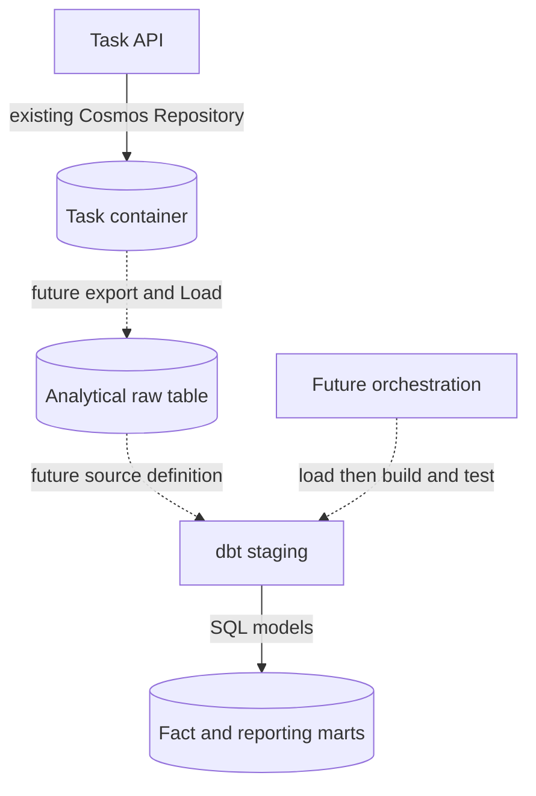

# Extend Task storage and the analytics platform

Use the [hands-on](tutorial.md) for a runnable local exercise. This guide explains why the
DuckDB addition stays small and what changes when operational storage or analytics grows.
The Cosmos ingestion examples below are **future design examples**, not shipped commands.

## Choose a reading path

| Goal | State | Read |
| --- | --- | --- |
| Operate DuckDB Tasks through the API | Runnable | [API exercise](tutorial.md#api-persistence-exercise) |
| Understand or add a Repository | Current implementation guide | [DuckDB implementation](#duckdb-implementation) |
| Switch API storage to Cosmos | Runnable after preparation | [Cosmos switch](#cosmos-storage) |
| Load Cosmos Tasks into analytics | Future design, not implemented | [Cosmos analytics](#cosmos-analytics) |
| Run dbt on another platform | Future design, compatibility checks required | [Analytics target](#analytics-target) |

## Three independent extension points

| Boundary | Current implementation | How to extend |
| --- | --- | --- |
| API CRUD storage | `TaskRepositoryBackend`: in-memory (default), cosmosdb, duckdb | Implement the existing `TaskRepository` Protocol; wire settings and lifespan |
| Analytics input | Fixed learning CSV loaded with dbt seed | Add a separate export / Load job, then declare the loaded table as a dbt source |
| dbt SQL execution | This example's `profiles.yml`: `type: duckdb`, local file | Verify a supported adapter, configure a profile target, and validate SQL / model compatibility |

Changing `TASK_REPOSITORY` does not change dbt's profile, copy Tasks between backends, or migrate data.
Conversely, changing a dbt target does not make the Task API use that warehouse.
dbt executes SQL on its supported platforms; its `sources:` metadata is not an extraction connector.

<a id="duckdb-implementation"></a>

## Read the DuckDB implementation

Start with the [architecture](../architecture/index.md) and these source files:

| Read in order | Responsibility |
| --- | --- |
| [TaskRepository](https://github.com/ks6088ts-labs/template-azure-python/blob/main/template_azure_python/application/ports/task_repository.py) | Async add / get / list / update / delete contract |
| [Task and TaskStatus](https://github.com/ks6088ts-labs/template-azure-python/blob/main/template_azure_python/domain/task.py) | UUID type, status values, text normalization and invariants |
| [Task use cases](https://github.com/ks6088ts-labs/template-azure-python/blob/main/template_azure_python/application/task.py) | CRUD through the port and application errors; unchanged when adding storage |
| [DuckDB adapter](https://github.com/ks6088ts-labs/template-azure-python/blob/main/template_azure_python/infrastructure/repositories/duckdb_task.py) | SQL, row decoding, concurrency, errors, connection factory |
| [Project settings](https://github.com/ks6088ts-labs/template-azure-python/blob/main/template_azure_python/settings/project.py) | Backend enum and optional file path |
| [Composition root](https://github.com/ks6088ts-labs/template-azure-python/blob/main/template_azure_python/api.py) | Select and inject the adapter; own its lifespan |
| [Contract tests](https://github.com/ks6088ts-labs/template-azure-python/blob/main/tests/test_task_repositories.py) and [DuckDB tests](https://github.com/ks6088ts-labs/template-azure-python/blob/main/tests/test_duckdb_task_repository.py) | Shared behavior plus persistence, invalid data, failures and cancellation |

### Storage mapping is adapter-owned

| Domain / HTTP field | dbt column | Mapping |
| --- | --- | --- |
| `id` | `task_id` VARCHAR | Serialize UUID; parse the dbt model's hyphenated UUID strings, ignoring letter case for identity |
| `title` | `task_title` VARCHAR | Construct Task to apply the existing text rules |
| `description` | `task_description` VARCHAR | Empty text is valid; stored NULL is not silently repaired |
| `status` | `status` VARCHAR | Convert through TaskStatus, not an unchecked string |
| No additional domain field | `is_completed` BOOLEAN | Write true only for done; reject invalid / inconsistent flags on decoding |

The SQL targets **only `main.fct_tasks`**. Values use bound parameters, not SQL interpolation.
`get` returns None for an absent Task; update / delete return False. A duplicate add raises the
existing TaskAlreadyExistsError. DuckDB failures and malformed rows are logged by operation / exception
type and translated to TaskRepositoryError, which the existing HTTP handler maps to 503.
Table loss is not reported as a missing Task. Internal SQL and row contents are not exposed in responses.

dbt's `unique` test is not a physical primary-key constraint. Startup rejects duplicate / NULL IDs,
including UUID strings that differ only in letter case; lookup preserves that UUID identity.
Add checks existence and inserts inside the adapter's lock. This protects the single app's
connection, not arbitrary external writers or multiple independent app instances.
Use only one writing repository instance per file, including within a single process.

### Async port, synchronous driver

DuckDB's Python driver is synchronous. `_run_sync` moves a complete operation to a worker thread;
the lock keeps execute and fetch together on one connection. Cancellation waits for a running worker
before releasing ownership, because cancelling an asyncio task cannot stop a thread.
A mutation already executing may finish even if its caller is cancelled.

`open_duckdb_task_repository` validates the existing path, opens and checks the table, yields the
adapter, and closes the connection on success, failure, or cancellation. `create_app` enters this
factory through AsyncExitStack during startup. App construction / OpenAPI inspection does not open
the file. The Protocol needs no close method, and use cases need no DuckDB dependency.
Injecting an existing instance with `create_app(repository=...)` bypasses backend factory selection;
the caller must close its connection. It cannot be combined with `repository_backend`.

The [architecture's component-wiring diagram](../architecture/index.md#repository-wiring)
is the single reference for creation and injection. This page explains adapter-specific storage,
SQL and error decisions instead.

### Distinguish startup checks from row validation

| Timing | Checks | Failure |
| --- | --- | --- |
| CLI / factory entry | Required DUCKDB_PATH and existing file | Explicit configuration error |
| Startup after connection | Physical main.fct_tasks table, column types, NULL / duplicate IDs | Reject startup and release connection |
| get / list decoding | UUID, status, text and is_completed consistency | Storage failure mapped to HTTP 503 |

Successful startup does not establish the quality of every row. dbt tests provide the input quality
gate; row decoding validates the API's read boundary.

### Changed versus preserved

| Changed | Preserved |
| --- | --- |
| Concrete adapter, driver dependency, backend enum, path setting | Domain and use-case interfaces |
| Explicit lifespan branch and CLI path validation | HTTP paths, four-field schema, 404 / 409 / 422 / 503 contracts |
| New adapter-specific tests and documentation | Same shared CRUD contract; in-memory default; Cosmos resource lifetime |

## Add another Repository without redesigning the core

1. Read the Protocol and error contract; preserve result types and non-upsert update behavior.
2. Implement storage-specific serialization, validation, parameterization, and missing / duplicate / failure mapping.
3. Provide a factory for initialization and cleanup if the driver owns resources.
4. Add typed settings and an enum value. Validate only when that backend is selected.
5. Wire the factory in the composition root and the existing common launch path, not in the router.
6. Apply the shared repository test and add persistence, failures, concurrency and cleanup tests.
7. Update setup commands, diagrams, and runtime limitations; run existing type and import-boundary checks.

Do not introduce an ORM, generic repository base class, factory registry, or new Domain fields
merely to add a backend. Protocol uses structural typing: compatible methods are enough.

<a id="cosmos-storage"></a>

## Switch the existing API to Cosmos DB

This is already supported. Follow the [dedicated Task container preparation](../cosmosdb.md#task-api-persistence-and-container-management),
not the product sample's `/category` container. The Task container uses `/id`.
Configure its endpoint, database and task container; grant the API identity the native data-plane
permissions needed by DefaultAzureCredential. Management permissions belong to the preparation CLI.

```shell
uv run --locked python -m scripts.template serve-container-apps --repository cosmosdb
```

Verify POST → GET → restart → GET against that configured container using test data.
DUCKDB_PATH is not required for Cosmos. The DuckDB Tasks remain in their file; no automatic data
migration occurs. This switches operational CRUD only, not the dbt project or its input.

<a id="cosmos-analytics"></a>

## Future: analyze Cosmos Tasks with dbt

**Not implemented here.** Prefer separating the operational store from a rebuildable analytical mart.
Direct API CRUD on a dbt-managed fact is useful for this local exercise, but rebuilding destroys those
writes and leaves reports stale until rebuild. It is not a production synchronization design.

<!-- mermaid-checked: quoted labels, unique ids, closed subgraphs -->


This is a data-flow view. Dotted export, source-definition and orchestration paths are not implemented.
A source definition describes an already-loaded table; it does not perform ingestion.

### Start with a complete snapshot

Export only validated id / title / description / status. Reuse UUID parsing, TaskStatus, and Task's
text validation, rather than inferring valid input from type annotations.
Define the observation window: a paginated query is not automatically a single consistent
point-in-time snapshot when Tasks change during extraction.

Stage a complete export before publishing it. Reject duplicates and malformed data, do not expose
partial pages as a complete snapshot, and replace the previous generation only after successful
validation. A full replacement can reflect deletions; an append-only Load cannot.
Decide retry, generation identity, freshness and failure notification before scheduling it.
Keep observation metadata in the ingestion layer unless the domain genuinely needs it.

For learning / small datasets, a validated CSV can replace the working seed and be rebuilt.
For externally loaded production tables, use [dbt Sources](https://docs.getdbt.com/docs/build/sources).
For example, **after an external loader has created `main.cosmos_tasks_raw`**, this future YAML
and staging change describe it; they do not load Cosmos themselves:

```yaml
version: 2
sources:
  - name: operational
    schema: main
    tables:
      - name: cosmos_tasks_raw
        columns:
          - name: id
            data_tests: [not_null, unique]
```

```sql
select
    cast(id as varchar) as task_id,
    trim(title) as task_title,
    trim(coalesce(description, '')) as task_description,
    status
from {{ source('operational', 'cosmos_tasks_raw') }}
```

Keep the existing domain/status tests, add source-field quality checks, and extend descriptions /
lineage. Replace the staging `ref('raw_tasks')` in a separate working project; do not register the
same table as both a seed and an external source or silently disable failing tests.

### Only then consider incremental / change feed

| Decision | Required design |
| --- | --- |
| New / updated records | Stable key, idempotent upsert, checkpoint ownership, retry / replay |
| Deleted records | Full reconciliation or a supported delete-capture mechanism |
| Failures / stale results | Partial-load policy, atomic publication boundary, freshness and notification |
| Operations | Least-privilege identity, schema evolution, RU / memory costs, retention and scheduling |

[Cosmos latest-version change feed](https://learn.microsoft.com/azure/cosmos-db/change-feed-modes)
does **not** capture deletes and may omit intermediate updates. Do not promise complete
history or deletion synchronization by simply enabling it.
All-versions-and-deletes mode requires continuous backup and only exposes changes within its
retention window; confirm current account, SDK and service support before designing around it.
Soft delete would change the current Task contract and is not part of this extension.

<a id="analytics-target"></a>

## Future: run dbt on another analytics platform

The [official supported-platform list](https://docs.getdbt.com/docs/supported-data-platforms)
describes SQL-speaking platforms and adapter lifecycle. It does not list Cosmos DB as a dbt v2 target.
Do not invent `type: cosmosdb`, treat Cosmos's SQL-like NoSQL query language as warehouse SQL,
or assume an existing v1 community adapter works with v2.

1. Verify the installed **dbt major version**, target adapter availability, lifecycle and needed features.
2. Select a documented target (for example a supported warehouse), permissions and credential handling.
   Configure a separate profile output / target from its official setup guide; do not commit secrets.
3. Implement and validate Load into that platform independently from dbt.
4. Declare the loaded source and check database / schema / identifier resolution.
5. Review SQL dialects, regexp functions, casts, boolean handling, seed types, materializations and static analysis.
   A `type` change alone does not guarantee these DuckDB models are portable.
6. Run debug → build → test and inspect **persisted** results and lineage in an isolated project.
   With the bundled input expect six Tasks, two per status, and 33.33% completion;
   also compare empty-input NULL behavior and invalid-data failures.

dbt v2 ships supported adapters; v1 Python adapter installation is a different workflow.
A v1-only target requires separately evaluated dependencies / environment and SQL compatibility.
DuckDB v2's built-in driver also has [extension limitations](https://docs.getdbt.com/docs/local/connect-data-platform/duckdb-setup):
installing Python's duckdb for the API does not enable dbt's external extension driver.

## What is runnable now?

| Capability | State |
| --- | --- |
| dbt seed / build / test and local Docs | Runnable hands-on |
| Task CRUD against dbt-built fct_tasks | One writer instance per file; stop API before dbt |
| Restart persistence | Runnable; existing file is reused |
| API writes → raw / reporting synchronization | Not implemented; manual rebuild overwrites fact writes |
| Existing Cosmos Repository | Runnable after account / container / permissions preparation |
| Automatic backend data migration | Not implemented |
| Cosmos export / source Load / change feed | Future design only |
| Another dbt target | Future design; requires verified adapter, Load, SQL and credential setup |
| Distributed DuckDB API writers / Azure volume provisioning | Outside this sample |

## References

- [dbt supported platforms and v1 / v2 distinction](https://docs.getdbt.com/docs/supported-data-platforms)
- [dbt v2 DuckDB connection and bundled-driver limitations](https://docs.getdbt.com/docs/local/connect-data-platform/duckdb-setup)
- [dbt Sources: externally loaded data](https://docs.getdbt.com/docs/build/sources)
- [Cosmos DB change feed modes and deletion / retention rules](https://learn.microsoft.com/azure/cosmos-db/change-feed-modes)
- [DuckDB in-process concurrency](https://duckdb.org/docs/current/connect/concurrency)
