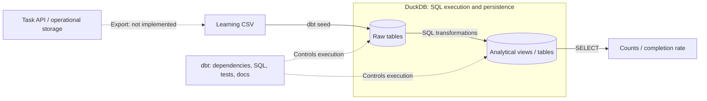
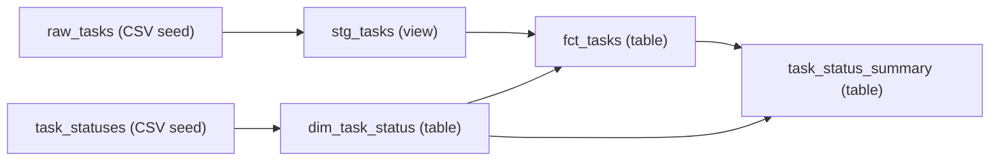
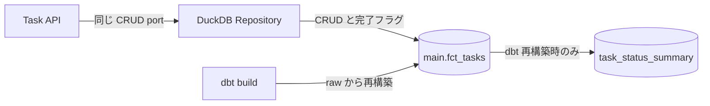

# Data engineering 入門: dbt v2 と DuckDB

既存の **Task** を題材に、データの取り込み、SQL による変換、集計、品質検証、
ドキュメント化を体験します。Azure リソース、DB サーバー、dbt platform のアカウントは不要です。

まず完成版を動かし、その後 [ゼロから作るハンズオン](tutorial.md) で同じプロジェクトを組み立てます。
説明・コマンドは dbt **2.0.8** で検証しています。
検証環境は macOS / Apple Silicon、一次情報の確認日は **2026-10-11** です。
公式資料は最新版に更新されるため、一般仕様へのリンクと、この教材での実測値を区別して読みます。
Windows の補助記法は掲載していますが、Windows での実行検証は行っていません。

## 最初の問い: 何を分析したいか

この教材の問いは「現在の Task は各状態に何件あり、全体の何%が完了しているか」です。
Task を1件作成・更新する **OLTP（トランザクション処理）** と、
複数の Task をまとめて読む **OLAP（分析処理）** は、同じデータでも目的が違います。
今回は分析側だけを作り、Task API の保存先を DuckDB に置き換えません。
DuckDB を選ぶ根拠は、[公式の dbt 接続ガイド](https://docs.getdbt.com/docs/local/connect-data-platform/duckdb-setup)
が説明する、サーバー・認証なしのローカル実行と OLAP 向けの特性です。

## 何を学ぶか

| 概念 | この教材での体験 |
| --- | --- |
| OLTP / OLAP | アプリの Task CRUD と、Task 全体の分析を分離する |
| ELT | CSV を取り込み、DB 内の SQL で整形・集計する |
| 粒度 (grain) | 「1行が何を表すか」を Task 単位 / status 単位で定義する |
| staging / mart | 入力の正規化と、分析向けのモデルを分ける |
| dimension / fact | 状態の参照データと、現在の Task を結び付ける |
| DAG / lineage | `ref()` で依存を宣言し、実行順とデータの由来を確認する |
| データ品質 | 重複、NULL、不正 status、文字数、集計の整合性を検証する |
| 再現性 | 固定入力、ロック済み依存、再実行、期待値で結果を確かめる |

### dbt と DuckDB の役割

**DuckDB** は SQL を実行してデータを保存する、分析向けの組み込みデータベースです。
この教材ではローカルの `.duckdb` ファイルを使います。DB サーバーの起動や認証はありません。

**dbt** は SQL モデルの依存、実行、テスト、ドキュメントを管理します。
dbt 自体がデータベースになるわけではなく、一般的な API export や CDC の取り込みツールでもありません。
`seed` による CSV 取り込みは、小さな教材・参照データに適した簡易的な Load です。

ETL は「抽出 → 変換 → 読み込み」、ELT は「抽出 → 読み込み → DB 内で変換」です。
今回は抽出済みと見なすサンプル CSV から始めるため、実データの Extract は実装しません。
この責務分担は [dbt の Sources](https://docs.getdbt.com/docs/build/sources)
（別ツールで Load した table の宣言）と
[seed コマンド](https://docs.getdbt.com/reference/commands/seed)
（小さな version-controlled CSV の Load）の公式説明に対応します。



実線は教材で動かす流れ、API からの破線は **未実装の取り込み境界** です。
固定 CSV は API と同期していません。dbt が処理を管理し、DuckDB が SQL と保存を担うことを分けて考えます。
後述の任意の DuckDB Repository は API から fact を直接編集するものであり、取り込み処理ではありません。

## Task と教材の境界

[既存の Task](https://github.com/ks6088ts-labs/template-azure-python/blob/main/template_azure_python/domain/task.py)
は次の4項目です。Domain と use case は変更せず、同じ CRUD port の実装として任意の DuckDB Repository を追加しています。

| 項目 | ドメインの意味 | 教材での扱い |
| --- | --- | --- |
| `id` | UUID | CSV では UUID 文字列、分析モデルでは `task_id` |
| `title` | 前後の空白を除去、空文字不可、200文字以内 | `task_title` として正規化・検証 |
| `description` | 前後の空白を除去、2000文字以内、空文字可 | 空の CSV セルを空文字として扱う |
| `status` | `todo` / `in_progress` / `done` | 値を勝手に補正・除外せず、テストで検証 |

CSV は実 API の export ではなく、UUID を固定した学習用データです。
教材の SQL `trim()` は通常の前後スペースを除去します。Python の `str.strip()` が扱う
タブ・Unicode 空白すべてを再現するものではありません。実データとの厳密な境界検証には
既存の Task の正規化・検証を利用してください。
なお `Task.__post_init__()` が実行時に検証するのは title / description です。
`TaskId` / `TaskStatus` の型注釈だけが外部入力を自動検証するわけではありません
（[Python の型注釈の仕様](https://docs.python.org/3/library/typing.html)）。
実際の取り込みでは UUID の解析、`TaskStatus` への変換と、Task の文字列検証を明示的に行います。

Task には日時や担当者がありません。計算できるのは **現在状態の件数や完了率** であり、
日別推移、処理時間、期限超過、担当者別生産性ではありません。
`status_label`、`status_order`、`is_completed` は分析用の参照情報で、
ドメインに追加するフィールドではありません。

## 完成版を最短で動かす

### 前提

- リポジトリを取得済みで、[Python・uv](../scripts.md) が利用できる。
- 以下は macOS / Linux の shell 用。**すべてリポジトリルートで実行**する。
- 最初の依存取得にはネットワークが必要。取得後のデータ処理はローカル完結。
- 既存の dependency group `dbt` を使う。v2 は DuckDB アダプター内蔵のため、
  `dbt-core`、`dbt-duckdb` は追加インストールしない。API の Repository 用の Python `duckdb`
  driver は通常のアプリ依存に含まれ、dbt 内蔵 driver とは別のものです。
  これは [v2 の公式説明](https://docs.getdbt.com/docs/local/connect-data-platform/duckdb-setup#installing-dbt-duckdb)
  に基づく手順で、v1 の adapter インストール手順とは異なる。
  拡張ドライバーが必要な機能や CSV の直接 `read_csv()` は使わない。

```shell
export DBT_PROJECT_DIR="$PWD/docs/dbt/task_analytics"
export DBT_PROFILES_DIR="$DBT_PROJECT_DIR"
export DBT_SEND_ANONYMOUS_USAGE_STATS=false

uv run --locked --no-dev --group dbt dbt --version
uv run --locked --no-dev --group dbt dbt debug
uv run --locked --no-dev --group dbt dbt build
```

PowerShell では最初の3行を次に置き換えます。1行の `uv run` コマンドは共通ですが、
以降の shell 例の行末 `\` は PowerShell の継続記号ではありません。
複数行のコマンドは `\` と改行を除いて1行にまとめて実行します。
ハンズオンのファイル作成・コピー・変数解除は、エディター操作や PowerShell の同等操作へ置き換えてください。

```powershell
$env:DBT_PROJECT_DIR = Join-Path (Get-Location) "docs/dbt/task_analytics"
$env:DBT_PROFILES_DIR = $env:DBT_PROJECT_DIR
$env:DBT_SEND_ANONYMOUS_USAGE_STATS = "false"
```

`debug` が接続成功になり、`build` が **2 seeds・4 models・42 tests** に成功すれば構築完了です。
DB は `docs/dbt/task_analytics/task_analytics.duckdb` に保存されます。
`DBT_PROJECT_DIR` は絶対パスにし、途中で `cd` せずに実行します。
設定はこの shell 内だけに適用され、`~/.dbt/profiles.yml` を書き換えません。

コマンドを丸暗記せず、[uv の locking / syncing](https://docs.astral.sh/uv/concepts/projects/sync/)
と [dependency groups](https://docs.astral.sh/uv/concepts/projects/dependencies/#dependency-groups) に対応させます。

| 指定 | 意味 |
| --- | --- |
| `uv run` | プロジェクト環境を同期してからコマンドを実行する |
| `--locked` | lockfile の整合性を検査し、更新が必要ならエラーにする。自動 upgrade しない |
| `--no-dev --group dbt` | 既定の dev group を選ばず dbt group を選ぶ。通常のアプリ依存も対象 |
| `DBT_PROJECT_DIR` / `DBT_PROFILES_DIR` | プロジェクトと profile を明示し、他のプロジェクトと混同しない |
| `DBT_SEND_ANONYMOUS_USAGE_STATS=false` | dbt の匿名利用統計を送らない |

`--no-dev` は dbt 専用の別 virtualenv を作る指定ではありません。
既存の `.venv` を使用します。strict なオフライン実行や他のプロジェクトとの環境分離を保証する指定でもありません。

### 実際の集計結果を確かめる

```shell
uv run --locked --no-dev --group dbt dbt show --inline \
  "select status, task_count from {{ ref('task_status_summary') }} order by status_order"
```

| status | task_count |
| --- | --- |
| todo | 2 |
| in_progress | 2 |
| done | 2 |

```shell
uv run --locked --no-dev --group dbt dbt show --inline \
  "select count(*) as total_tasks, sum(case when is_completed then 1 else 0 end) as completed_tasks, round(100.0 * sum(case when is_completed then 1 else 0 end) / nullif(count(*), 0), 2) as completion_rate_pct from {{ ref('fct_tasks') }}"
```

期待値は `total_tasks=6`、`completed_tasks=2`、`completion_rate_pct=33.33` です。
分母は全 Task、分子は現在 `done` の Task です。
`case` が完了を1・未完了を0にし、`sum` が完了数を数え、`100.0` が百分率へ変換し、
`round(..., 2)` が表示を小数点以下2桁に丸めます。
`nullif(count(*), 0)` は分母が0なら NULL にし、率を未定義とします。

[DuckDB の aggregate 仕様](https://duckdb.org/docs/current/sql/functions/aggregates#handling-null-values)
では、空集合の `count(*)` は0、`sum(...)` は NULL です。
したがって入力が空なら、このクエリは `total_tasks=0`、`completed_tasks=NULL`、率も `NULL`。
「Task はあるが done が0件」の **0%** と、「Task 自体が0件」の **未定義** を区別します。
完了数だけを表示上0にしたい場合は `coalesce(sum(...), 0)` を使えますが、分母0の率は未定義のままにします。

### 依存関係



**次へ:** [ゼロから作るハンズオン](tutorial.md) では、この DAG を1段ずつ構築し、
テスト失敗・復旧、更新、ローカル Docs / lineage を体験します。
完成版の CSV を直接編集せず、作業用コピーで演習します。
この図はデータの依存を表す DAG です。すべての node は同じ DuckDB 内にあり、
矢印はネットワーク転送や別の DB サーバーを意味しません。

## dbt 生成 Task を API で操作する

`dbt build` 後、dbt Docs・エディターのクエリ・その他の DB 接続を停止します。
前述の `DBT_PROJECT_DIR` を設定したリポジトリルートのターミナルで起動します。

```shell
export DUCKDB_PATH="$DBT_PROJECT_DIR/task_analytics.duckdb"
export TELEMETRY_ENABLED=false
uv run --locked python -m scripts.template serve-container-apps --repository duckdb
```

別のターミナルで確認します。

```shell
curl --fail --silent --show-error http://127.0.0.1:8000/tasks |
  uv run --locked python -c 'import json,sys; tasks=json.load(sys.stdin); assert len(tasks)==6; assert all(set(t)=={"id","title","description","status"} for t in tasks); print("6 Tasks, unchanged API schema")'
```

InMemory / Cosmos と同じ非同期 TaskRepository 契約と HTTP API を使います。
DUCKDB_PATH は必須で、既存ファイルと物理テーブル main.fct_tasks の列を検証します。
API は dbt を実行せず、空 DB も初期化しません。
API の既定値は引き続き **in-memory**、**dbt 教材**の既定の接続先が `type: duckdb` です。

<!-- mermaid-checked: quoted labels, unique ids, closed subgraphs -->


API 更新で is_completed は維持しますが、CSV・raw・保存済み集計表は更新しません。
dbt 再構築で API 更新は上書きされます。同じ DB を開く dbt コマンドの前に API を停止し、
複数 writer / API worker を使わないでください。
[ハンズオン](tutorial.md)で CRUD・再起動後の永続性・古い集計・意図的なテスト失敗・再構築の復旧を検証します。
[拡張ガイド](backends.md)では実装の読み方と、将来の Cosmos / 分析基盤との境界を説明します。

## 仕様・設計判断・期待値を区別する

| 種類 | この教材での例 | 確かめる場所 |
| --- | --- | --- |
| ツールの仕様 | `ref()` が依存を宣言する、v2 の DuckDB adapter は内蔵 | 本文中の公式 reference |
| 教材の設計判断 | staging を view、mart を table にする、status を dimension に分ける | ハンズオンの選択理由 |
| 入力に依存する実測値 | 6件、状態別2件、42 data tests、完了率33.33% | 同梱 CSV・SQL・YAML と実行結果 |

42 tests が成功したことは、すべての業務要件を満たした証明ではありません。
この教材では「品質ルールを満たす」と「固定入力に対して期待値が合う」を別々に確認します。

## 参考資料

- [公式 dbt v2 quickstart](https://docs.getdbt.com/guides/dbt?step=4&version=2)
- [DuckDB と dbt v2 の接続](https://docs.getdbt.com/docs/local/connect-data-platform/duckdb-setup)
- [dbt data tests](https://docs.getdbt.com/docs/build/data-tests)
- [dbt Docs v2](https://docs.getdbt.com/reference/commands/cmd-docs?version=2.0)
