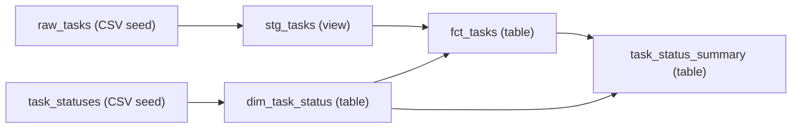

# Data engineering 入門: dbt v2 と DuckDB

既存の **Task** を題材に、データの取り込み、SQL による変換、集計、品質検証、
ドキュメント化を体験します。Azure リソース、DB サーバー、dbt platform のアカウントは不要です。

まず完成版を動かし、その後 [ゼロから作るハンズオン](tutorial.md) で同じプロジェクトを組み立てます。
説明・コマンドは dbt **2.0.8** で検証しています。

## 何を学ぶか

| 概念 | この教材での体験 |
| --- | --- |
| OLTP / OLAP | アプリの Task CRUD と、Task 全体の分析を分離する |
| ELT | CSV を取り込み、DB 内の SQL で整形・集計する |
| 粒度 (grain) | 「1行が何を表すか」を Task 単位 / status 単位で定義する |
| staging / mart | 入力の正規化と、分析向けのモデルを分ける |
| dimension / fact | 状態の参照データと、現在の Task を結び付ける |
| DAG / lineage | `ref()` で依存を宣言し、実行順とデータの由来を確認する |
| データ品質 | 重複、NULL、不正 status、文字数、集計の整合性を検証する |
| 再現性 | 固定入力、ロック済み依存、再実行、期待値で結果を確かめる |

### dbt と DuckDB の役割

**DuckDB** は SQL を実行してデータを保存する、分析向けの組み込みデータベースです。
この教材ではローカルの `.duckdb` ファイルを使います。DB サーバーの起動や認証はありません。

**dbt** は SQL モデルの依存、実行、テスト、ドキュメントを管理します。
dbt 自体がデータベースになるわけではなく、一般的な API export や CDC の取り込みツールでもありません。
`seed` による CSV 取り込みは、小さな教材・参照データに適した簡易的な Load です。

ETL は「抽出 → 変換 → 読み込み」、ELT は「抽出 → 読み込み → DB 内で変換」です。
今回は抽出済みと見なすサンプル CSV から始めるため、実データの Extract は実装しません。

## Task と教材の境界

[既存の Task](https://github.com/ks6088ts-labs/template-azure-python/blob/main/template_azure_python/domain/task.py)
は次の4項目です。アプリの実装・保存先は変更しません。

| 項目 | ドメインの意味 | 教材での扱い |
| --- | --- | --- |
| `id` | UUID | CSV では UUID 文字列、分析モデルでは `task_id` |
| `title` | 前後の空白を除去、空文字不可、200文字以内 | `task_title` として正規化・検証 |
| `description` | 前後の空白を除去、2000文字以内、空文字可 | 空の CSV セルを空文字として扱う |
| `status` | `todo` / `in_progress` / `done` | 値を勝手に補正・除外せず、テストで検証 |

CSV は実 API の export ではなく、UUID を固定した学習用データです。
教材の SQL `trim()` は通常の前後スペースを除去します。Python の `str.strip()` が扱う
タブ・Unicode 空白すべてを再現するものではありません。実データとの厳密な境界検証には
既存の Task の正規化・検証を利用してください。

Task には日時や担当者がありません。計算できるのは **現在状態の件数や完了率** であり、
日別推移、処理時間、期限超過、担当者別生産性ではありません。
`status_label`、`status_order`、`is_completed` は分析用の参照情報で、
ドメインに追加するフィールドではありません。

## 完成版を最短で動かす

### 前提

- リポジトリを取得済みで、[Python・uv](../scripts.md) が利用できる。
- 以下は macOS / Linux の shell 用。**すべてリポジトリルートで実行**する。
- 最初の依存取得にはネットワークが必要。取得後のデータ処理はローカル完結。
- 既存の dependency group `dbt` を使う。v2 は DuckDB アダプター内蔵のため、
  `dbt-core`、`dbt-duckdb`、Python の `duckdb` を追加インストールしない。

```shell
export DBT_PROJECT_DIR="$PWD/docs/dbt/task_analytics"
export DBT_PROFILES_DIR="$DBT_PROJECT_DIR"
export DBT_SEND_ANONYMOUS_USAGE_STATS=false

uv run --locked --no-dev --group dbt dbt --version
uv run --locked --no-dev --group dbt dbt debug
uv run --locked --no-dev --group dbt dbt build
```

PowerShell では最初の3行を次に置き換えます。以降の `uv run` コマンドは共通です。
ハンズオンのファイル作成用 shell コマンドは、エディター操作へ置き換えてください。

```powershell
$env:DBT_PROJECT_DIR = Join-Path (Get-Location) "docs/dbt/task_analytics"
$env:DBT_PROFILES_DIR = $env:DBT_PROJECT_DIR
$env:DBT_SEND_ANONYMOUS_USAGE_STATS = "false"
```

`debug` が接続成功になり、`build` が **2 seeds・4 models・42 tests** に成功すれば構築完了です。
DB は `docs/dbt/task_analytics/task_analytics.duckdb` に保存されます。
`DBT_PROJECT_DIR` は絶対パスにし、途中で `cd` せずに実行します。
設定はこの shell 内だけに適用され、`~/.dbt/profiles.yml` を書き換えません。

### 実際の集計結果を確かめる

```shell
uv run --locked --no-dev --group dbt dbt show --inline \
  "select status, task_count from {{ ref('task_status_summary') }} order by status_order"
```

| status | task_count |
| --- | --- |
| todo | 2 |
| in_progress | 2 |
| done | 2 |

```shell
uv run --locked --no-dev --group dbt dbt show --inline \
  "select count(*) as total_tasks, sum(case when is_completed then 1 else 0 end) as completed_tasks, round(100.0 * sum(case when is_completed then 1 else 0 end) / nullif(count(*), 0), 2) as completion_rate_pct from {{ ref('fct_tasks') }}"
```

期待値は `total_tasks=6`、`completed_tasks=2`、`completion_rate_pct=33.33` です。
分母は全 Task、分子は現在 `done` の Task です。0件なら分母が存在しないため率は `NULL`
（未定義）とし、根拠のない 0% にはしません。

### 依存関係



**次へ:** [ゼロから作るハンズオン](tutorial.md) では、この DAG を1段ずつ構築し、
テスト失敗・復旧、更新、ローカル Docs / lineage を体験します。
完成版の CSV を直接編集せず、作業用コピーで演習します。

## 参考資料

- [公式 dbt v2 quickstart](https://docs.getdbt.com/guides/dbt?step=4&version=2)
- [DuckDB と dbt v2 の接続](https://docs.getdbt.com/docs/local/connect-data-platform/duckdb-setup)
- [dbt data tests](https://docs.getdbt.com/docs/build/data-tests)
- [dbt Docs v2](https://docs.getdbt.com/reference/commands/cmd-docs?version=2.0)
