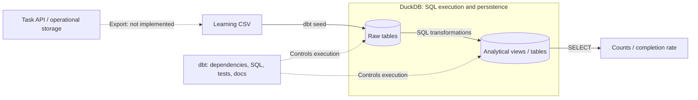
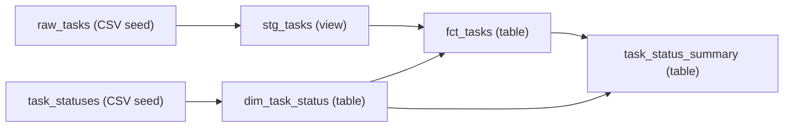
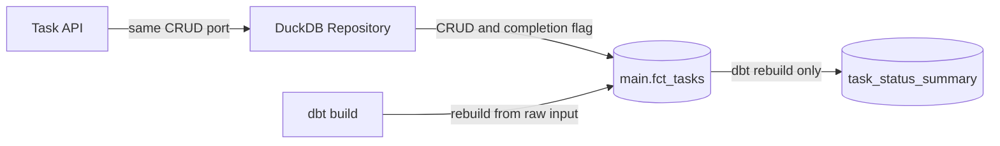

# Data engineering: dbt v2 and DuckDB

Use the existing **Task** domain to learn loading, SQL transformations, reporting, data quality,
and documentation. No Azure resources, database server, or dbt platform account are required.

Run the completed example below, then follow the [from-scratch hands-on](tutorial.md)
to assemble the same project. The commands and example are verified with dbt **2.0.8**.
Verification used macOS / Apple Silicon; first-party references were checked on **2026-10-11**.
Official pages evolve, so distinguish general specifications from this example's measured results.
Windows syntax is provided as assistance, but execution on Windows has not been verified.

## Start with an analytical question

The question is: "How many current Tasks are in each status, and what percentage are complete?"
**OLTP (transaction processing)** creates or updates individual Tasks;
**OLAP (analytical processing)** reads many Tasks to answer aggregate questions.
This tutorial builds the analytical side, not a replacement DuckDB backend for the Task API.
The [official dbt connection guide](https://docs.getdbt.com/docs/local/connect-data-platform/duckdb-setup)
supports the choice of DuckDB: local execution without a server or authentication, designed for OLAP.

## Learning objectives

| Concept | What you will do |
| --- | --- |
| OLTP / OLAP | Separate application Task CRUD from analytics over all Tasks |
| ELT | Load CSV input, then transform and aggregate it inside the database |
| Grain | Define whether one row represents a Task or a status |
| Staging / mart | Separate input normalization from analytical models |
| Dimension / fact | Join status reference data to current Tasks |
| DAG / lineage | Declare dependencies with `ref()` and inspect execution order and provenance |
| Data quality | Check duplicates, NULLs, statuses, text lengths, and aggregate consistency |
| Reproducibility | Use fixed input, locked dependencies, reruns, and measurable expected results |

### Responsibilities

**DuckDB** is an embedded analytical database that stores data and executes SQL.
This example uses a local `.duckdb` file, without a server or authentication.

**dbt** manages SQL model dependencies, execution, tests, and documentation.
It is not a database or a general API export / CDC ingestion tool.
CSV `seed` is a convenient Load mechanism for small learning and reference datasets.

ETL means Extract → Transform → Load. ELT means Extract → Load → Transform in the database.
This example starts with sample CSV treated as already extracted, so it does not implement Extract.
This division follows the official descriptions of
[dbt Sources](https://docs.getdbt.com/docs/build/sources) (declaring tables loaded by other tools)
and the [seed command](https://docs.getdbt.com/reference/commands/seed)
(loading small version-controlled CSV datasets).



Solid arrows show the implemented data path; the dashed API arrow marks an **unimplemented ingestion boundary**.
The fixed CSV is not synchronized with the API. dbt coordinates work; DuckDB executes SQL and persists data.
The optional DuckDB Repository below lets the API directly edit the fact table; it does not implement ingestion.

## Domain and scope

The [existing Task](https://github.com/ks6088ts-labs/template-azure-python/blob/main/template_azure_python/domain/task.py)
has four fields. The domain and use cases remain unchanged; an optional DuckDB Repository implements the same CRUD port.

| Field | Domain meaning | Analytical representation |
| --- | --- | --- |
| `id` | UUID | UUID string in CSV; `task_id` in models |
| `title` | Strip surrounding whitespace; nonempty, at most 200 characters | Normalize and test `task_title` |
| `description` | Strip surrounding whitespace; at most 2000 characters; empty allowed | Interpret an empty CSV cell as empty text |
| `status` | `todo` / `in_progress` / `done` | Preserve invalid values for tests rather than silently correcting or dropping them |

The input uses fixed UUIDs and is learning data, not an export from the live API.
SQL `trim()` in this example removes ordinary surrounding spaces. It does not reproduce all
tab / Unicode whitespace handling of Python's `str.strip()`. Reuse the existing Task
normalization and validation when a real ingestion boundary needs exact domain behavior.
`Task.__post_init__()` validates title / description at runtime.
The `TaskId` / `TaskStatus` annotations alone do not automatically validate external input
([Python's type annotation specification](https://docs.python.org/3/library/typing.html)).
Real ingestion must explicitly parse UUIDs, convert to `TaskStatus`, and apply Task's text validation.

Task has no timestamps or assignees. These models describe **current counts and completion rate**,
not daily trends, duration, overdue work, or individual productivity.
`status_label`, `status_order`, and `is_completed` are analytical reference attributes,
not additions to the application domain.

## Run the completed example

### Prerequisites

- Clone the repository and have [Python and uv](../scripts.md) available.
- The following shell commands are for macOS / Linux. Run **every command from the repository root**.
- Initial dependency downloads require network access; data processing is entirely local afterwards.
- Use the existing `dbt` dependency group. v2 includes its DuckDB adapter, so do not additionally
  install `dbt-core` or `dbt-duckdb`. The application's normal dependencies include Python's
  `duckdb` driver for the API Repository; this is separate from dbt's bundled driver.
  This follows the [official v2 instructions](https://docs.getdbt.com/docs/local/connect-data-platform/duckdb-setup#installing-dbt-duckdb),
  not the v1 adapter installation workflow.
  This tutorial avoids features needing an extension driver and direct CSV `read_csv()` calls.

```shell
export DBT_PROJECT_DIR="$PWD/docs/dbt/task_analytics"
export DBT_PROFILES_DIR="$DBT_PROJECT_DIR"
export DBT_SEND_ANONYMOUS_USAGE_STATS=false

uv run --locked --no-dev --group dbt dbt --version
uv run --locked --no-dev --group dbt dbt debug
uv run --locked --no-dev --group dbt dbt build
```

In PowerShell, replace the first three lines with the following. Single-line `uv run` commands are unchanged,
but the later shell examples' trailing `\` is not a PowerShell continuation character.
Remove those `\` characters and join multiline commands into one line before running them.
Use your editor or equivalent PowerShell operations for file creation, copying, and unsetting variables.

```powershell
$env:DBT_PROJECT_DIR = Join-Path (Get-Location) "docs/dbt/task_analytics"
$env:DBT_PROFILES_DIR = $env:DBT_PROJECT_DIR
$env:DBT_SEND_ANONYMOUS_USAGE_STATS = "false"
```

Expect a successful connection from `debug`, then **2 seeds, 4 models, and 42 tests** from `build`.
The database lives at `docs/dbt/task_analytics/task_analytics.duckdb`.
Set an absolute `DBT_PROJECT_DIR` and do not change directories mid-session.
These variables affect only the current shell; no changes to `~/.dbt/profiles.yml` are needed.

Understand the command using uv's official
[locking / syncing](https://docs.astral.sh/uv/concepts/projects/sync/) and
[dependency group](https://docs.astral.sh/uv/concepts/projects/dependencies/#dependency-groups) documentation:

| Setting | Meaning |
| --- | --- |
| `uv run` | Synchronize the project environment, then execute the command |
| `--locked` | Check lockfile consistency; error if an update is needed rather than automatically upgrading |
| `--no-dev --group dbt` | Select dbt without the default dev group; normal application dependencies are also included |
| `DBT_PROJECT_DIR` / `DBT_PROFILES_DIR` | Explicitly choose the project and profile instead of another project's configuration |
| `DBT_SEND_ANONYMOUS_USAGE_STATS=false` | Disable dbt's anonymous usage statistics |

`--no-dev` does not create a separate dbt-only virtual environment.
The existing `.venv` is used. It does not guarantee strict offline operation or isolation from other project work.

### Inspect persisted results

```shell
uv run --locked --no-dev --group dbt dbt show --inline \
  "select status, task_count from {{ ref('task_status_summary') }} order by status_order"
```

| status | task_count |
| --- | --- |
| todo | 2 |
| in_progress | 2 |
| done | 2 |

```shell
uv run --locked --no-dev --group dbt dbt show --inline \
  "select count(*) as total_tasks, sum(case when is_completed then 1 else 0 end) as completed_tasks, round(100.0 * sum(case when is_completed then 1 else 0 end) / nullif(count(*), 0), 2) as completion_rate_pct from {{ ref('fct_tasks') }}"
```

Expect `total_tasks=6`, `completed_tasks=2`, and `completion_rate_pct=33.33`.
The denominator is all current Tasks; the numerator is Tasks currently marked `done`.
`case` maps complete to 1 and incomplete to 0, `sum` counts completions, `100.0` converts to percent,
and `round(..., 2)` rounds the display to two decimal places.
`nullif(count(*), 0)` makes a zero denominator NULL, so the rate is undefined.

[DuckDB aggregate semantics](https://duckdb.org/docs/current/sql/functions/aggregates#handling-null-values)
specify that `count(*)` is zero on empty input, while `sum(...)` is NULL.
Thus an empty input returns `total_tasks=0`, `completed_tasks=NULL`, and a `NULL` rate.
Distinguish **0%** when Tasks exist but none are done from **undefined** when there are no Tasks.
Use `coalesce(sum(...), 0)` if you want to display the completed count as zero, without inventing a defined rate.

### Dependencies



**Next:** the [from-scratch hands-on](tutorial.md) builds this DAG one step at a time,
including failed tests, recovery, updates, and local Docs / lineage.
Use a working copy for exercises rather than editing the completed example's CSV.
This DAG represents data dependencies. All nodes are in the same DuckDB database;
arrows do not imply network transfers or separate database servers.

## Use the dbt-built Tasks through the API

After `dbt build`, stop dbt Docs, editor queries, and other database connections.
In the same repository-root terminal, using the `DBT_PROJECT_DIR` set above:

```shell
export DUCKDB_PATH="$DBT_PROJECT_DIR/task_analytics.duckdb"
export TELEMETRY_ENABLED=false
uv run --locked python -m scripts.template serve-container-apps --repository duckdb
```

In another terminal, check:

```shell
curl --fail --silent --show-error http://127.0.0.1:8000/tasks |
  uv run --locked python -c 'import json,sys; tasks=json.load(sys.stdin); assert len(tasks)==6; assert all(set(t)=={"id","title","description","status"} for t in tasks); print("6 Tasks, unchanged API schema")'
```

This uses the same async `TaskRepository` contract and HTTP API as InMemory / Cosmos.
`DUCKDB_PATH` is required; the API opens an existing file and validates the physical
`main.fct_tasks` table and its columns. It does **not** run dbt or initialize an empty database.
The API default remains **in-memory**; `type: duckdb` is the **dbt example's** default, not the API's.

<!-- mermaid-checked: quoted labels, unique ids, closed subgraphs -->


API writes maintain `is_completed` but do not update CSV, raw tables, or persisted summary tables.
Rebuilding with dbt overwrites API changes. Stop the API before any dbt command opens the same file:
do not run multiple writers or multiple API workers.
The [hands-on](tutorial.md#8-connect-the-task-api-and-verify-persistence) verifies CRUD,
restart persistence, stale reports, an intentional test failure, and rebuild recovery.
The [extension guide](backends.md) explains the implementation and future Cosmos / warehouse boundaries.

## Distinguish specifications, design choices, and expected results

| Kind | Example | Evidence |
| --- | --- | --- |
| Tool specification | `ref()` declares dependencies; v2 includes the DuckDB adapter | Official references linked in context |
| Tutorial design choice | Staging as views, marts as tables, a separate status dimension | Reasons explained in the hands-on |
| Input-dependent measurement | Six Tasks, two per status, 42 data tests, 33.33% completion | Bundled CSV / SQL / YAML and execution results |

Passing 42 tests does not prove that all business requirements are met.
This tutorial separately verifies quality rules and expected results for a fixed input.

## References

- [Official dbt v2 quickstart](https://docs.getdbt.com/guides/dbt?step=4&version=2)
- [DuckDB setup for dbt v2](https://docs.getdbt.com/docs/local/connect-data-platform/duckdb-setup)
- [dbt data tests](https://docs.getdbt.com/docs/build/data-tests)
- [dbt Docs v2](https://docs.getdbt.com/reference/commands/cmd-docs?version=2.0)
