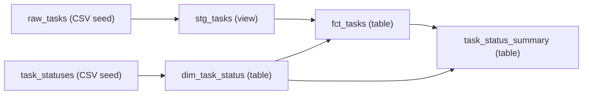

# Data engineering: dbt v2 and DuckDB

Use the existing **Task** domain to learn loading, SQL transformations, reporting, data quality,
and documentation. No Azure resources, database server, or dbt platform account are required.

Run the completed example below, then follow the [from-scratch hands-on](tutorial.md)
to assemble the same project. The commands and example are verified with dbt **2.0.8**.

## Learning objectives

| Concept | What you will do |
| --- | --- |
| OLTP / OLAP | Separate application Task CRUD from analytics over all Tasks |
| ELT | Load CSV input, then transform and aggregate it inside the database |
| Grain | Define whether one row represents a Task or a status |
| Staging / mart | Separate input normalization from analytical models |
| Dimension / fact | Join status reference data to current Tasks |
| DAG / lineage | Declare dependencies with `ref()` and inspect execution order and provenance |
| Data quality | Check duplicates, NULLs, statuses, text lengths, and aggregate consistency |
| Reproducibility | Use fixed input, locked dependencies, reruns, and measurable expected results |

### Responsibilities

**DuckDB** is an embedded analytical database that stores data and executes SQL.
This example uses a local `.duckdb` file, without a server or authentication.

**dbt** manages SQL model dependencies, execution, tests, and documentation.
It is not a database or a general API export / CDC ingestion tool.
CSV `seed` is a convenient Load mechanism for small learning and reference datasets.

ETL means Extract → Transform → Load. ELT means Extract → Load → Transform in the database.
This example starts with sample CSV treated as already extracted, so it does not implement Extract.

## Domain and scope

The [existing Task](https://github.com/ks6088ts-labs/template-azure-python/blob/main/template_azure_python/domain/task.py)
has four fields. The application's implementation and storage backend remain unchanged.

| Field | Domain meaning | Analytical representation |
| --- | --- | --- |
| `id` | UUID | UUID string in CSV; `task_id` in models |
| `title` | Strip surrounding whitespace; nonempty, at most 200 characters | Normalize and test `task_title` |
| `description` | Strip surrounding whitespace; at most 2000 characters; empty allowed | Interpret an empty CSV cell as empty text |
| `status` | `todo` / `in_progress` / `done` | Preserve invalid values for tests rather than silently correcting or dropping them |

The input uses fixed UUIDs and is learning data, not an export from the live API.
SQL `trim()` in this example removes ordinary surrounding spaces. It does not reproduce all
tab / Unicode whitespace handling of Python's `str.strip()`. Reuse the existing Task
normalization and validation when a real ingestion boundary needs exact domain behavior.

Task has no timestamps or assignees. These models describe **current counts and completion rate**,
not daily trends, duration, overdue work, or individual productivity.
`status_label`, `status_order`, and `is_completed` are analytical reference attributes,
not additions to the application domain.

## Run the completed example

### Prerequisites

- Clone the repository and have [Python and uv](../scripts.md) available.
- The following shell commands are for macOS / Linux. Run **every command from the repository root**.
- Initial dependency downloads require network access; data processing is entirely local afterwards.
- Use the existing `dbt` dependency group. v2 includes its DuckDB adapter, so do not additionally
  install `dbt-core`, `dbt-duckdb`, or Python's `duckdb` package.

```shell
export DBT_PROJECT_DIR="$PWD/docs/dbt/task_analytics"
export DBT_PROFILES_DIR="$DBT_PROJECT_DIR"
export DBT_SEND_ANONYMOUS_USAGE_STATS=false

uv run --locked --no-dev --group dbt dbt --version
uv run --locked --no-dev --group dbt dbt debug
uv run --locked --no-dev --group dbt dbt build
```

In PowerShell, replace the first three lines with the following. The `uv run` commands are unchanged.
Use your editor instead of the tutorial's shell-specific file creation commands.

```powershell
$env:DBT_PROJECT_DIR = Join-Path (Get-Location) "docs/dbt/task_analytics"
$env:DBT_PROFILES_DIR = $env:DBT_PROJECT_DIR
$env:DBT_SEND_ANONYMOUS_USAGE_STATS = "false"
```

Expect a successful connection from `debug`, then **2 seeds, 4 models, and 42 tests** from `build`.
The database lives at `docs/dbt/task_analytics/task_analytics.duckdb`.
Set an absolute `DBT_PROJECT_DIR` and do not change directories mid-session.
These variables affect only the current shell; no changes to `~/.dbt/profiles.yml` are needed.

### Inspect persisted results

```shell
uv run --locked --no-dev --group dbt dbt show --inline \
  "select status, task_count from {{ ref('task_status_summary') }} order by status_order"
```

| status | task_count |
| --- | --- |
| todo | 2 |
| in_progress | 2 |
| done | 2 |

```shell
uv run --locked --no-dev --group dbt dbt show --inline \
  "select count(*) as total_tasks, sum(case when is_completed then 1 else 0 end) as completed_tasks, round(100.0 * sum(case when is_completed then 1 else 0 end) / nullif(count(*), 0), 2) as completion_rate_pct from {{ ref('fct_tasks') }}"
```

Expect `total_tasks=6`, `completed_tasks=2`, and `completion_rate_pct=33.33`.
The denominator is all current Tasks; the numerator is Tasks currently marked `done`.
With no Tasks, the denominator is absent and the rate is `NULL` (undefined), not an invented 0%.

### Dependencies



**Next:** the [from-scratch hands-on](tutorial.md) builds this DAG one step at a time,
including failed tests, recovery, updates, and local Docs / lineage.
Use a working copy for exercises rather than editing the completed example's CSV.

## References

- [Official dbt v2 quickstart](https://docs.getdbt.com/guides/dbt?step=4&version=2)
- [DuckDB setup for dbt v2](https://docs.getdbt.com/docs/local/connect-data-platform/duckdb-setup)
- [dbt data tests](https://docs.getdbt.com/docs/build/data-tests)
- [dbt Docs v2](https://docs.getdbt.com/reference/commands/cmd-docs?version=2.0)
