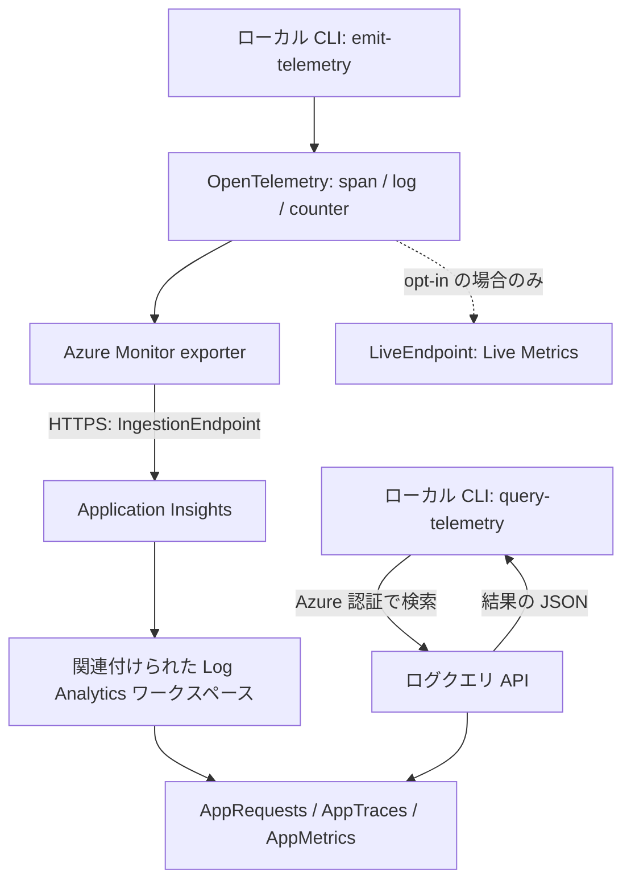

# 監視とログ

Azure の監視データやログを、CLI で読み取ります。
CLI はアクセス権の付与、診断設定の変更、コレクターの作成を行いません。

| 手順 | Azure への影響 |
| --- | --- |
| 第1～3章の出力取得・監視データの検索 | 読み取り専用。リソースや権限は変更しません |
| 第4章の無効時・接続文字列未設定時の確認 | Azure へのテレメトリ送信は不要です |
| 第4章の「Azure で API テレメトリを確認する」 | API のテレメトリを送信します |
| 第5章の `emit-telemetry` | サンプルのテレメトリを送信します |

**第4章の Azure 確認と第5章の送信には、取り込み料金が発生する場合があります。**
送信先と送信回数を決めてから実施してください。読み取りだけが目的なら送信は不要です。

## 1. 読み取り先を設定する

[開発環境と Azure の共通準備](scripts.md)を済ませ、使うリソースを用意します。
[`azure_observability` Terraform シナリオ](https://github.com/ks6088ts/template-terraform/tree/main/infra/scenarios/azure_observability)
の機能はすべて既定で無効です。必要な機能だけ、同リポジトリで有効にしてください。

| 見たいもの | シナリオで必要な機能 |
| --- | --- |
| マネージド Prometheus | `features.azure_monitor` |
| Log Analytics の `AzureActivity` | `features.log_analytics` と `features.activity_log` |
| Application Insights | `features.application_insights` と `features.log_analytics` |
| Network Watcher | `features.network_watcher` |
| サブスクリプションの Activity Log API | 機能フラグ不要。ワークスペースとは独立 |

`features.activity_log` はログのエクスポート設定です。Activity Log API の有効化ではありません。
Azure Monitor Workspace は Prometheus 用で、Log Analytics とは別のリソースです。

Terraform リポジトリのチェックアウト先で、秘密情報を含まない出力を取得します。

```shell
terraform -chdir=infra/scenarios/azure_observability output
terraform -chdir=infra/scenarios/azure_observability output -raw azure_monitor_id
```

`output` は構築済みの状態に保存された値を読む操作で、リソースを作成しません。
`Required plugins are not installed` や `Module not installed` が出た場合は、
Terraform リポジトリの準備手順に従い、同じシナリオで `terraform init` を行ってから再実行します。
`init` は provider・モジュール・backend の初期化です。出力取得のためだけに
`terraform apply` を実行したり、リソースを作り直したりしないでください。
既存の正しい ID があれば、出力取得ができなくても Python CLI の読み取り確認は進められます。

Python リポジトリの既存の `.env` に、使う対象の値だけ設定します。

| 取得元 | `.env` 変数 | 値の形式 |
| --- | --- | --- |
| `azure_monitor_id` | `AZURE_MONITOR_ID` | Azure Monitor Workspace の ARM ID |
| `log_analytics_workspace_id` | `AZURE_LOG_ANALYTICS_WORKSPACE_ID` | ワークスペースの GUID |
| `application_insights_id` | `AZURE_APPLICATION_INSIGHTS_ID` | Application Insights の ARM ID |
| `network_watcher_id` | `AZURE_NETWORK_WATCHER_ID` | Watcher の ARM ID |
| `az account show --query id --output tsv` | `AZURE_SUBSCRIPTION_ID` | サブスクリプションの GUID |
| `resource_group_name` または実際の Watcher のグループ | `AZURE_RESOURCE_GROUP` | 任意の絞り込み。全体を読む場合は空 |

ARM ID は `/subscriptions/<id>/resourceGroups/<group>/providers/` で始まるパスです。
GUID は `xxxxxxxx-xxxx-xxxx-xxxx-xxxxxxxxxxxx` 形式です。
**Log Analytics には `log_analytics_id`（ARM ID）ではなく GUID を使います。**
`activity_log_id` はエクスポート設定の ID で、サブスクリプション ID ではありません。
無効な機能の `null` は設定せず、その実習を省略します。

CLI で上書きする場合、Monitor / Application Insights / Watcher は `--resource-id`、
Log Analytics は `--workspace-id`、Activity Log は `--subscription-id` を使います。

### 設定の優先順位と空の値

Azure の設定は、**CLI オプション → 空でない OS 環境変数 → `.env` → 既定値**の順で解決します。
空の OS 環境変数は無視されるため、`AZURE_RESOURCE_GROUP=''` と指定しても
`.env` にグループ名が残っていれば、そのグループで絞り込まれます。

サブスクリプション全体を読む場合は、既存の `.env` の `AZURE_RESOURCE_GROUP` を空にし、
現在のターミナルで export していた値も解除します。

```shell
unset AZURE_RESOURCE_GROUP
```

このコマンドは現在のシェルの環境変数だけを解除し、`.env` は変更しません。
設定ファイル全体を上書きせず、必要な項目だけ編集してください。
接続文字列にも同じフォールバックがあるため、「空の環境変数を渡した」ことと
「接続文字列が未設定である」ことは同じではありません。

## 2. 読み取り権限を確認する

実際にコマンドを実行する ID に、管理者が次の権限を付与します。

| 操作 | ロール | 付与先 |
| --- | --- | --- |
| ワークスペース・Watcher の情報取得 | `Reader` | 対象リソース。一覧取得は対象グループまたはサブスクリプション |
| PromQL クエリ | `Monitoring Data Reader` | Azure Monitor Workspace |
| Log Analytics クエリ | `Log Analytics Reader` | Log Analytics ワークスペース |
| Application Insights クエリ | `Reader` またはワークスペースのクエリ権限 | Application Insights または保存先ワークスペース |
| Activity Log API | `Reader`（Activity Log 読み取りを含む） | サブスクリプション |

PromQL の `Monitoring Data Reader` は `Monitoring Reader` とは別です。
Application Insights は、ワークスペースがリソースの権限による読み取りを許可していれば
コンポーネントの `Reader` を使えます。それ以外は保存先の `Log Analytics Reader` などが必要です。

詳細は [Prometheus API](https://learn.microsoft.com/azure/azure-monitor/metrics/prometheus-api-promql)と
[Log Analytics のアクセス管理](https://learn.microsoft.com/azure/azure-monitor/logs/manage-access)を参照してください。

`az account show` でアカウントとサブスクリプションを確認しても、データの読み取り権限までは
確認できません。以下の実クエリが成功すれば、その時点でその操作を実行できることは確認できます。
ただし、成功したことだけで特定のロール名が付与されているとは断定できません。

## 3. 必要なデータを読み取る

以降は、この Python リポジトリのルートで実行します。
使える対象のコマンドだけ選び、全オプションは各コマンドの `--help` で確認します。

`uv run` はプロジェクトの依存関係を使って実行し、`--locked` はロックファイルの更新を防ぎます。
`python -m` は指定したモジュールを CLI として起動します。
ログ検索の JSON は `tables` の中に `columns`（列の定義）と `rows`（行の値）を返します。
各行の値は `columns` と同じ順序です。
**終了コードと結果の両方を確認してください。** 結果が空でも成功の場合があり、
逆に JSON に `error` がある部分結果は、完全な成功として扱えません。

### Prometheus: ワークスペースとメトリック

```shell
uv run --locked python -m scripts.cli_azure_monitor show-workspace
uv run --locked python -m scripts.cli_azure_monitor query-prometheus --query 'up'
```

`show-workspace` は配置とクエリ先の確認、`query-prometheus` はメトリックの検索です。
`up` は収集対象の稼働状態を表すメトリックです。
シナリオはコレクターを作成しません。収集を別途設定していなければ、
`status: success` でも `result` が空なのは正常です。
空の結果だけで、コレクターが未設定だと断定することはできません。

### Log Analytics: エクスポート済みの Activity Log

```shell
uv run --locked python -m scripts.cli_log_analytics query-logs --hours 24 --limit 100
uv run --locked python -m scripts.cli_log_analytics summarize-activity --hours 24 --limit 100
```

固定の `AzureActivity` クエリを実行します。任意の KQL を渡す CLI ではありません。
`query-logs` は新しい順の操作履歴、`summarize-activity` は操作名とステータス別の件数を返します。
対象ワークスペースへの[診断エクスポート](https://learn.microsoft.com/azure/azure-monitor/platform/activity-log#export-activity-log)と
取り込み待ちが必要です。未設定なら、テーブルが未作成または空になります。

### Application Insights: リクエストなどのテレメトリ

```shell
uv run --locked python -m scripts.cli_application_insights query-telemetry \
  --table AppRequests --hours 24 --limit 100
```

読み取りに接続文字列は不要です。`--table` は `AppRequests`・`AppTraces`・
`AppMetrics`・`AppDependencies` の 4 種類です。
送信前に0行でも、クエリ自体が成功していれば読み取り確認は成功です。
送信と取り込みの確認は第4・5章で別に行います。

### Network Watcher: 配置と設定

```shell
uv run --locked python -m scripts.cli_network_watcher list-watchers
uv run --locked python -m scripts.cli_network_watcher show-watcher
```

`list-watchers` は一覧、`show-watcher` は指定した Watcher の詳細を返します。
`provisioning_state: Succeeded` は Watcher の構築成功で、通信の正常性を示す値ではありません。
Watcher はシナリオとは別のリソースグループにある場合があります。
全体を探す場合は、第1章の手順で `.env` と OS のグループ絞り込みを解除します。個別の対象は
`show-watcher --resource-id "<watcher-ARM-ID>"` で指定できます。
これらは[読み取り専用](https://learn.microsoft.com/azure/network-watcher/network-watcher-overview)で、
パケットキャプチャや接続テストは開始しません。

### Activity Log API: サブスクリプションの操作履歴

```shell
uv run --locked python -m scripts.cli_activity_log list-events --hours 24 --limit 100
uv run --locked python -m scripts.cli_activity_log summarize-events --hours 24 --limit 100
```

ワークスペースへのエクスポートがなくても読めます。
`list-events` は操作履歴、`summarize-events` は取得したサンプルの集計を返します。
操作がなければ結果は空です。ただし、0件の場合はグループ絞り込みも確認してください。
Log Analytics の `AzureActivity` が空ではないのに API が0件なら、
同じサブスクリプション・時間範囲・絞り込みで読んでいるかを確認します。
履歴内の `Failed` は過去の操作の状態であり、今回の検索コマンドの失敗ではありません。
[Activity Log の概要](https://learn.microsoft.com/azure/azure-monitor/platform/activity-log)も参照してください。

### 絞り込みと集計の違い

- ログ・テレメトリ・Activity Log は `--hours` が 1～168（既定 24）、
  `--limit` が 1～1,000（既定 100）です。
- `list-watchers`・`list-events`・`summarize-events` は
  `--resource-group "<group>"` または `AZURE_RESOURCE_GROUP` で絞れます。

| コマンド | `--limit` が制限するもの |
| --- | --- |
| `query-logs`, `query-telemetry` | 返す行数 |
| Log Analytics の `summarize-activity` | 時間範囲内の全一致行を集計した後のグループ数 |
| Activity Log の `summarize-events` | 取得・集計するイベント数。期間内の総数ではない |

## 4. API を計装する

API は Azure Monitor OpenTelemetry Distro を使い、FastAPI のリクエスト、
標準メトリック、パッケージログの相関、計装済み HTTP / Azure SDK の依存関係を収集します。
アプリケーションコードは環境変数を直接読みません。`.env` またはホスティング環境の値を
Pydantic Settings で集約し、プロセス単位の初期化関数へ渡します。

ローカル開発で Azure を必須にしない既定値は次のとおりです。

```dotenv
PROJECT_NAME=template-azure-python
TELEMETRY_ENABLED=false
TELEMETRY_TRACES_PER_SECOND=5
TELEMETRY_LIVE_METRICS_ENABLED=false
APPLICATIONINSIGHTS_CONNECTION_STRING=
```

`PROJECT_NAME` は OpenTelemetry の `service.name` と Application Insights の
クラウドロール名になります。`TELEMETRY_TRACES_PER_SECOND` は正数で、
1 プロセスごとの上限です。既定値のまま 5 replica を動かすと、全体では最大でおよそ
毎秒 25 trace をサンプリングできます。worker / replica 数と取り込み予算に合わせて
調整してください。Live Metrics は常時接続を追加するため、別設定にしています。

### Live Metrics を opt-in で有効にする

`TELEMETRY_LIVE_METRICS_ENABLED` は API と CLI の `emit-telemetry` で共用するフラグです。
既定値は `false` で、通常の取り込みだけを行います。
`.env` またはホスティング環境で `true` にすると、SDK の Live Metrics 機能も有効になります。
API では `TELEMETRY_ENABLED=true` と接続文字列も必要です。

```shell
TELEMETRY_ENABLED=true TELEMETRY_LIVE_METRICS_ENABLED=true \
  uv run --locked python -m scripts.template serve-container-apps
```

CLI の1回の送信だけで opt-in する場合は、次を使います。
接続文字列はあらかじめ非公開で設定してください。

```shell
TELEMETRY_LIVE_METRICS_ENABLED=true \
  uv run --locked python -m scripts.cli_application_insights emit-telemetry --count 10
```

CLI は明示的な送信コマンドなので、`TELEMETRY_ENABLED=false` でも送信します。
この設定は API の起動時の計装だけを制御し、CLI 送信の停止スイッチではありません。
CLI は指定回数を送って終了するため、Live Metrics の接続・表示が間に合わない場合があります。
Azure portal の **Live Metrics** で確認する用途には、起動を維持する API が適しています。

Live Metrics は通常のログ取り込みとは別の HTTPS 通信です。
有効にすると、接続文字列の `LiveEndpoint` を使う SDK のライブ監視通信が追加されます。
通常の `AppRequests`・`AppTraces`・`AppMetrics` への取り込みを置き換えるものではありません。
`flushed: true` や通常のクエリ結果は、Live Metrics の表示成功を保証しません。
Live Metrics では SDK がライブ用の集計やサンプルも扱うため、
通常の保存データと同じ件数・項目になるとは限りません。

無効へ戻す場合は設定を `false` にし、新しいプロセスで起動し直します。
実行中のプロセスでは設定がキャッシュされるため、設定ファイルの編集だけでは切り替わりません。
API は明示的な初期化失敗で起動を止め、CLI は検知した SDK 警告や送信失敗を報告します。
ただし、Live Metrics が画面に表示されたかどうかは portal で別途確認してください。

### 無効時の動作を確認する

`TELEMETRY_ENABLED=false` のまま、次を実行します。

```shell
TELEMETRY_ENABLED=false uv run --locked python -m scripts.template serve-container-apps
```

起動コマンドはサーバーを動かし続けます。別のターミナルで応答を確認します。

```shell
curl --fail http://127.0.0.1:8000/
curl --fail --silent --output /dev/null --write-out '%{http_code}\n' http://127.0.0.1:8000/docs
```

期待する応答は `{"Hello":"World"}` です。接続文字列は不要で、
Azure Monitor provider も設定されません。
`/docs` は HTTP `200` を確認します。確認後はサーバー側で `Ctrl+C` を押して停止します。
次の確認も同じポートを使うため、同時に起動しないでください。

### fail-fast を確認する

`.env` の `APPLICATIONINSIGHTS_CONNECTION_STRING` が空または未設定であることを確認し、
OS 環境変数も解除してから、テレメトリを有効にして起動します。
既存の接続文字列を保持したい場合は、無理に消さず、後述の自動テストで未設定時の契約を確認してください。

```shell
unset APPLICATIONINSIGHTS_CONNECTION_STRING
TELEMETRY_ENABLED=true uv run --locked python -m scripts.template serve-container-apps
```

接続文字列が未設定であることを示す、秘匿済みのエラーで起動に失敗するのが期待結果です。
終了コードは0以外で、メッセージは次のとおりです。

```text
API telemetry is enabled but APPLICATIONINSIGHTS_CONNECTION_STRING is not configured.
```

単に起動に失敗しただけでは、この確認は成功とはいえません。
`Azure Monitor telemetry initialization failed.` は別の初期化エラーです。
空の OS 環境変数と `.env` の既存値が混在すると、Settings と SDK の解釈が異なり、
未設定エラーではなく初期化エラーになる場合があります。
設定元を整理して期待するメッセージを確認してください。
本当に未設定なのに API が起動した場合は設定契約が壊れています。この確認のために接続文字列を
コマンドラインへ貼り付けないでください。

### Azure で API テレメトリを確認する

**ここからは実際に Azure へ送信します。取り込み料金が発生する場合があります。**
Git の無視対象 `.env` に `APPLICATIONINSIGHTS_CONNECTION_STRING` を非公開で設定し、
接続文字列の送信先と `AZURE_APPLICATION_INSIGHTS_ID` の検索先が同じリソースであることを確認します。
Azure portal の同じ Application Insights の概要とリソース ID を使い、
照合のために接続文字列を画面共有やログへ出さないでください。

```shell
TELEMETRY_ENABLED=true uv run --locked python -m scripts.template serve-container-apps
```

別のターミナルでリクエストを送ります。

```shell
curl --fail http://127.0.0.1:8000/
curl --fail http://127.0.0.1:8000/docs
```

取り込みを待ち、同じ Application Insights リソースを検索します。

```shell
uv run --locked python -m scripts.cli_application_insights query-telemetry \
  --table AppRequests --hours 1 --limit 100
```

送信時刻と `url` を使って今回の `GET /` と `GET /docs` を探します。
`resultCode` が `200`、`success` が成功を示す値、
`cloud_RoleName` が `PROJECT_NAME` と一致することを確認します。
`PROJECT_NAME` は初期化時に OpenTelemetry の `service.name` にも設定されます。
HTTP 200 は API の応答確認であり、Azure への取り込み確認とは別です。
少数のリクエストはサンプリングで表示されないことがあります。上限を決めて複数回送り、
待ってから再検索してください。本番で確認のためだけにサンプリングを無効化しないでください。
例えば合計10リクエストを上限として、最初の2回を含めて数えます。
追加送信は間隔を空けて行い、まず数十秒待って再検索します。
待ち時間は取り込み完了の保証ではありません。検索回数にも上限を設け、
見つからなければ未確認として送信先・サンプリング・SDK 警告を調べます。
確認後は `Ctrl+C` でサーバーを正常終了させ、終了時の送信処理を待ちます。

API ルートが計装済み HTTP / Azure SDK を呼ぶ場合は `AppDependencies` を検索し、
operation / trace ID が親リクエストにつながることを確認します。
`template_azure_python` 配下の logger でログを出した場合は `AppTraces` を検索して、
同じ相関を確認します。標準・カスタムメトリックは `AppMetrics` で確認します。
root endpoint は、テーブルを埋めるためだけの偽の依存関係、リクエストごとの INFO ログ、
デモメトリックを生成しません。
したがって root endpoint の確認で `AppTraces`・`AppDependencies` が空でも異常とは限りません。
外部呼び出しを行わないルートでは、依存関係の相関を実証したことにはなりません。

### 大規模運用と拡張の境界

- バッチ処理、再試行、exporter の寿命、対応する FastAPI / Azure SDK 計装は
  Distro に任せます。初期化はプロセスごとに 1 回だけで、リクエストごとには行いません。
- Resource とメトリックの属性は安定した低カーディナリティ値に限定します。
  request ID、user ID、payload、token、機密値、無制限に増える値を付けないでください。
- レート制限はデプロイ全体ではなく各プロセスに適用されます。worker / replica 数を
  変更したら再評価し、取り込みコストとサンプリングの影響を監視してください。
- 明示的に有効にした場合だけ、初期化失敗で起動を止めます。ローカル利用を維持しつつ、
  本番が未監視のまま正常に見える状態を防ぎます。
- 実装済み backend は Azure Monitor だけです。将来の OTLP exporter は初期化境界の
  内側へ追加し、router やドメインコードは exporter 固有 API ではなく
  OpenTelemetry API を使い続けます。

## 5. CLI からテレメトリを送って確認する（任意）

**第4章の Azure 確認と同様にデータを送信します。取り込み料金が発生する場合があります。**

### 接続文字列をローカルに設定する

シナリオは接続文字列を出力しません。Azure portal の Application Insights の
**概要**から取得し、Git の無視対象 `.env` の `APPLICATIONINSIGHTS_CONNECTION_STRING` に設定します。
ローカルのシークレット管理で環境変数を設定しても構いません。

テンプレートの値は空のままにします。ソース・シェルの引数や履歴・ログ・
スクリーンショット・共有出力に値を貼り付けないでください。接続文字列用の CLI オプションはありません。
[接続文字列](https://learn.microsoft.com/azure/azure-monitor/app/connection-strings)と
[Python OpenTelemetry](https://learn.microsoft.com/azure/azure-monitor/app/opentelemetry-enable?tabs=python)も参照してください。

内部実装は中央の settings パッケージから `SecretStr` として値を取得し、設定の dump からも除外します。
SDK 用の環境変数制御は一時的なもので、送信後に元の状態へ復元します。
[アーキテクチャ](architecture/index.md)も参照してください。

### サンプルを送信する

```shell
uv run --locked python -m scripts.cli_application_insights emit-telemetry --count 10
```

`--count` は 1～100（既定 10）です。server span・相関ログ・メトリック増分を送信し、
一意の `run_id` を表示します。dependency span は生成しません。
flush の失敗や検知した SDK 警告は報告されます。
**`flushed: true` はローカルの送信処理完了だけを示し、Azure の受理・取り込みを保証しません。**

### 同じ実行のデータを検索する

取り込みを待ち、最近のリクエストと、表示された UUID の各データを確認します。

```shell
uv run --locked python -m scripts.cli_application_insights query-telemetry \
  --table AppRequests --hours 1 --limit 100
RUN_ID="<run_id-UUID-printed-by-emit-telemetry>"
uv run --locked python -m scripts.cli_application_insights query-telemetry \
  --table AppRequests --run-id "$RUN_ID" --hours 1 --limit 100
uv run --locked python -m scripts.cli_application_insights query-telemetry \
  --table AppTraces --run-id "$RUN_ID" --hours 1 --limit 100
uv run --locked python -m scripts.cli_application_insights query-telemetry \
  --table AppMetrics --run-id "$RUN_ID" --hours 1 --limit 100
```

`--run-id` は省略可能ですが、指定する場合は UUID を使います。

| 確認するもの | 見る値 |
| --- | --- |
| 時刻 | `timestamp` |
| 実行 ID | `customDimensions.run_id` |
| リクエストとログの相関 | `AppRequests` と `AppTraces` の `operation_Id` が対応すること |
| `quickstart.events` のメトリック | 対象実行の `valueSum` の合計を `--count` と比較 |

CLI はテーブル名をリソース用 API の `requests`・`traces`・`customMetrics`・
`dependencies` に変換し、JSON の列名は API の形式を保ちます。
メトリックは集約されるため、行数ではなく値で比較してください。
相関は行の並び順ではなく ID で照合します。
`customDimensions` が JSON 文字列で返った場合は、その文字列を JSON として解釈して
`run_id` を確認します。SDK を直接使う検証コードでは `timestamp` が日時オブジェクトになる場合がありますが、
CLI は JSON に日時を文字列として出力します。

シナリオのサンプリングは既定 25% です。送信 CLI のクライアント側設定は別で、
`always_on` を使います。ログや span の行数は `--count` と一致するとは限りません。
各データの到着時刻も異なる場合があります。
[サンプリング](https://learn.microsoft.com/azure/azure-monitor/app/opentelemetry-sampling)と
[取り込み遅延](https://learn.microsoft.com/azure/azure-monitor/logs/data-ingestion-time)を確認し、
見つからない場合は同じ `run_id` で待って再検索します。無制限に再送しないでください。

終了後はサーバーを停止し、実習のためだけに追加した接続文字列を削除します。
既存の業務・開発用の設定は、用途を確認せず削除しないでください。
**ローカル設定の削除だけでは Azure の課金は止まりません。**

## 6. 何が生成され、どこへ転送されるか

`emit-telemetry` はローカルでデータを生成して Azure へ送る処理です。
`query-telemetry` は保存済みのデータを Azure から読み取る処理で、逆方向の通信です。



この保存先の説明は、今回確認したワークスペースベースの Application Insights を対象とします。
Azure Monitor Workspace（Prometheus 用）や Network Watcher に送る処理ではありません。

### 送信先と検索先を決める設定

| 設定 | 役割 |
| --- | --- |
| `APPLICATIONINSIGHTS_CONNECTION_STRING` | exporter の送信先。`InstrumentationKey` は宛先の Application Insights を識別し、`IngestionEndpoint` は HTTPS の取り込み先 |
| 接続文字列内の `LiveEndpoint` | Live Metrics を有効にした場合のライブ監視通信先 |
| `AZURE_APPLICATION_INSIGHTS_ID` / `--resource-id` | クエリ API の検索対象となる Application Insights の ARM ID。送信先は変更しない |

送信処理は `DefaultAzureCredential` を作成せず、接続文字列を SDK に渡します。
検索処理は接続文字列を使わず、`DefaultAzureCredential` と `LogsQueryClient.query_resource` を使います。
送信先と検索先が違えば、送信が成功しても検索では見つかりません。

### 1回のループで生成する3種類のデータ

実行ごとに UUID の `run_id` を作り、各ループに1から `--count` までの `sequence` を付けます。
`count=10` なら、コード上では次の処理を10回行います。

| 種類 | 生成するデータ | exporter の形式 | 保存先 |
| --- | --- | --- | --- |
| span | `quickstart.request`、`SpanKind.SERVER`、開始・終了時刻、所要時間、trace/span ID、実行属性 | `RequestData` | `AppRequests` |
| ログ | INFO の `Quickstart telemetry`、時刻、現在の span の相関 ID、実行属性 | `MessageData` | `AppTraces` |
| カウンター | `quickstart.events` に1を加算し、実行属性を付与 | `MetricData` | `AppMetrics` |

**CLI は HTTP リクエストを API に送っているわけではありません。**
手動で作る SERVER span を exporter がリクエスト形式へ変換するため、
`AppRequests` に保存されます。`quickstart.request` が見つかっても、
実際に `GET /` が成功したことを示すデータではありません。dependency span も生成しません。

ログは span の内側で出すため、リクエストと `operation_Id` で相関できます。
`run_id` は実行全体をまとめる ID、`operation_Id` は個々の処理を対応させる ID です。
メトリックは同じ実行の `run_id` と値で確認し、ログのような operation ID の一致は必須にしません。
`sequence` もメトリックの属性なので、今回のサンプルでは連番ごとに系列が分かれます。
この属性設計は上限100の実習用です。本番のメトリックに実行 UUID や無制限に増える連番を付けないでください。

### exporter による転送と終了処理

OpenTelemetry の provider がデータを収集し、Azure Monitor exporter が変換・バッチ送信します。
確認した SDK の通常の送信経路は `POST <IngestionEndpoint>/v2.1/track` です。
1ループが1 HTTP POST になるとは限りません。
exporter は明示した属性以外にも、時刻、ID、SDK・リソースの情報などを付加します。
ソースコードや設定ファイル全体を送る処理ではありませんが、ログ本文や属性に機密値を入れれば
それも送信され得ます。サンプルは固定メッセージ、UUID、連番だけを明示的に生成します。

CLI は通常の HTTP / FastAPI / Azure SDK 自動計装とパフォーマンスカウンターを無効にします。
オフライン保存も無効にし、送信できないデータを exporter のローカルファイルへ残しません。
SDK の Statsbeat・SDKStats・Control Plane 用機能は送信中だけ無効にし、環境変数は元へ戻します。
Live Metrics はこれらとは別に、共用フラグが `true` の場合だけ有効にします。

最後に trace・log・metric の各 provider を `force_flush` し、`shutdown` します。
標準出力の `run_id`・`count`・`flushed` はローカル処理の結果であり、Azure の検索結果ではありません。
`flushed` は検知した失敗がないことを示す値で、Azure への保存確認は同じ `run_id` の検索で行います。

### 検索時の変換と API 計装との違い

`query-telemetry` はテーブル名をリソース用 API の形式へ変換します。

| CLI の `--table` | クエリで使う名前 |
| --- | --- |
| `AppRequests` | `requests` |
| `AppTraces` | `traces` |
| `AppMetrics` | `customMetrics` |
| `AppDependencies` | `dependencies` |

例えば1時間・実行 ID・100行の指定では、次の KQL を組み立てます。
結果は CLI がローカルの標準出力へ JSON で表示します。

```kusto
requests
| where timestamp >= ago(1h)
| where tostring(customDimensions["run_id"]) == "<今回のUUID>"
| order by timestamp desc
| take 100
```

API の計装はこれとは異なり、実際に受けた `GET /` などを自動収集します。
対象 logger の実ログや、計装済みの外部 HTTP / Azure SDK 呼び出しも収集対象です。
API は `PROJECT_NAME` を `service.name` に明示設定しますが、CLI サンプルは明示設定しません。
どちらも同じ接続文字列で送信できますが、データの発生元と意味を区別してください。

## 動作確認例と自動テスト

2026年10月5日の確認では、次の結果が得られました。
件数はその環境・時間範囲・サンプリングでの実測例であり、毎回一致すべき期待値ではありません。
秘密情報、サブスクリプション ID、実行 UUID はここには記載しません。

| 確認 | 実測結果と読み方 |
| --- | --- |
| Azure 読み取りコマンド9種類 | すべて成功。Prometheus の `up` は成功・0件 |
| Log Analytics | 過去24時間で61行、操作名・状態の集計は32グループ |
| Activity Log API | グループ絞り込みでは0件、解除後は61件。空の結果でも絞り込みを確認する必要がある |
| Network Watcher | 1件、構築状態は `Succeeded` |
| 無効時と fail-fast | `/`・`/docs` は200。既存設定を読まない一時ディレクトリで未設定時の起動失敗も確認 |
| API の実送信 | 合計10回すべて200。Azure では両ルートを含む3行と期待するクラウドロール名を確認 |
| CLI の実送信 | `count=10` を1回送信。リクエスト3行・ログ3行の operation ID が対応し、メトリックの `valueSum` 合計は10 |
| 確認の限界 | Terraform 出力取得はプラグイン・モジュール不足で未確認。外部呼び出しのない API ルートでは依存関係の相関は未確認 |

関連自動テストは241件成功しました。実クエリとは別に、境界値、設定の優先順位、
秘密値の非表示、環境変数の復元、計装、初期化の一度限り実行、エラー処理を確認します。
[開発環境の準備](scripts.md)後、次のコマンドで実行できます。

```shell
uv run --locked pytest \
  tests/test_cli_azure_monitor.py tests/test_cli_log_analytics.py \
  tests/test_cli_application_insights.py tests/test_cli_network_watcher.py \
  tests/test_cli_activity_log.py tests/test_settings.py \
  tests/test_telemetry.py tests/test_api.py -q --no-cov
```

接続文字列を変更せず未設定時の契約だけを確認する場合は、次を使います。
このテストは設定を明示的に渡し、Azure へ送信しません。実サーバーの起動確認とは別です。

```shell
uv run --locked pytest tests/test_telemetry.py \
  -k enabled_telemetry_requires_connection_string -q --no-cov
```

## 困ったとき

| 症状 | 対処 |
| --- | --- |
| `Missing option` | 対応表の ID を `.env` に追加するか、CLI で指定します。`az login` は ID を設定しません |
| 古い `.env` に変数がない | 既存ファイルに不足する変数を追記します。テンプレートの更新は自動反映されません |
| 一部のグループしか表示されない／Activity Log が0件 | `.env` と OS の両方の `AZURE_RESOURCE_GROUP` を確認します。空の OS 値だけでは `.env` の絞り込みは解除されません |
| 空の接続文字列を指定しても未設定エラーにならない | `.env` に既存値がないかを確認します。未設定エラーと SDK 初期化エラーを区別します |
| Terraform 出力を取得できない | プラグイン・モジュール不足なら準備手順に従って `terraform init` を行います。読み取りのためだけに `apply` はしません |
| 403 | 実行 ID・テナント・ロールの付与先・反映待ち・ネットワーク制限を確認します |
| `AzureActivity` がない | 対象ワークスペースへの診断エクスポートと取り込みを確認します |
| Application Insights のテーブルエラー | CLI を更新します。リソース用 API とワークスペース用のスキーマは異なります |
| 送信したデータが見つからない | 同じ `run_id` で再検索し、送信先・検索先・サンプリング・SDK 警告・ネットワークを確認します |

CLI オプションや一時的な環境変数は、後から開くターミナルに保存されません。
設定後は通常のターミナルでコマンドを再実行してください。
Application Insights の[スキーマ](https://learn.microsoft.com/azure/azure-monitor/app/data-model-complete)では、
リソース用 API の `timestamp`・`customDimensions` と、ワークスペース用の
`TimeGenerated`・`Properties` を混同しないようにします。
