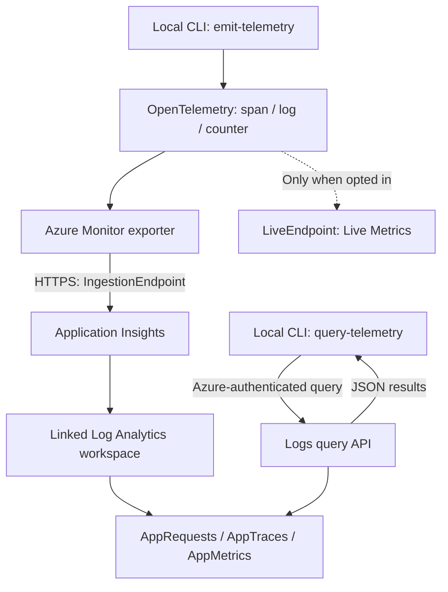

# Monitoring and logs

Read Azure monitoring data and logs from the CLI.
The CLIs do not assign roles, change diagnostic settings, or deploy collectors.

| Exercise | Effect on Azure |
| --- | --- |
| Output retrieval and monitoring queries in sections 1-3 | Read-only; no resource or permission changes |
| Disabled and missing-connection-string checks in section 4 | No Azure telemetry emission required |
| "Verify API telemetry in Azure" in section 4 | Sends API telemetry |
| `emit-telemetry` in section 5 | Sends sample telemetry |

**Both the Azure API check in section 4 and emission in section 5 may incur ingestion charges.**
Choose the destination and request count before proceeding. Skip emission if you only need to read data.

## 1. Set the read targets

Complete the [development and common Azure setup](scripts.md) and prepare the
resources you need. All features in the
[`azure_observability` Terraform scenario](https://github.com/ks6088ts/template-terraform/tree/main/infra/scenarios/azure_observability)
are off by default. Enable only the required features in that repository.

| Data to read | Required scenario features |
| --- | --- |
| Managed Prometheus | `features.azure_monitor` |
| Log Analytics `AzureActivity` | `features.log_analytics` and `features.activity_log` |
| Application Insights | `features.application_insights` and `features.log_analytics` |
| Network Watcher | `features.network_watcher` |
| Subscription Activity Log API | No feature flag; independent of workspaces |

`features.activity_log` configures export; it does not enable the Activity Log API.
Azure Monitor Workspace is for Prometheus and is separate from Log Analytics.

Read nonsecret outputs from your Terraform checkout:

```shell
terraform -chdir=infra/scenarios/azure_observability output
terraform -chdir=infra/scenarios/azure_observability output -raw azure_monitor_id
```

`output` reads values stored in existing state; it does not create resources.
If it reports `Required plugins are not installed` or `Module not installed`,
follow the Terraform repository's setup instructions and run `terraform init`
for the same scenario before retrying. `init` initializes providers, modules, and
the backend. Do not run `terraform apply` or recreate resources merely to read outputs.
If you already have correct IDs, you can continue Python CLI read checks without retrieving outputs.

Set only the values you need in this Python repository's existing `.env`:

| Source | `.env` variable | Value format |
| --- | --- | --- |
| `azure_monitor_id` | `AZURE_MONITOR_ID` | Azure Monitor Workspace ARM ID |
| `log_analytics_workspace_id` | `AZURE_LOG_ANALYTICS_WORKSPACE_ID` | Workspace GUID |
| `application_insights_id` | `AZURE_APPLICATION_INSIGHTS_ID` | Application Insights ARM ID |
| `network_watcher_id` | `AZURE_NETWORK_WATCHER_ID` | Watcher ARM ID |
| `az account show --query id --output tsv` | `AZURE_SUBSCRIPTION_ID` | Subscription GUID |
| `resource_group_name` or the watcher's actual group | `AZURE_RESOURCE_GROUP` | Optional filter; empty for subscription-wide reads |

An ARM ID is a path starting with `/subscriptions/<id>/resourceGroups/<group>/providers/`.
A GUID has the form `xxxxxxxx-xxxx-xxxx-xxxx-xxxxxxxxxxxx`.
**For Log Analytics, use the GUID, not the `log_analytics_id` ARM ID.**
`activity_log_id` identifies an export setting, not a subscription.
Do not configure `null` outputs for disabled features; skip those exercises.

To override settings, Monitor / Application Insights / Watcher use `--resource-id`,
Log Analytics uses `--workspace-id`, and Activity Log uses `--subscription-id`.

### Setting precedence and empty values

Azure settings resolve in this order: **CLI options, nonempty OS environment variables,
`.env`, then defaults**. Empty OS values are ignored. Setting `AZURE_RESOURCE_GROUP=''`
therefore still uses a group configured in `.env`.

For subscription-wide reads, empty `AZURE_RESOURCE_GROUP` in the existing `.env`
and remove any exported value in the current terminal:

```shell
unset AZURE_RESOURCE_GROUP
```

This command removes only the current shell's environment variable; it does not
edit `.env`. Change only the necessary fields, not the entire settings file.
Connection strings have the same fallback: passing an empty environment variable
does not necessarily mean the connection string is unconfigured.

## 2. Check read permissions

Ask an administrator to grant these permissions to the actual calling identity:

| Operation | Role | Scope |
| --- | --- | --- |
| Workspace / Watcher metadata | `Reader` | Target resource; listing needs group or subscription access |
| PromQL queries | `Monitoring Data Reader` | Azure Monitor Workspace |
| Log Analytics queries | `Log Analytics Reader` | Log Analytics workspace |
| Application Insights queries | `Reader` or workspace query access | Application Insights or its backing workspace |
| Activity Log API | `Reader`, including Activity Log read access | Subscription |

PromQL's `Monitoring Data Reader` is not `Monitoring Reader`.
Application Insights can use component-level `Reader` when the workspace permits
resource-based access. Otherwise, grant query access such as `Log Analytics Reader`
on the backing workspace.

See [Prometheus API access](https://learn.microsoft.com/azure/azure-monitor/metrics/prometheus-api-promql)
and [Log Analytics access](https://learn.microsoft.com/azure/azure-monitor/logs/manage-access).

`az account show` confirms the account and subscription, not data read permissions.
A successful query below demonstrates access to that operation at that time.
It does not prove that a particular named role has been assigned.

## 3. Read the data you need

Run the remaining commands from the root of this Python repository.
Choose only available targets. Add `--help` to a command to see all options.

`uv run` uses the project's dependencies, `--locked` prevents lockfile updates,
and `python -m` starts the selected module as a CLI.
Log query JSON contains `tables`, each with `columns` (definitions) and `rows` (values).
Values in each row follow the order of `columns`.
**Check both the exit code and the result.** Empty results can be successful;
partial results containing `error` must not be treated as complete success.

### Prometheus: workspace and metrics

```shell
uv run --locked python -m scripts.cli_azure_monitor show-workspace
uv run --locked python -m scripts.cli_azure_monitor query-prometheus --query 'up'
```

`show-workspace` checks location and query endpoint; `query-prometheus` searches metrics.
`up` represents the health of collection targets.
The scenario does not deploy a collector. Without a separate collection setup,
`status: success` with an empty `result` is normal.
An empty result alone does not prove that a collector is unconfigured.

### Log Analytics: exported Activity Log

```shell
uv run --locked python -m scripts.cli_log_analytics query-logs --hours 24 --limit 100
uv run --locked python -m scripts.cli_log_analytics summarize-activity --hours 24 --limit 100
```

These run fixed `AzureActivity` queries, not arbitrary KQL.
`query-logs` returns recent operation history, newest first; `summarize-activity`
returns counts grouped by operation and status.
Configure [diagnostic export](https://learn.microsoft.com/azure/azure-monitor/platform/activity-log#export-activity-log)
to the selected workspace and allow ingestion time. Without it, the table may be
missing or empty.

### Application Insights: requests and other telemetry

```shell
uv run --locked python -m scripts.cli_application_insights query-telemetry \
  --table AppRequests --hours 24 --limit 100
```

Reading does not need a connection string. `--table` accepts `AppRequests`,
`AppTraces`, `AppMetrics`, and `AppDependencies`.
A successful query returning zero rows before emission still passes the read check.
Verify emission and ingestion separately in sections 4 and 5.

### Network Watcher: location and settings

```shell
uv run --locked python -m scripts.cli_network_watcher list-watchers
uv run --locked python -m scripts.cli_network_watcher show-watcher
```

`list-watchers` returns a list; `show-watcher` returns one watcher's details.
`provisioning_state: Succeeded` means provisioning succeeded, not that network traffic is healthy.
The watcher may be in a different resource group from the scenario.
Follow section 1 to clear both `.env` and OS group filters for subscription-wide discovery.
Select an individual watcher with `show-watcher --resource-id "<watcher-ARM-ID>"`.
These [read-only operations](https://learn.microsoft.com/azure/network-watcher/network-watcher-overview)
do not start packet captures or connectivity tests.

### Activity Log API: subscription operation history

```shell
uv run --locked python -m scripts.cli_activity_log list-events --hours 24 --limit 100
uv run --locked python -m scripts.cli_activity_log summarize-events --hours 24 --limit 100
```

These work without workspace export. A quiet subscription can return no events.
`list-events` returns operation history; `summarize-events` aggregates the retrieved sample.
For zero results, also check the resource group filter. If Log Analytics `AzureActivity`
is nonempty but this API returns no events, compare the subscription, time window,
and filters. A `Failed` status in history describes an earlier operation,
not a failure of the current query command.
See the [Activity Log overview](https://learn.microsoft.com/azure/azure-monitor/platform/activity-log).

### Filters and summary limits

- Log, telemetry, and Activity Log commands accept `--hours` from 1 to 168
  (default 24) and `--limit` from 1 to 1,000 (default 100).
- `list-watchers`, `list-events`, and `summarize-events` accept
  `--resource-group "<group>"` or `AZURE_RESOURCE_GROUP`.

| Command | What `--limit` limits |
| --- | --- |
| `query-logs`, `query-telemetry` | Returned rows |
| Log Analytics `summarize-activity` | Groups returned after aggregating all matching rows in the time window |
| Activity Log `summarize-events` | Events retrieved and counted; not the total for the time window |

## 4. Instrument the API

The API uses the Azure Monitor OpenTelemetry Distro for FastAPI requests, standard
metrics, correlated package logs, and instrumented HTTP/Azure SDK dependencies.
Application code reads no environment variables directly. Values flow from `.env`
or the hosting environment through Pydantic settings into the process-level
telemetry initializer.

The following defaults keep local development Azure-independent:

```dotenv
PROJECT_NAME=template-azure-python
TELEMETRY_ENABLED=false
TELEMETRY_TRACES_PER_SECOND=5
TELEMETRY_LIVE_METRICS_ENABLED=false
APPLICATIONINSIGHTS_CONNECTION_STRING=
```

`PROJECT_NAME` becomes the OpenTelemetry `service.name` and Application Insights
cloud role name. `TELEMETRY_TRACES_PER_SECOND` is a positive, per-process limit.
Five replicas with the default can therefore sample up to about 25 traces per
second in total. Size it against the number of workers/replicas and the ingestion
budget. Live Metrics is separately controlled because it adds a continuous channel.

### Opt in to Live Metrics

`TELEMETRY_LIVE_METRICS_ENABLED` is shared by the API and CLI `emit-telemetry`.
It defaults to `false`, leaving only normal ingestion enabled.
Set it to `true` in `.env` or the hosting environment to enable the SDK's Live Metrics feature.
The API also requires `TELEMETRY_ENABLED=true` and a connection string.

```shell
TELEMETRY_ENABLED=true TELEMETRY_LIVE_METRICS_ENABLED=true \
  uv run --locked python -m scripts.template serve-container-apps
```

To opt in for one CLI emission, with the connection string already configured privately:

```shell
TELEMETRY_LIVE_METRICS_ENABLED=true \
  uv run --locked python -m scripts.cli_application_insights emit-telemetry --count 10
```

The CLI is an explicit emission command and sends even when `TELEMETRY_ENABLED=false`.
That setting controls API initialization, not whether the CLI may emit.
The CLI exits after its bounded run, so Live Metrics may not connect or display in time.
A long-running API is better suited to checking Azure portal **Live Metrics**.

Live Metrics adds separate HTTPS communication through the connection string's
`LiveEndpoint`. It does not replace ingestion into `AppRequests`, `AppTraces`, or `AppMetrics`.
Neither `flushed: true` nor ordinary query results guarantee Live Metrics display.
The SDK also handles live aggregates and samples, so Live Metrics need not have
the same counts or fields as stored telemetry.

To disable it again, set the flag to `false` and start a new process.
Settings are cached in a running process; editing the file alone does not switch it.
Explicit API initialization failures stop startup; the CLI reports detected SDK
warnings or export failures. Check portal display separately.

### Verify Live Metrics display with the local API

The simplest check is to call the local API while watching Azure portal graphs.
**The API runs locally, but Live Metrics display requires an Azure connection.**
Normal telemetry is also emitted and may incur ingestion charges.
Run these Bash-compatible commands from the repository root.

#### 1. Prepare the destination

Set `PROJECT_NAME=template-azure-python` in the existing `.env`, and privately
configure `APPLICATIONINSIGHTS_CONNECTION_STRING` for the target Application Insights.
Obtain the connection string from that resource's Azure portal **Overview**.
Do not overwrite the existing file or paste the secret into shell arguments or shared logs.
Exported OS values for these settings take precedence over `.env`.

#### 2. Open Live Metrics for that resource

Open **Live Metrics** in the same Application Insights resource and keep it open
during verification. Browser sign-in and resource access are required separately
from Azure CLI login.

The SDK pings the live endpoint and publishes live data when the subscription
response becomes `true`. Without an open view, continued pings with
`subscribed: false` are different from connection failure.
Normal API startup logs do not necessarily show this response.

#### 3. Start the API in terminal 1

Stop any other server using port 8000, then run:

```shell
TELEMETRY_ENABLED=true TELEMETRY_LIVE_METRICS_ENABLED=true \
  uv run --locked python -m scripts.template serve-container-apps
```

These flags apply only to this process and do not edit `.env`. Keep the server running.

#### 4. Generate requests in terminal 2

First check a normal response:

```shell
curl --fail http://127.0.0.1:8000/tasks
```

Expect a Task array (initially `[]` with default InMemory). Then send up to 30 requests one second apart:
at most 31 including the initial check. Stop the loop if `curl` fails.

```shell
for i in $(seq 1 30); do
  curl --fail --silent --show-error --output /dev/null \
    --write-out 'HTTP %{http_code}\n' http://127.0.0.1:8000/tasks || break
  sleep 1
done
```

#### 5. Check changes in the portal

| Item | Expected state |
| --- | --- |
| Connected server/instance | The local process appears connected |
| Role name | `template-azure-python`, or the effective OS override of `PROJECT_NAME` |
| Request count/rate | Increases while sending |
| Request duration | Values are displayed |
| Failed requests | With no other traffic, successful `/tasks` calls do not increase failures |

**Both HTTP 200 responses and changing live graphs are required to verify display.**
Connection and rendering can take time. Wait for a connection, then observe graphs
during and immediately after the batch. If the first batch finished before connection,
you may send the same batch once more after connecting.
If nothing appears, mark display unverified and investigate the target resource,
both flags, network restrictions, and SDK warnings. Do not send or wait indefinitely.

#### 6. Stop and restore settings

Press `Ctrl+C` in terminal 1 and wait for server shutdown.
Closing the portal view alone does not stop the API.
Restore flags changed in `.env` and remove only connection strings added for this exercise.
Stopping locally or removing settings does not stop charges for Azure resources themselves.

#### Verify with Docker Compose instead

`compose.yml` passes `.env` values into the container environment.
With the connection string configured privately, set these in the existing `.env`.
Prefixing a host command with flags alone does not guarantee they reach the container.

```dotenv
TELEMETRY_ENABLED=true
TELEMETRY_LIVE_METRICS_ENABLED=true
```

Stop the local API, then start the container:

```shell
docker compose up --build
```

Use the same request and portal checks. The current `compose.yml` overrides
`PROJECT_NAME=hello`, so **the portal role name is `hello`**.
Its current port mapping exposes all host interfaces; restrict it locally when needed.
See [local development's Compose instructions](scripts.md#use-compose).
Stop with `Ctrl+C`; use `docker compose down` to clean up resources created by this Compose project.
Check their purpose first if existing containers serve another task.

### Verify disabled behavior

Leave `TELEMETRY_ENABLED=false`, then run:

```shell
TELEMETRY_ENABLED=false uv run --locked python -m scripts.template serve-container-apps
```

The server command keeps running. Check responses from a second terminal:

```shell
curl --fail http://127.0.0.1:8000/tasks
curl --fail --silent --output /dev/null --write-out '%{http_code}\n' http://127.0.0.1:8000/docs
```

The expected response is a Task array. With InMemory and telemetry disabled, no connection string is required,
and no Azure Monitor provider is installed.
Confirm HTTP `200` for `/docs`. Stop the server with `Ctrl+C` in its terminal.
The next check uses the same port, so do not run both servers simultaneously.

### Verify fail-fast configuration

Check that `APPLICATIONINSIGHTS_CONNECTION_STRING` is empty or absent in `.env`,
remove the OS environment value, then start with telemetry enabled.
If you need to preserve an existing connection string, use the automated test below
to check the missing-setting contract instead of deleting it.

```shell
unset APPLICATIONINSIGHTS_CONNECTION_STRING
TELEMETRY_ENABLED=true uv run --locked python -m scripts.template serve-container-apps
```

Startup must fail with a sanitized message stating that the connection string is
not configured. Expect a nonzero exit code and this message:

```text
API telemetry is enabled but APPLICATIONINSIGHTS_CONNECTION_STRING is not configured.
```

Failure alone is insufficient to pass this check.
`Azure Monitor telemetry initialization failed.` is a different initialization error.
An empty OS connection string combined with an existing `.env` value can make
Settings and the SDK interpret configuration differently, resulting in initialization
failure rather than a missing-setting error. Resolve the configuration sources
and verify the expected message.
If the API starts with a genuinely missing setting, the configuration contract is broken. Do not
paste the secret into the command line to perform this check.

### Verify API telemetry in Azure

**This exercise sends data to Azure and may incur ingestion charges.**
Privately set `APPLICATIONINSIGHTS_CONNECTION_STRING` in the Git-ignored `.env`,
and confirm that its destination matches the query target in `AZURE_APPLICATION_INSIGHTS_ID`.
Use the same Application Insights resource's Azure portal overview and resource ID;
do not expose the connection string in shared screens or logs to compare them.

```shell
TELEMETRY_ENABLED=true uv run --locked python -m scripts.template serve-container-apps
```

Generate requests from a second terminal:

```shell
curl --fail http://127.0.0.1:8000/tasks
curl --fail http://127.0.0.1:8000/docs
```

Allow for ingestion delay, then query the same Application Insights resource:

```shell
uv run --locked python -m scripts.cli_application_insights query-telemetry \
  --table AppRequests --hours 1 --limit 100
```

Use the emission time and `url` to find this exercise's `GET /tasks` and `GET /docs`.
Confirm `resultCode` is `200`, `success` indicates success, and `cloud_RoleName`
matches `PROJECT_NAME`. Initialization also sets OpenTelemetry `service.name`
to `PROJECT_NAME`. HTTP 200 verifies the API response, not Azure ingestion.
Sampling means a small
number of requests may not appear; send a bounded batch, wait, and query again
rather than disabling sampling in production.
For example, cap the exercise at ten requests total, including the initial two.
Space additional requests apart and wait tens of seconds before querying again.
This wait does not guarantee ingestion. Also cap query attempts; if data remains
missing, mark it unverified and investigate destinations, sampling, and SDK warnings.
Finish with `Ctrl+C` and allow the server's shutdown emission to complete.

When an API route makes an instrumented HTTP or Azure SDK call, query
`AppDependencies` and confirm its operation/trace ID links to the parent request.
When code logs through a logger under `template_azure_python`, query `AppTraces`
and confirm the same correlation. Query `AppMetrics` for generated standard or
custom metrics. The root endpoint intentionally does not create fake dependencies,
per-request informational logs, or demo metrics merely to populate these tables.
Empty `AppTraces` or `AppDependencies` therefore need not indicate a problem for
the root endpoint. A route without external calls cannot demonstrate dependency correlation.

### Scale and extension boundaries

- The Distro owns batch processing, retries, exporter lifetime, and supported
  FastAPI/Azure SDK instrumentation. The application initializes it once per
  process, never per request.
- Keep resource and metric attributes stable and low-cardinality. Do not attach
  request IDs, user IDs, payloads, tokens, or other sensitive/unbounded values.
- Rate limiting bounds each process, not the whole deployment. Re-evaluate it when
  worker or replica counts change, and monitor ingestion cost and sampling effects.
- Telemetry initialization fails startup only when explicitly enabled. This avoids
  a healthy-looking but unobserved production process while preserving local use.
- Azure Monitor is the only implemented backend. A future OTLP exporter belongs
  behind the initialization boundary; routers and domain code should continue to
  use OpenTelemetry APIs rather than exporter-specific APIs.

## 5. Emit and find telemetry from the CLI, optionally

**Like the Azure API check in section 4, this step sends data and may incur ingestion charges.**

For a minimal local OpenTelemetry check, follow **configure the connection string,
emit one sample, then query portal logs**. No API server or Live Metrics is needed.
This checks stored requests, logs, and metrics rather than live graphs.

### Set the connection string locally

The scenario does not output the connection string. Copy it privately from
Application Insights' Azure portal **Overview** into the Git-ignored `.env` as
`APPLICATIONINSIGHTS_CONNECTION_STRING`, or set it using local secret management.

Keep the template value empty. Never paste it into source, shell arguments or
history, logs, screenshots, or shared output. There is no connection-string CLI
option. See [connection strings](https://learn.microsoft.com/azure/azure-monitor/app/connection-strings)
and [Python OpenTelemetry](https://learn.microsoft.com/azure/azure-monitor/app/opentelemetry-enable?tabs=python).

The internal adapter obtains the value from the central settings package as a
`SecretStr`, excluded from settings dumps. SDK-only environment controls are
temporary and restored after emission. See [architecture](architecture/index.md).

### Emit a sample

Explicitly disable Live Metrics for this process when checking only stored data.
Run once from the repository root:

```shell
TELEMETRY_LIVE_METRICS_ENABLED=false \
  uv run --locked python -m scripts.cli_application_insights emit-telemetry --count 10
```

`--count` accepts 1 to 100 (default 10). The command emits server spans,
correlated logs, and metric increments, then prints a unique `run_id`.
It does not create dependency spans. Flush failures and observed SDK warnings
are reported. **`flushed: true` means local provider flushing completed, not that
Azure accepted or ingested the data.**

Example output follows. Record the actual `run_id` and emission time.
Use the UUID from your execution, not the placeholder:

```json
{
  "run_id": "<run-UUID>",
  "count": 10,
  "flushed": true,
  "ingestion_guaranteed": false
}
```

### Run KQL in Azure portal logs

KQL is the query language used to search and aggregate Azure logs.
Paste these queries into the portal query editor, not a local shell.

#### 1. Open the destination Application Insights

1. Sign in to [Azure portal](https://portal.azure.com/) in your browser.
2. Search for **Application Insights** in the top search bar and select the service.
3. Select the same resource from which you obtained the emission connection string.
4. Open **Monitoring → Logs** in its left menu. Search the resource menu for "Logs" if needed.

Browser sign-in and log read permissions are required.
Local `az login` does not sign your browser in.
Portal-only verification does not require the CLI query setting `AZURE_APPLICATION_INSIGHTS_ID`.

#### 2. Show the query editor

Close the example-query dialog if it appears.
Switch from **Simple mode** to **KQL mode** if necessary.
Labels may vary with portal language and UI updates.
Set the time range to **Last hour** and ensure it includes the emission time.

**Use Logs, not Live Metrics.** Replace the editor contents with one query at a time
and select **Run**. Results appear in the results pane below.

#### 3. Check for recent requests

```kusto
requests
| where timestamp > ago(1h)
| order by timestamp desc
| take 20
```

This includes other emissions to the same resource. Rows alone do not verify your run;
filter by `run_id` next. Zero rows need not indicate an error.

#### 4. Find all three signals for this run

Replace `<run-UUID>` in each query with the emitted `run_id`.

Requests:

```kusto
requests
| where timestamp > ago(1h)
| where tostring(customDimensions["run_id"]) == "<run-UUID>"
| project timestamp, name, operation_Id, customDimensions
| order by timestamp desc
```

Logs:

```kusto
traces
| where timestamp > ago(1h)
| where tostring(customDimensions["run_id"]) == "<run-UUID>"
| project timestamp, message, operation_Id, customDimensions
| order by timestamp desc
```

Metrics:

```kusto
customMetrics
| where timestamp > ago(1h)
| where tostring(customDimensions["run_id"]) == "<run-UUID>"
| where name == "quickstart.events"
| summarize total = sum(valueSum)
```

**Look for `quickstart.request`, `Quickstart telemetry`, matching `operation_Id`
values, and a metric `total` of ten, matching the emitted count.**
Sampling and other factors can make request/log row counts differ from ten.
If results are empty or the total is incomplete, allow ingestion time and query
the same UUID again. Aggregation also returns zero when no rows match;
zero does not establish successful emission.
To widen the time range, review both the portal time selection and KQL `ago(1h)`.
Check destination, UUID, time range, and permissions before resending.

#### Query from the Log Analytics workspace instead

The queries above use the Application Insights resource format.
The linked **Log Analytics workspace → Logs** uses different table and column names.
If `requests` cannot be resolved, check which resource's Logs view you opened.

| Application Insights | Log Analytics workspace |
| --- | --- |
| `requests` / `traces` / `customMetrics` | `AppRequests` / `AppTraces` / `AppMetrics` |
| `timestamp` / `customDimensions` | `TimeGenerated` / `Properties` |
| `name` / `message` | `Name` / `Message` |
| `operation_Id` / `valueSum` | `OperationId` / `Sum` |

Run these workspace queries individually:

```kusto
AppRequests
| where TimeGenerated > ago(1h)
| where tostring(Properties["run_id"]) == "<run-UUID>"
| project TimeGenerated, Name, OperationId, Properties
| order by TimeGenerated desc
```

```kusto
AppTraces
| where TimeGenerated > ago(1h)
| where tostring(Properties["run_id"]) == "<run-UUID>"
| project TimeGenerated, Message, OperationId, Properties
| order by TimeGenerated desc
```

```kusto
AppMetrics
| where TimeGenerated > ago(1h)
| where tostring(Properties["run_id"]) == "<run-UUID>"
| where Name == "quickstart.events"
| summarize total = sum(Sum)
```

A workspace can contain data from other resources, so filter by this run's UUID.

### Find data from the same run using the CLI

To use the CLI instead of portal, configure the same destination's ARM ID through
`AZURE_APPLICATION_INSIGHTS_ID` or `--resource-id`, and prepare Azure authentication
and read permissions.

Allow ingestion time, then check recent requests and each signal using the printed UUID:

```shell
uv run --locked python -m scripts.cli_application_insights query-telemetry \
  --table AppRequests --hours 1 --limit 100
RUN_ID="<run_id-UUID-printed-by-emit-telemetry>"
uv run --locked python -m scripts.cli_application_insights query-telemetry \
  --table AppRequests --run-id "$RUN_ID" --hours 1 --limit 100
uv run --locked python -m scripts.cli_application_insights query-telemetry \
  --table AppTraces --run-id "$RUN_ID" --hours 1 --limit 100
uv run --locked python -m scripts.cli_application_insights query-telemetry \
  --table AppMetrics --run-id "$RUN_ID" --hours 1 --limit 100
```

`--run-id` is optional, but must be a UUID when supplied.

| Check | Field or value |
| --- | --- |
| Time | `timestamp` |
| Run ID | `customDimensions.run_id` |
| Request/log correlation | Matching `operation_Id` values in `AppRequests` and `AppTraces` |
| `quickstart.events` metric | Compare the run's sum of `valueSum` with `--count` |

The CLI maps table aliases to the resource API's `requests`, `traces`,
`customMetrics`, and `dependencies`. JSON columns retain that API's format.
Metrics are aggregated, so compare values rather than row counts.
Match correlation by ID, not row order.
If `customDimensions` is returned as a JSON string, parse it to check `run_id`.
SDK-based verification code may receive `timestamp` as a datetime object;
the CLI serializes dates and times as strings in JSON.

Scenario sampling defaults to 25%. Client-side sampling is separate; the emitter
uses `always_on`. Span and log row counts may not equal `--count`, and signals
may arrive at different times. See [sampling](https://learn.microsoft.com/azure/azure-monitor/app/opentelemetry-sampling)
and [ingestion latency](https://learn.microsoft.com/azure/azure-monitor/logs/data-ingestion-time).
If data is missing, wait and query the same `run_id` again rather than resending without limits.

Stop the server and remove connection strings added solely for the exercise.
Do not delete pre-existing work or development settings without checking their purpose.
**Deleting local settings does not stop Azure charges.**

## 6. What is generated and where it goes

`emit-telemetry` generates local data and sends it to Azure.
`query-telemetry` retrieves stored data from Azure: it is the reverse direction.



This storage description applies to the workspace-based Application Insights
verified in this exercise. Data is not sent to Azure Monitor Workspace
(used for Prometheus) or Network Watcher.

### Settings that choose emission and query targets

| Setting | Purpose |
| --- | --- |
| `APPLICATIONINSIGHTS_CONNECTION_STRING` | Export destination: `InstrumentationKey` identifies Application Insights; `IngestionEndpoint` selects the HTTPS ingestion endpoint |
| `LiveEndpoint` in the connection string | Live monitoring endpoint when Live Metrics is enabled |
| `AZURE_APPLICATION_INSIGHTS_ID` / `--resource-id` | Application Insights ARM ID targeted by queries; does not change emission destination |

Emission passes the connection string to the SDK without constructing `DefaultAzureCredential`.
Queries do not use that string: they use `DefaultAzureCredential` and
`LogsQueryClient.query_resource`. If destinations differ, successful emission
will not make data appear at the query target.

### Three signals per loop

Each run receives a UUID `run_id`; each loop receives `sequence` from one to `--count`.
For `count=10`, the code performs the following ten times:

| Signal | Generated data | Exporter format | Stored table |
| --- | --- | --- | --- |
| Span | `quickstart.request`, `SpanKind.SERVER`, start/end time, duration, trace/span IDs, run attributes | `RequestData` | `AppRequests` |
| Log | INFO `Quickstart telemetry`, time, current span correlation IDs, run attributes | `MessageData` | `AppTraces` |
| Counter | Add one to `quickstart.events`, with run attributes | `MetricData` | `AppMetrics` |

**The CLI does not make an HTTP request to the API.**
The exporter converts its manually created SERVER span into request telemetry.
Finding `quickstart.request` in `AppRequests` does not demonstrate a successful
real `GET /tasks`. No dependency span is generated either.

Logging inside the span provides matching `operation_Id` values.
`run_id` groups the entire run; `operation_Id` correlates individual operations.
Check metrics using the run ID and values, not a requirement for matching operation IDs.
Because `sequence` is also a metric attribute, each sequence has a distinct series
in this sample. This attribute design is for an exercise bounded at 100;
do not attach run UUIDs or unbounded sequence values to production metrics.

### Export and shutdown

OpenTelemetry providers collect data; Azure Monitor exporters convert and batch it.
The installed SDK's normal route is `POST <IngestionEndpoint>/v2.1/track`.
One loop does not necessarily produce one HTTP POST.
Exporters add time, IDs, SDK/resource information, and other metadata beyond
explicit attributes. The code does not upload entire source or settings files,
but sensitive values placed in log bodies or attributes can be transmitted.
The sample explicitly generates only a fixed message, UUID, and sequence number.

The CLI disables normal HTTP/FastAPI/Azure SDK auto-instrumentation and performance counters.
Offline storage is disabled, so failed exports are not retained in exporter-local files.
Statsbeat, SDKStats, and Control Plane features are disabled during emission;
their environment controls are restored afterward.
Live Metrics is separately enabled only when the shared flag is `true`.

Finally, trace, log, and metric providers are force-flushed and shut down.
Standard output fields `run_id`, `count`, and `flushed` describe local execution,
not Azure query results. `flushed` indicates no detected failures;
query the same run ID to verify storage in Azure.

### Query conversion and differences from API instrumentation

`query-telemetry` maps table aliases to resource API names:

| CLI `--table` | Query name |
| --- | --- |
| `AppRequests` | `requests` |
| `AppTraces` | `traces` |
| `AppMetrics` | `customMetrics` |
| `AppDependencies` | `dependencies` |

For a one-hour window, run ID, and 100-row limit, it builds the following KQL.
The CLI prints results as JSON to local standard output.

```kusto
requests
| where timestamp >= ago(1h)
| where tostring(customDimensions["run_id"]) == "<run-UUID>"
| order by timestamp desc
| take 100
```

API instrumentation instead collects real inbound requests such as `GET /tasks`,
actual logs from the selected logger, and instrumented outbound HTTP/Azure SDK calls.
The API explicitly sets `service.name` to `PROJECT_NAME`; the CLI sample does not.
Both can use the same connection string, but distinguish their data sources and meaning.

## Verification example and automated tests

The following results were observed on October 5, 2026. Counts are examples for
that environment, time window, and sampling configuration, not fixed acceptance criteria.
Secrets, subscription IDs, and run UUIDs are intentionally omitted.

These are historical results from before root endpoint removal. Current startup/instrumentation checks use `/tasks`.
This record does not verify external SDK dependency correlation for the Cosmos-backed API.

| Check | Observation and interpretation |
| --- | --- |
| Nine Azure read commands | All succeeded; Prometheus `up` succeeded with zero results |
| Log Analytics | 61 rows in 24 hours; 32 operation/status groups |
| Activity Log API | Zero events with the group filter, 61 after clearing it; check filters even for successful empty results |
| Network Watcher | One watcher with provisioning state `Succeeded` |
| Disabled and fail-fast behavior | `/` and `/docs` returned 200; missing-setting startup failed in a temporary directory that did not load existing settings |
| API emission | All ten requests returned 200; three Azure rows included both routes and the expected cloud role |
| CLI emission | One `count=10` run; three request and three log rows had matching operation IDs; metric `valueSum` totaled ten |
| Limits of verification | Terraform outputs remained unverified due to missing plugins/modules; routes without external calls did not verify dependency correlation |

All 241 related automated tests passed. Separately from live queries, these cover
input boundaries, setting precedence, secret redaction, environment restoration,
instrumentation, one-time initialization, and error handling.
After [development setup](scripts.md), run:

```shell
uv run --locked pytest \
  tests/test_cli_azure_monitor.py tests/test_cli_log_analytics.py \
  tests/test_cli_application_insights.py tests/test_cli_network_watcher.py \
  tests/test_cli_activity_log.py tests/test_settings.py \
  tests/test_telemetry.py tests/test_api.py -q --no-cov
```

To check only the missing-setting contract without changing a connection string:

```shell
uv run --locked pytest tests/test_telemetry.py \
  -k enabled_telemetry_requires_connection_string -q --no-cov
```

This test passes settings explicitly and does not send to Azure.
It is separate from an actual server startup check.

## Troubleshooting

| Symptom | Action |
| --- | --- |
| `Missing option` | Add the IDs from the mapping to `.env` or pass CLI options; `az login` does not set them |
| Variables missing from an old `.env` | Add them to the existing file; template updates are not applied automatically |
| Only some groups appear, or Activity Log returns zero events | Check `AZURE_RESOURCE_GROUP` in both `.env` and the OS; an empty OS value does not clear the `.env` filter |
| An empty connection string does not produce the missing-setting error | Check for an existing `.env` value; distinguish missing-setting errors from SDK initialization errors |
| Terraform output retrieval fails | Follow setup instructions and run `terraform init` for missing plugins/modules; do not run `apply` merely to read outputs |
| 403 | Check identity, tenant, role scope, propagation time, and network restrictions |
| Missing `AzureActivity` | Check diagnostic export to the chosen workspace and ingestion |
| Application Insights table error | Update the CLI; resource and workspace APIs use different schemas |
| Emitted data not found | Query the same `run_id`; check destination, query target, sampling, SDK warnings, and network access |

CLI options and temporary environment variables do not persist to later terminals.
After configuration, run the commands in a normal terminal again.
In the [Application Insights schema](https://learn.microsoft.com/azure/azure-monitor/app/data-model-complete),
do not confuse resource API `timestamp` / `customDimensions` with workspace
`TimeGenerated` / `Properties`.
